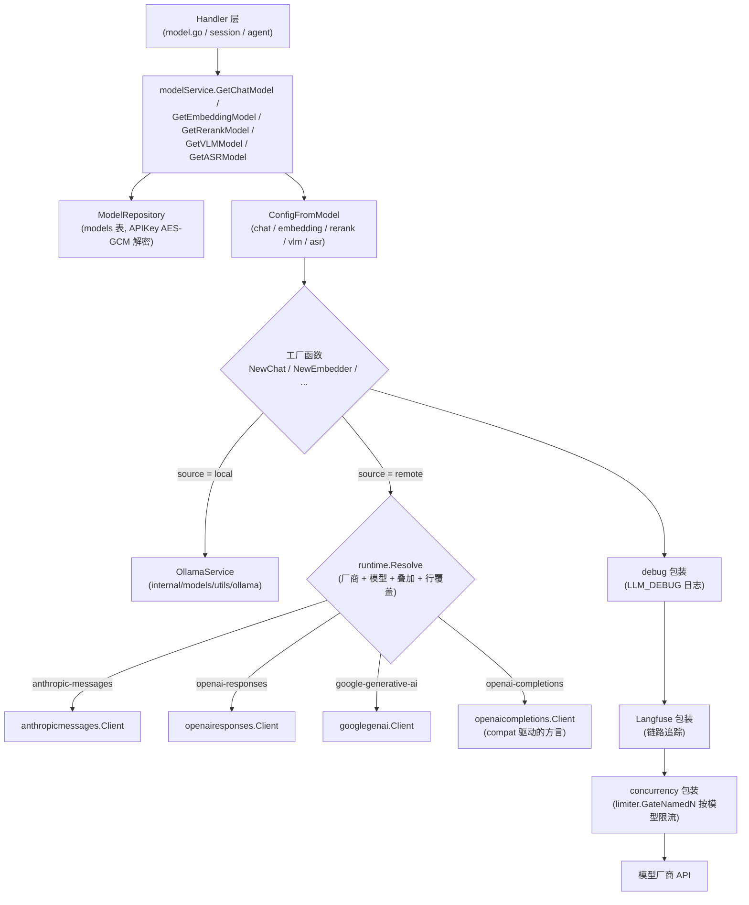

# 模型管理

在「设置 → 模型」添加对话、向量、重排、视觉和语音模型，再由知识库或智能体按需选用。本地 Ollama 和远程模型可以组合使用，例如由本地模型生成向量、远程模型生成回答。

<Screenshot
  src="/screenshots/settings-models.png"
  caption="模型设置：按类型管理已添加的模型"
  hint="展示模型列表（名称、类型、厂商图标与名称、默认标记）与「添加模型」入口。" />

添加模型时应检查连接配置和索引兼容性：

- **更换向量模型需要重建索引**。模型决定向量的语义空间与维度，新旧向量不能直接混用；
- **保存前测试连接**。确认服务地址、凭据和模型名称可用后，再将模型用于知识库或智能体。

模型类型、配置字段和使用状态可按以下说明查询。

## 选择模型类型

| 类型 | 用途 |
| --- | --- |
| 对话模型 | 生成问答、摘要和智能推理内容 |
| 向量模型 | 将文档与问题转换为向量，支持语义检索 |
| 重排模型 | 对召回片段重新排序 |
| 视觉模型 | 识别文档或对话中的图片 |
| 语音模型 | 将音频转写为文本 |

## 添加与验证连接

添加模型时先选类型和来源：「API」接入远程服务，「Ollama」使用本地模型（重排模型不支持 Ollama）。远程模型按以下步骤配置：

1. **选择服务商**。列表只显示支持当前模型类型的厂商，选中后可跳转到该厂商或该模型的文档页。没有对应厂商时选「自定义（OpenAI 兼容接口）」。
2. **填写模型名称**。可从厂商内置的模型目录中选择，选项上标出上下文窗口、向量维度、推理和视觉能力；也可以直接输入目录里没有的模型名。选中目录中的模型时，会自动填入尚未填写的上下文窗口、最大输出 tokens、视觉支持和向量维度。
3. **填写 Base URL 与 API Key**，以及该厂商要求的额外字段（见[厂商额外字段](#厂商额外字段)）。需要经企业网关访问时，可添加自定义请求头。
4. **核对「实际调用方式」**。对话与视觉模型会实时显示请求协议、能力来源（内置模型档案或厂商通用默认）、请求地址、思考开关传参、可选思考强度、上下文窗口和最大输出 tokens，用于在保存前确认配置会被怎样调用。
5. **测试连接后保存**。测试使用表单中当前填写的配置，不需要先保存；编辑已有模型时，API Key 使用已单独保存的值。测试后修改了配置，需要重新测试。

<Screenshot
  src="/screenshots/model-editor-catalog.png"
  caption="添加模型：从厂商目录选择模型并查看实际调用方式"
  hint="打开「添加模型」抽屉，类型选对话、来源选 API，服务商选一个国内厂商（如阿里云 DashScope），展开模型名称下拉以显示上下文窗口 / 推理 / 视觉标记，同时露出下方「实际调用方式」面板（请求协议、能力来源、可选思考强度）和底部「测试连接」按钮。" />

「高级选项」中还可以设置：

| 选项 | 适用类型 | 说明 |
| --- | --- | --- |
| 向量维度 / 自定义输出维度 | 向量 | 维度需与索引一致。只有确认模型支持指定维度时才开启「自定义输出维度」 |
| 上下文窗口 | 对话、视觉 | 留空使用默认 200000。按厂商文档填写真实值；填得过大会导致智能体历史压缩不触发，上游直接拒绝请求 |
| 支持视觉/多模态 | 对话 | 模型是否接受图片输入 |
| 最大输出 tokens | 对话、视觉 | 单次回复的输出上限，留空沿用目录中该模型的默认值 |
| 后台并发上限 | 对话、视觉、向量 | 限制文档入库、富化等后台任务对该模型的并发数；0 或留空使用全局默认，不影响交互式对话 |
| 高级 → 协议覆盖 | 对话、视觉 | 强制使用某种请求协议，一般保持「自动」 |
| 高级 → 远端模型名 | 远程模型 | 实际发送给厂商的模型 ID，与模型名称不同时填写 |
| 高级 → 协议兼容覆盖（JSON） | 远程模型 | 修正个别接口与目录默认值不一致的请求字段，如 `{"max_tokens_field": "max_tokens"}`；留空表示不覆盖。写法与字段见[协议兼容覆盖](#协议兼容覆盖-compat-json) |

旧版本保存的对话模型如果带有 `thinking_control` 设置，高级区域会额外显示「思考参数格式（旧配置）」，改为「遵循目录默认」后由模型目录决定思考参数的写法。

模型目录决定对话模型能否思考以及可选的思考强度（关闭、自动、极低、低、中、高、极高、最大中的一部分）。智能体或对话中选择的强度不被模型支持时，会调整到最接近的可用等级。

### 协议兼容覆盖 compat JSON

同样是「OpenAI 兼容」接口，各家对请求字段的要求并不一致：有的只认 `max_tokens`，有的用不同字段开关思考，推理模型可能拒绝 `temperature`。内置厂商和已收录模型的这些差异已写在模型目录里，通常不需要填写这一项。该选项位于远程模型（WeKnora 云服务除外）的「高级选项 → 高级」中，以下情况才需要手动覆盖：

- 自建推理服务（vLLM、SGLang 等）或中转网关，接口行为和厂商默认值不一致；
- 厂商新发布的模型尚未收录，「实际调用方式」面板显示「厂商通用默认（未收录此模型）」，且调用报错；
- 厂商调整了接口，需要在升级前临时修正。

#### 填写规则

1. **先看协议**。对话、视觉模型的字段取决于「实际调用方式」面板里的「请求协议」，只接受该协议的字段；如果改了「协议覆盖」，JSON 也要改成新协议的字段。向量、重排、语音模型各用一组字段，与协议无关。
2. **只写要改的键**。没写的键继续沿用目录默认值。`extra_body` 等对象按键合并，数组整个替换。
3. **保存时校验**。输入必须是 JSON 对象。键名拼错、取值类型不对或枚举值不存在时，保存会失败并提示原因，不会等到对话时才报错。
4. **改完测试**。「测试连接」使用当前表单中的配置，无需先保存。

这里的覆盖优先级高于厂商默认值和模型目录；旧配置中的「思考参数格式」和「远端模型名」仍然最后生效。模型目录标注为不支持思考的模型，思考相关字段会被忽略。

`extra_body` 只补充 WeKnora 没有写入的字段，不能覆盖 `model`、`messages`、`max_tokens` 这类由 WeKnora 生成的字段。

#### 常见场景

| 现象 | 填写 |
| --- | --- |
| 报错不认识 `max_completion_tokens` | `{"max_tokens_field": "max_tokens"}` |
| 推理模型拒绝 `temperature` / `top_p` | `{"supports_temperature": false}` |
| 接口只接受固定温度（例如 1） | `{"fixed_temperature": 1}` |
| vLLM / SGLang 部署的 Qwen3 等混合思考模型无法关闭或开启思考 | `{"thinking_format": "chat-template-kwargs"}` |
| 网关不支持流式返回用量，流式请求报错 | `{"supports_usage_in_streaming": false}` |
| 网关拒绝带图片的消息结构 | `{"supports_multi_content": false}`（只发送文字，图片会被丢弃） |
| 需要附带厂商私有参数，如阿里云联网搜索 | `{"extra_body": {"enable_search": true}}` |
| 多轮对话回传思考内容时报错 | `{"replay_reasoning_content": false}` |
| 自建向量服务一次请求只接受 16 条 | `{"max_batch_size": 16}` |
| 向量或重排服务响应慢，需要更长的超时 | `{"request_timeout_seconds": 120}` |
| 自建重排服务返回的是未归一化分数（logit） | `{"score_scale": "logit"}` |

#### 字段参考

下表的「协议默认」是没有任何厂商、目录或覆盖时的取值；具体厂商的实际值以「实际调用方式」面板为准。

**OpenAI Chat Completions（`openai-completions`）**：绝大多数「OpenAI 兼容」厂商、自建服务和网关使用此协议。

| 字段 | 类型 | 协议默认 | 说明 |
| --- | --- | --- | --- |
| `max_tokens_field` | string | `max_completion_tokens` | 输出上限的字段名：`max_tokens` 或 `max_completion_tokens`，只发其中一个 |
| `thinking_format` | string | `none` | 思考开关的写法：`none` 不发；`openai` 只发 `reasoning_effort`；`thinking-type` 发 `{"thinking": {"type": ...}}`；`enable-thinking` 发 `enable_thinking`（配合预算字段）；`chat-template-kwargs` 发 `chat_template_kwargs.enable_thinking`（vLLM / SGLang）；`openrouter` 发 `{"reasoning": ...}` |
| `thinking_enabled_value` | string | `enabled` | `thinking-type` 写法开启思考时的 `type` 值（如 MiniMax 用 `adaptive`） |
| `thinking_always_send` | bool | false | 未指定思考偏好时也发送开关 |
| `thinking_disable_on_non_stream` | bool | false | 非流式调用时强制关闭思考（部分模型只允许在流式下思考） |
| `thinking_budget_field` | string | 空 | 思考预算的字段名，如 `thinking_budget`；空则不发 |
| `thinking_budget_excludes_effort` | bool | false | 厂商不允许预算和 `reasoning_effort` 同时出现时置 true，只保留思考强度 |
| `supports_reasoning_effort` | bool | false | 是否额外发送思考强度 |
| `reasoning_effort_field` | string | `reasoning_effort` | 思考强度的字段名 |
| `supports_developer_role` | bool | false | 推理模型的系统提示改用 `developer` 角色 |
| `supports_store` | bool | false | 发送 `store: false`，要求服务端不保留对话 |
| `supports_usage_in_streaming` | bool | true | 流式请求携带 `stream_options.include_usage` 以统计用量 |
| `supports_temperature` | bool | true | false 时不发送任何采样参数（温度、top_p、惩罚项） |
| `fixed_temperature` | number | 无 | 固定发送的温度值 |
| `supports_seed` | bool | true | 是否发送 `seed` |
| `tool_choice_modes` | string[] | `none`、`auto`、`required`、`function` | 允许的 `tool_choice` 取值 |
| `supports_parallel_tool_calls` | bool | true | 是否发送 `parallel_tool_calls` |
| `supports_response_format` | bool | true | 需要 JSON 输出时是否发送 `response_format` |
| `supports_multi_content` | bool | true | false 时图文混排的消息只保留文字部分 |
| `replay_reasoning_content` | bool | true | 多轮对话中把之前的思考内容回传给模型 |
| `reasoning_fields` | string[] | `reasoning_content`、`reasoning`、`reasoning_text` | 从响应中读取思考文本的字段，按顺序取第一个 |
| `tool_call_extra_fields` | string[] | 空 | 工具调用中需要原样回传的额外字段（如经 OpenAI 兼容口调用 Gemini 时的 `extra_content`） |
| `prompt_cache_key` | bool | false | 发送 `prompt_cache_key`，让同一会话命中提示缓存 |
| `cache_control_format` | string | 空 | 设为 `anthropic` 时按 Anthropic 格式插入缓存断点 |
| `prompt_cache_accounting` | bool | false | 厂商会返回缓存命中用量，用于统计 |
| `extra_body` | object | 空 | 附加到每次请求的字段 |

**OpenAI Responses（`openai-responses`）**：OpenAI 官方接口（`api.openai.com`）默认使用。

| 字段 | 类型 | 协议默认 | 说明 |
| --- | --- | --- | --- |
| `supports_developer_role` | bool | true | 系统提示使用 `developer` 角色 |
| `supports_max_output_tokens` | bool | true | 是否发送 `max_output_tokens` |
| `supports_reasoning_summary` | bool | true | 是否请求思考摘要 |
| `supports_encrypted_reasoning` | bool | true | 是否请求并回传加密的思考内容 |
| `supports_store` | bool | true | 发送 `store: false` |
| `supports_temperature` | bool | true | false 时不发送采样参数 |
| `prompt_cache_key` | bool | true | 发送提示缓存键 |
| `supports_long_cache_retention` | bool | true | 允许 24 小时的长缓存 |
| `supports_parallel_tool_calls` | bool | true | 是否发送 `parallel_tool_calls` |
| `extra_body` | object | 空 | 附加到每次请求的字段 |

**Anthropic Messages（`anthropic-messages`）**：Anthropic，以及 `base_url` 以 `/anthropic` 结尾的兼容接口。

| 字段 | 类型 | 协议默认 | 说明 |
| --- | --- | --- | --- |
| `thinking_mode` | string | `budget` | `budget` 按预算开启思考；`adaptive` 由模型自行决定，强度通过 `output_config.effort` 传递 |
| `supports_effort` | bool | false | 是否发送思考强度 |
| `thinking_budgets` | object | minimal 1024、low 2048、medium 8192、high 16384、xhigh 32768、max 63999 | 各思考强度对应的 `budget_tokens`，键为 `minimal`/`low`/`medium`/`high`/`xhigh`/`max` |
| `default_max_tokens` | int | 4096 | 未设置输出上限时使用的 `max_tokens`（该协议必填） |
| `supports_temperature` | bool | true | 是否发送温度 |
| `temperature_with_thinking` | bool | false | 开启思考时是否仍发送温度 |
| `supports_top_p` | bool | true | 是否发送 `top_p` |
| `supports_cache_control` | bool | true | 是否插入缓存断点 |
| `supports_cache_control_on_tools` | bool | true | 是否在工具定义上插入缓存断点 |
| `long_cache_ttl` | string | `1h` | 长缓存的有效期 |
| `version` | string | `2023-06-01` | `anthropic-version` 请求头 |
| `beta_headers` | string[] | 空 | 附加的 `anthropic-beta` 请求头 |
| `interleaved_thinking_beta` | string | `interleaved-thinking-2025-05-14` | 同时使用思考和工具时附加的 beta 标识；空字符串表示不发送 |
| `prompt_cache_accounting` | bool | true | 厂商会返回缓存命中用量 |
| `extra_body` | object | 空 | 附加到每次请求的字段 |

**Gemini（`google-generative-ai`）**：Gemini 原生接口。

| 字段 | 类型 | 协议默认 | 说明 |
| --- | --- | --- | --- |
| `thinking_mode` | string | `budget` | `budget` 发送 `thinkingBudget`（Gemini 2.5）；`level` 发送 `thinkingLevel`（Gemini 3 起）；`none` 不发送思考配置 |
| `thinking_budgets` | object | minimal 128、low 2048、medium 8192、high 24576、xhigh 32768、max 32768 | 各思考强度对应的 `thinkingBudget` |
| `include_thoughts` | bool | true | 是否返回思考内容 |
| `supports_seed` | bool | true | 是否发送 `seed` |
| `supports_penalty` | bool | true | 是否发送频率 / 存在惩罚 |
| `extra_generation_config` | object | 空 | 附加到 `generationConfig` 的字段 |
| `prompt_cache_accounting` | bool | true | 厂商会返回缓存命中用量 |
| `api_version_prefix` | string | `/v1beta` | `base_url` 只填主机时追加的版本路径 |

**向量模型**

| 字段 | 类型 | 协议默认 | 说明 |
| --- | --- | --- | --- |
| `api` | string | 厂商默认 | 向量协议：`openai-embeddings`、`dashscope-embeddings`、`ark-embeddings`、`google-embeddings` |
| `path` | string | 空 | 追加在 `base_url` 之后的路径 |
| `send_encoding_format` | bool | false | 是否发送 `encoding_format: "float"` |
| `dimensions_field` | string | 空 | 指定输出维度的字段名；仅在开启「自定义输出维度」时发送 |
| `truncate_field` / `truncate_value` | string | 空 | 输入过长时由服务端截断的开关字段与取值 |
| `input_type_field` | string | 空 | 区分「文档」和「查询」的字段名 |
| `input_type_values` | object | 空 | `document`、`query` 两种输入分别对应的取值 |
| `max_batch_size` | int | 0（不限） | 单次请求的最大条数，超出自动分批 |
| `max_input_chars` | int | 0（不限） | 单条输入的最大字符数 |
| `accepts_truncate_prompt_tokens` | bool | false | 服务是否支持 vLLM 的 `truncate_prompt_tokens` |
| `request_timeout_seconds` | int | 60 | 单次请求超时（秒） |
| `extra_body` | object | 空 | 附加到每次请求的字段 |

**重排模型**

| 字段 | 类型 | 协议默认 | 说明 |
| --- | --- | --- | --- |
| `path` | string | 空 | 追加在 `base_url` 之后的路径 |
| `send_top_n` | bool | false | 是否发送 `top_n`（不发时返回全部文档） |
| `send_return_documents` | bool | false | 是否要求服务端回传文档原文 |
| `score_scale` | string | `probability` | 分数含义：`probability`（0～1）或 `logit`（未归一化）。填错会让相关度阈值失效 |
| `truncate` | string | 空 | 服务端截断设置（如 NIM 的 `END`） |
| `max_documents` / `max_query_chars` / `max_document_chars` / `max_request_chars` | int | 0（不限） | 单次请求的文档数、查询长度、单篇长度与总长度上限，超出自动分批 |
| `max_concurrency` | int | 0（使用默认） | 分批后同时发出的请求数 |
| `accepts_truncate_prompt_tokens` | bool | false | 服务是否支持 vLLM 的 `truncate_prompt_tokens` |
| `request_timeout_seconds` | int | 0（不单独限制） | 单次请求超时（秒） |
| `extra_body` | object | 空 | 附加到每次请求的字段 |

**语音识别模型**

| 字段 | 类型 | 协议默认 | 说明 |
| --- | --- | --- | --- |
| `api` | string | 厂商默认 | `openai-transcriptions`（上传音频文件）或 `openai-chat-audio`（在对话请求中携带音频） |
| `path` | string | `/audio/transcriptions` | 追加在 `base_url` 之后的路径 |
| `response_format` | string | 空 | 发送的 `response_format`，需要分段结果时填 `verbose_json` |
| `language_param` | string | 空 | 语言提示的位置：`form`、`header`、`asr_options`；空则不发送 |
| `max_file_bytes` / `max_encoded_bytes` | int | 0（不限） | 音频文件与 base64 编码后的大小上限 |
| `formats` | string[] | 空（不限） | 接受的音频扩展名（不带点） |
| `request_timeout_seconds` | int | 300 | 单次请求超时（秒） |

## 内置厂商

内置 27 个厂商，另可通过 Ollama 接入本地模型。各厂商支持的模型类型如下（✓ 表示支持）：

| 厂商 | ID | 对话 | 向量 | 重排 | 视觉 | 语音 |
| --- | --- | :-: | :-: | :-: | :-: | :-: |
| 自定义（OpenAI 兼容接口） | `generic` | ✓ | ✓ | ✓ | ✓ | ✓ |
| WeKnora 云服务 | `weknoracloud` | ✓ | ✓ | ✓ | ✓ | |
| 阿里云 DashScope | `aliyun` | ✓ | ✓ | ✓ | ✓ | ✓ |
| 智谱 BigModel | `zhipu` | ✓ | ✓ | ✓ | ✓ | ✓ |
| 火山引擎 | `volcengine` | ✓ | ✓ | ✓ | ✓ | |
| 腾讯混元 | `hunyuan` | ✓ | ✓ | | | |
| 硅基流动 | `siliconflow` | ✓ | ✓ | ✓ | ✓ | ✓ |
| MiniMax | `minimax` | ✓ | | | | ✓ |
| 月之暗面 Moonshot | `moonshot` | ✓ | | | ✓ | |
| 小米 MiMo | `mimo` | ✓ | | | | ✓ |
| 魔搭 ModelScope | `modelscope` | ✓ | ✓ | | ✓ | |
| 百度千帆 | `qianfan` | ✓ | ✓ | ✓ | ✓ | |
| 七牛云 | `qiniu` | ✓ | | | | |
| 美团 LongCat | `longcat` | ✓ | | | | |
| 腾讯云 LKEAP | `lkeap` | ✓ | | ✓ | | |
| DeepSeek | `deepseek` | ✓ | | | | |
| OpenAI | `openai` | ✓ | ✓ | | ✓ | ✓ |
| Azure OpenAI | `azure_openai` | ✓ | ✓ | | ✓ | |
| Anthropic | `anthropic` | ✓ | | | | |
| Google Gemini | `gemini` | ✓ | ✓ | | | |
| OpenRouter | `openrouter` | ✓ | ✓ | ✓ | ✓ | ✓ |
| LiteLLM | `litellm` | ✓ | ✓ | ✓ | ✓ | ✓ |
| Requesty | `requesty` | ✓ | ✓ | | ✓ | ✓ |
| Jina | `jina` | | ✓ | ✓ | | |
| NVIDIA | `nvidia` | ✓ | ✓ | ✓ | ✓ | |
| Novita AI | `novita` | ✓ | ✓ | ✓ | ✓ | |
| GPUStack | `gpustack` | ✓ | ✓ | ✓ | ✓ | ✓ |

表中的「视觉」指可在视觉模型类型下选择该厂商；对话模型本身是否接受图片，以模型目录和「支持视觉/多模态」开关为准。WeKnora 云服务需先在设置中保存云服务凭证，模型名称可选 `chat`、`embedding`、`rerank`、`vlm`。

厂商列表、默认地址和模型目录由服务端下发（`GET /api/v1/models/providers`），运维可以通过[部署叠加](#部署叠加-config-models-json)修改或新增厂商。

## 查看引用与调整配置

知识库和智能体保存对模型的引用。删除模型前需检查依赖详情；内置模型由 YAML 配置管理，应在配置文件中维护。

模型调试器会对已保存的模型实际发起请求，显示耗时、脱敏请求和响应结果，可用于检查向量维度、重排得分或流式输出。能思考的对话模型可在调试器中选择思考强度，结果中会显示实际的请求协议和思考开关传参。调用量和缓存使用情况可结合[可观测性与审计](16-observability.md)查看。

## 配置与调用参考

### 模型类型与用途

模型类型定义在 `internal/types/model.go`：

```go
const (
    ModelTypeEmbedding   ModelType = "Embedding"   // Embedding model
    ModelTypeRerank      ModelType = "Rerank"      // Rerank model
    ModelTypeKnowledgeQA ModelType = "KnowledgeQA" // KnowledgeQA model
    ModelTypeVLLM        ModelType = "VLLM"        // VLLM model
    ModelTypeASR         ModelType = "ASR"         // ASR model
)
```

| 类型 | 前端标识 | 客户端包 | 接口 | 用途 |
|------|---------|---------|------|------|
| `KnowledgeQA` | `chat` | `internal/models/chat` | `Chat` / `ChatStream`（支持 Tools、Thinking、多模态消息） | 知识问答、Agent 推理、摘要 / 问题生成 / 图谱抽取等一切 LLM 调用 |
| `Embedding` | `embedding` | `internal/models/embedding` | `Embed` / `BatchEmbed`（含 `GetDimensions`） | 文本向量化，供向量检索索引与查询 |
| `Rerank` | `rerank` | `internal/models/rerank` | `Rerank(query, documents)` 返回 `RankResult` | 检索结果精排 |
| `VLLM` | `vllm` | `internal/models/vlm` | `Predict(imgBytes, prompt)` | 视觉语言模型（VLM），文档图片理解 / 多模态解析 |
| `ASR` | `asr` | `internal/models/asr` | `Transcribe(audioBytes, fileName)` 返回文本；模型提供时附带分段时间戳（如 OpenAI `whisper-1`） | 音频转写（自动语音识别） |

前后端类型映射见 `internal/handler/model_catalog.go` 的 `modelTypeToFrontend()`（`KnowledgeQA -> chat` 等）。创建模型的 REST 接口按原样保存 `type`，调用方应传后端取值（`KnowledgeQA` 等）；`model_type` 查询参数则两种写法都接受。

模型来源（`ModelSource`）核心取值为两个：`local`（本地 Ollama 拉起）与 `remote`（远程 API）；其余历史值（`aliyun`、`zhipu`、`openai` 等）为兼容保留，路由行为等同 `remote` + 对应 provider。

### 模型配置字段

模型实体 `types.Model` 的 `Parameters`（`internal/types/model.go` 的 `ModelParameters`）：

| 名称 | 类型 | 默认值 | 说明 |
|------|------|--------|------|
| `base_url` | string | 空（使用厂商默认地址） | 模型 API 地址，创建/更新时经过 SSRF 校验（`ValidateURLForSSRF`） |
| `api_key` | string | 空 | API 密钥，**AES-256-GCM 加密落库**（`ModelParameters.Value/Scan`）。创建时可随请求提交；之后只能通过 `PUT /models/:id/credentials` 子资源修改 |
| `interface_type` | string | 空（VLM：local 默认 `ollama`，remote 默认 `openai`） | 接口协议类型 |
| `embedding_parameters.dimension` | int | 0 | 向量维度 |
| `embedding_parameters.truncate_prompt_tokens` | int | 0 | 服务端截断 token 数。这是 vLLM 的扩展参数，只发给 `generic`、`gpustack`（为 0 时沿用历史值 511）；托管厂商的文档里没有它，一律不发 |
| `embedding_parameters.supports_dimension_override` | bool | false | 是否在请求里指定向量维度。字段名由厂商决定（OpenAI 系 `dimensions`、Gemini `outputDimensionality`、百炼多模态 `parameters.dimension`）；厂商文档里没有该参数的模型（NVIDIA NIM、混元、Novita、ada-002 等）即使勾选也不发 |
| `parameter_size` | string | 空 | Ollama 模型参数规模（如 "7B"），后端维护、前端不可改 |
| `provider` | string | 空（按 BaseURL 自动检测） | 厂商 ID，取值见[内置厂商](#内置厂商) |
| `extra_config` | map[string]string | nil | 厂商额外字段（见下节）；保留键 `api`（强制对话协议）、`remote_model_name`（远端模型名）、`thinking_control`（旧版思考参数格式） |
| `spec` | object | nil | 单行目录覆盖：`api`、`reasoning`、`input`、`context_window`、`max_output_tokens`、`thinking_levels`、`compat`（协议相关的扁平 JSON） |
| `custom_headers` | map[string]string | nil | 附加自定义 HTTP 请求头（类似 OpenAI SDK `extra_headers`；`Authorization`、`api-key` 等保留头在运行期被忽略） |
| `supports_vision` | bool | false | 对话模型是否接受图片多模态输入 |
| `context_window` | int | 0（回落到 200000） | 对话/VLM 上下文窗口（token）。智能体按此上限加载与压缩历史；应填写服务实际支持的窗口大小，过高会导致压缩无法及时触发 |
| `max_output_tokens` | int | 0（沿用目录默认） | 对话/VLM 单次回复的输出上限 |
| `max_concurrency` | int | 0（回落到全局 `model.max_concurrency`） | 该模型后台任务并发上限（仅 chat/vlm/embedding 生效） |
| `app_id` / `app_secret` | string | 空 | WeKnora 云服务凭证；LKEAP / 火山引擎重排的第二段密钥也存于 `app_secret`。`app_secret` AES 加密存储 |

模型级字段还包括 `name`（运行期实际调用的模型名）、`display_name`、`type`、`source`、`is_default`（同一 `(tenant_id, type)` 桶内唯一默认）、`is_builtin`、`managed_by`、`status`（`active` / `downloading` / `download_failed`）。

远程对话和视觉模型的查询响应附带 `capabilities`（协议、是否可思考、可选思考等级、上下文窗口等），由服务端按目录解析得出。

### 厂商额外字段

厂商在定义中声明额外字段，编辑器据此动态渲染，值存入 `extra_config`（标记为密钥的字段不回显，只返回是否已配置）：

| 厂商 | 字段 | 适用类型 | 说明 |
| --- | --- | --- | --- |
| Azure OpenAI | `api_version` | 全部 | 留空走 `/openai/v1` 数据面；填写版本号（如 `2025-04-01-preview`）则走旧的 `/openai/deployments/{部署名}` 路径 |
| 腾讯云 LKEAP | SecretKey（必填，按密钥加密保存）、`region`（默认 `ap-guangzhou`） | 重排 | 重排接口使用 TC3 签名，API Key 一栏填 SecretId |
| 火山引擎 | SecretKey（必填，按密钥加密保存）、`region`（默认 `cn-beijing`）、`instruction` | 重排 | 重排接口使用 AK/SK 签名，API Key 一栏填 Access Key ID；`instruction` 默认为控制台原文 |
| 自定义、GPUStack、LiteLLM | `score_scale` | 重排 | 「Rerank 分数标度」：`probability`（0~1 相关度，BGE 一类）或 `logit`（无界分数，Qwen3-Reranker 一类，会换算到 0~1 后再与重排阈值比较）。按端点后实际部署的模型选择 |
| 自定义、GPUStack | `truncate_prompt_tokens` | 重排 | vLLM 扩展参数，默认不发送；只在后端因文档过长报错时填写 |

#### 管理 API（`internal/router/routes_infra.go`）

| 方法 & 路径 | 说明 |
|-------------|------|
| `GET /models/providers` | 按 `model_type` 查询支持的厂商定义（含图标、默认地址、额外字段、模型目录） |
| `GET` / `POST /models/catalog/resolve` | 解析一行配置的实际调用方式（协议、思考等级、上下文），即编辑器中的「实际调用方式」 |
| `POST /models` / `GET /models` / `GET /models/:id` / `PUT /models/:id` / `DELETE /models/:id` | 模型 CRUD |
| `PUT /models/:id/credentials`、`DELETE /models/:id/credentials/:field` | 凭证子资源；`PUT /models/:id` 请求体中的 `api_key` 会被强制忽略并告警 |
| `POST /models/:id/debug` | 模型调试（见下文） |
| `GET /models/weknoracloud/status` | WeKnora 云服务凭证状态 |

完整请求与响应见 [API 参考：模型与初始化](../04-api/02-api-model-system.md)。

### 模型健康检查 / 连通性测试

两套机制，均在服务端持有凭证、不回传明文密钥：

1. **测试连接**（`internal/handler/initialization.go`，供模型编辑器的「测试连接」按钮）：
   - `POST /initialization/remote/check` — Chat 模型（`CheckRemoteModel` / `checkChatModelConnection`）
   - `POST /initialization/embedding/test` — Embedding（`TestEmbeddingModel`）
   - `POST /initialization/rerank/check` — Rerank（`CheckRerankModel`）
   - `POST /initialization/asr/check` — ASR（`CheckASRModel`）
   - `POST /initialization/multimodal/test` — VLM 多模态解析（`TestMultimodalFunction`）

   请求体 `ModelTestRequest` 可携带 `modelId`：`fillSecretsFromStoredModel` 会把请求中缺失的 `APIKey` / `AppSecret`、`extraConfig` 与 `spec` 从已存模型（解密后）补齐，实现"改 BaseURL 用旧密钥一键验证"，前端无需也无法拿到明文密钥。`buildTestModel` 把请求转换为**不落库**的临时 `*types.Model`，与生产路径共享同一套 `ConfigFromModel` 映射。

2. **模型调试器**（`POST /models/:id/debug`，`ModelHandler.DebugModel`）：对已保存模型按类型发起真实调用并返回完整归一化响应——Chat 走流式，可指定思考强度（`options.reasoning_effort`），并聚合协议、思考开关传参等观测项；Embedding 返回向量与维度；Rerank 返回打分结果；VLM / ASR 接受上传文件。响应含 `elapsed_ms`、脱敏后的请求预览与 `observations`。

### 内置模型机制

`internal/types/builtin_models_config.go` 实现了声明式内置模型：启动时读取 `config/builtin_models.yaml`（或 `BUILTIN_MODELS_CONFIG` 指定路径，模板见 `config/builtin_models.yaml.example`），把每个条目 UPSERT 到 `models` 表，`is_builtin=true`、`managed_by="yaml"`、默认 `tenant_id=10000`（`DefaultBuiltinModelTenantID`），对所有租户可见。

关键行为（`LoadBuiltinModelsConfig`）：

- 任意字符串字段支持 `${ENV_NAME}` 环境变量插值；未设置的变量保留字面量以便暴露配置错误。
- 每次启动按 `id` UPSERT，并把 `deleted_at` 强制重置为 NULL（文件中重新出现的条目会复活）。
- **漂移清理**：`managed_by='yaml'` 但 id 已不在文件中的行被软删除——从 YAML 删除条目即是下线内置模型的正规方式。
- 管理员在运行时接管某行（`managed_by` 置空）后，YAML 加载器会跳过该行（"preserving runtime override"）。
- `is_default: true` 条目会先清掉同 `(tenant_id, type)` 桶内其他默认，保持与 API 路径一致的唯一默认不变式。
- 校验规则：id 非空且 ≤64 字符（`ModelIDMaxLen`）、type 必须是 `KnowledgeQA | Embedding | Rerank | VLLM | ASR`、status 合法或为空；YAML 解析失败时中止对账（不执行漂移清理）。
- `parameters` 与 REST 接口使用同一套目录校验（`runtime.ValidateRow`）：无法解析的行（未知协议、拼错的 compat 键、非法思考等级）只输出 WARN，不阻塞启动。

YAML 示例（摘自 `builtin_models.yaml.example`）：

```yaml
builtin_models:
  - id: builtin-llm-default
    type: KnowledgeQA
    source: remote
    is_default: true
    name: ${LLM_MODEL_NAME}
    parameters:
      base_url: ${LLM_BASE_URL}
      api_key: ${LLM_API_KEY}
      provider: ${LLM_PROVIDER}
      context_window: 200000     # 可选；省略时使用默认 200K
```

#### 本地模型下载（Ollama）

本地 embedding 与对话共用同一 `OLLAMA_BASE_URL`；向量模型名与环境变量说明见 [配置文档](../01-getting-started/04-configuration.md)。

本地模型的生命周期由 `internal/models/utils/ollama/ollama.go` 的 `OllamaService` 管理（`IsModelAvailable` / `PullModel` / `EnsureModelAvailable` / `ListModelsDetailed` / `DeleteModel` 等），HTTP 入口在 `internal/handler/initialization.go`：

| 路径 | 说明 |
|------|------|
| `GET /initialization/ollama/status` | Ollama 服务可用性 |
| `GET /initialization/ollama/models` | 列出本地已有模型 |
| `POST /initialization/ollama/models/check` | 批量检查模型是否已下载 |
| `POST /initialization/ollama/models/download` | 异步下载（`downloadModelAsync` + `pullModelWithProgress`，写入模型 `status=downloading`） |
| `GET /initialization/ollama/download/progress/:taskId`、`GET /initialization/ollama/download/tasks` | 下载进度 / 任务列表 |

> 注意：`cmd/download/duckdb/duckdb.go` 与模型无关——它在构建镜像时预下载 DuckDB 的 `spatial`、`excel` 扩展，供数据分析工具使用。模型权重下载只发生在 Ollama 路径。

### 部署叠加 `config/models.json` {#部署叠加-config-models-json}

不改代码也能加厂商、改地址、补模型：复制 `config/models.json.example` 到 `config/models.json`（或用 `MODELS_CONFIG` 指定路径）。`providers` 按厂商 ID 键入，已知 ID 打补丁，新 ID 声明新厂商。

| 字段 | 说明 |
| --- | --- |
| `name` / `names` / `description` / `descriptions` / `website` | 展示名称、按语言的名称与描述、官网 |
| `api` | 默认对话协议（`openai-completions`、`openai-responses`、`anthropic-messages`、`google-generative-ai`） |
| `base_url` / `base_urls` | 默认地址；`base_urls` 按 `chat`、`embedding`、`rerank`、`vlm`、`asr` 分别指定 |
| `api_key` | 部署级密钥，模型行未保存密钥时使用；支持 `${ENV}` / `$ENV` 插值，未设置的变量展开为空 |
| `auth` / `requires_auth` | 鉴权方式（`bearer`、`api-key`、`x-api-key`、`x-goog-api-key`、`none`）与是否必须填写密钥 |
| `headers` | 附加请求头 |
| `model_types` / `url_patterns` | 新厂商支持的模型类型；未填 provider 的旧行按 URL 子串识别厂商 |
| `compat` / `thinking_levels` | 厂商级协议兼容开关与思考等级映射 |
| `models` | 按 ID upsert：已存在的 ID 只覆盖写出来的字段，未写的 `reasoning`、`thinking_levels`、`compat`、`input` 保持原样；新 ID 整条新建 |
| `model_overrides` | 按 ID 修补已有条目（如 `context_window`、`max_output_tokens`） |
| `icon` | 内联 `<svg …>` 字符串，或相对于叠加文件所在目录的 `.svg` 路径；不接受绝对路径、不能越出该目录、不超过 256 KB（图标会以 data URI 下发给所有能打开模型页的人） |

叠加在启动时整体校验后生效：出现未知键、非法鉴权方式或无法解析的模型条目时，整份叠加都不生效，启动日志输出 `Load models catalog overlay failed`，服务继续使用内置目录。目前不监听文件变更，修改后需重启服务。运行时不会从外部拉取模型数据，字段名、思考格式这类行为事实由人维护。

叠加只改变厂商定义和模型目录；每个模型仍单独保存自己的 URL、API Key、额外字段和 `spec`，不会修改已有模型的 ID 或引用关系。

### 系统管理员维护模型目录

在「设置 → 系统管理 → 模型目录」查看所有目录模型：列表展示每个模型的厂商、类型、上下文窗口 / 最大输出、能力（思考、图像等输入）以及配置来源（内置 / 部署文件 / 管理员修改），可按厂商、类型筛选，或只看管理员修改过的条目。通配匹配规则排在各厂商的具体模型之后，只提供默认参数、不进入候选列表。

管理员修改单独保存在数据库中，优先顺序为：**内置目录 → 启动时读取的部署文件 → 管理员修改 → 单个模型的显式配置**。页面不会改写挂载的配置文件；修改部署文件仍需重启，各实例应使用一致的文件。

常用操作都是「保存即生效」：本实例立即切换完整目录，其他实例每 5 秒检查版本并同步；校验失败或数据库故障时保留原生效目录。另一位管理员先发布时返回 409，页面会提示并刷新到最新版本。

- **编辑模型**：点击列表中的模型，在抽屉里修改显示名称、上下文窗口、是否在候选列表中隐藏；对话模型还可改最大输出、输入模态（图像 / 音频 / 视频，勾选图像后可作为视觉模型）、是否支持思考和思考等级；Embedding 模型可改向量维度（添加模型时预填）。每项都显示默认值（部署文件或内置目录的取值），并标出已被管理员修改的字段；输入框留空即恢复默认。下方「各层取值」对比内置目录、部署文件和当前生效值。「恢复默认」一次性移除该模型的全部管理员修改。
  - 思考等级按服务端解析结果展示（已合并厂商等级映射与协议能力）。取消勾选写入 `null` 标记不支持，重新勾选沿用厂商映射的线上取值；与默认一致的等级不写入覆盖，继续跟随厂商。不勾选「关闭」表示模型始终思考。等级到厂商取值的自定义映射仍在 JSON 编辑中维护。
- **添加模型**：为厂商补充目录中没有的模型（厂商、类型、模型 ID，可选显示名称和默认参数；思考等级沿用厂商默认，添加后可再调整）。管理员添加的模型可在编辑抽屉里删除。
- **JSON 编辑**（「更多」菜单）：直接编辑 `models.json` 格式的管理员修改文档（最大 1 MiB，支持顶层 `_comment`，发布时移除），适合批量调整或迁移。先点「检查变更」由服务端校验，并列出将新增、修改、移除的条目及变更字段；确认后点「发布 N 项变更」。「导入 JSON」会把文件载入此编辑器，确认后才发布；「导出修改」下载当前生效的管理员修改。
- **版本历史**（「更多」菜单）：保留最近 20 个版本，显示发布人、时间和修改的模型数；「恢复」会以该版本内容发布一个新版本。

目录文档用于元数据管理。控制台不接受厂商 `api_key`、`headers`、`base_url` / `base_urls`、`url_patterns`、`auth` 或服务器图标文件路径；这些继续在模型配置 / 部署文件中维护（环境变量引用也只在部署文件的这些字段中展开，控制台文档里的 `$` 按普通文本处理）。控制台图标仅接受内联 SVG。生成文件 `models.generated.json` 的 `version + providers:数组` 结构不能直接作为覆盖文档导入，应按 `config/models.json.example` 的 `providers:对象` 结构编写。

目录更新后，重新打开模型编辑器会刷新厂商与模型候选。模型管理页有系统管理员专用的「模型目录」入口。目录中的模型不会自动创建为已配置模型，`deprecated` 只隐藏下拉候选；已有模型的上下文窗口等显式值继续保留，不会被批量改写。目录中的 API / compat 等未被单行覆盖的值会影响之后创建的模型客户端；已经创建的客户端继续使用原快照。

### 模型用量统计

- **Token 用量**：`types.TokenUsage`（`internal/types/chat.go`）记录 `prompt_tokens / completion_tokens / total_tokens` 及 prompt cache 细分（`cache_read_tokens / cache_write_tokens / cache_miss_tokens / cache_status`）。所有协议客户端通过 `internal/models/api/usage_log.go` 的 `LogUsage` 输出统一的结构化日志行：

  ```go
  logger.Infof(ctx,
      "[LLM Usage] model=%s, purpose=%s, prompt_prefix=%s, prompt_tokens=%d, completion_tokens=%d, ...",
      ...)
  ```

  其中 `purpose` 来自 `types.WithLLMCallMetadata`（如 `document_summary`、`entity_extraction`），可按用途聚合。
- **链路追踪**：启用 Langfuse 时，每类模型都有 `langfuse_wrapper.go` 装饰器把调用（含 usage）上报为 trace/span。
- **流式响应**：usage 随最后的 `StreamResponse` 事件返回（模型调试器会将其聚合进 `usage` 字段）。
- **并发水位**：`GET /system/admin/runtime/queues` 暴露每模型实时 `active / waiting / limit`（见下文[并发与限流](#并发与限流-limiter)）。

## 模型调用与实现参考

### 分层结构

模型接入按协议、厂商、目录、运行时分工：

| 层 | 位置 | 职责 |
|----|------|------|
| 协议层 | `internal/models/api/<protocol>` | 一个 wire 协议一个包。对话：`openaicompletions`、`openairesponses`、`anthropicmessages`、`googlegenai`；重排：`cohererank`、`dashscoperank`、`nimrerank`、`tencentlkeap`、`volcengineknowledge`；向量：`openaiembeddings`、`dashscopeembeddings`、`arkembeddings`、`googleembeddings`；语音：`openaitranscriptions`、`openaichataudio`。各自持有请求/响应结构与解析，不依赖厂商定义或模型目录 |
| 厂商层 | `internal/models/providers/<id>.go` | 一个厂商一份定义，声明支持的模型类型、各类型默认地址、鉴权方式、额外字段、协议兼容默认值与特殊端点钩子；图标放 `providers/assets/`，在 `builtin.go` 的 `Builtins()` 显式列出 |
| 目录层 | `internal/models/catalog` | 加载生成的模型目录 `catalog/data/models.generated.json`，按类型和模型名查询条目；不含厂商行为 |
| 运行时 | `internal/models/runtime` | 组合厂商定义与目录、应用部署叠加（`overlay.go`），合并单个模型配置、选择协议、组装认证和端点，隔离旧字段推断 |

`runtime.Resolve(Ref{Provider, Model, BaseURL, ModelType, Extra, Override})` 的合并顺序从低到高：

1. 协议默认值（`DefaultOpenAICompletions()` 等）；
2. 厂商级 `Compat`（`providers/<id>.go` 里声明，例如 DeepSeek 的 `max_tokens_field: max_tokens`；部署叠加的厂商级 `compat` 也在这一层）；
3. 目录中匹配到的条目（精确 id → `aliases` → `match` 通配，最长字面前缀优先；部署叠加的 `models` / `model_overrides` 已合入目录）；
4. 模型行上的 `parameters.spec`（编辑器「高级」里的协议覆盖与 compat JSON）；
5. `extra_config.api` 强制协议、`extra_config.thinking_control` 旧版思考编码、`extra_config.remote_model_name`。

厂商参数依据厂商文档维护，每个 `providers/<id>.go` 的注释列出依据与文档链接，目录条目的 `source` 字段记录来源。对应的出站 JSON 由各协议包的 golden 测试钉死（如 `openaicompletions/golden_test.go`）。

各协议的 compat 字段、协议默认值与常见用法见[协议兼容覆盖](#协议兼容覆盖-compat-json)；结构定义在 `internal/models/api/compat_settings.go`（对话协议）以及同目录的 `embeddings_settings.go`、`rerank_settings.go`、`transcriptions_settings.go`。

思考强度在内部统一为 `off / auto / minimal / low / medium / high / xhigh / max`，每个模型的 `thinking_levels` 把统一等级映射到厂商取值（`null` 表示不支持，`"off": null` 表示无法关闭思考，如 DeepSeek Reasoner、QwQ、Kimi K3）。请求的等级不受支持时，先向上、再向下取最近的已支持等级。

#### 协议选择

Anthropic 走 Messages 协议；Gemini 默认走原生 `generateContent`（`base_url` 指向 `/v1beta/openai` 则保持 OpenAI 兼容）；OpenAI 在 `api.openai.com` 上走 Responses 协议，中转/代理保持 Chat Completions；任何厂商 `base_url` 以 `/anthropic` 结尾时自动切到 Messages 协议（MiniMax、智谱、Kimi 的 Anthropic 兼容口）。单行 `spec.api` 的明确选择优先于 URL 和厂商推断；兼容旧配置的 `extra_config.api` 仍具有最高优先级。`extra_config.api` 可强制指定对话协议，只对 chat / VLM 行生效；embedding 行的协议覆盖写在 `spec.compat` 的 `"api"` 里，取值是向量协议（`openai-embeddings`、`dashscope-embeddings`、`ark-embeddings`、`google-embeddings`）。

目录条目按模型类型查找：embedding 行只匹配 embedding 条目，不会被同名前缀的对话通配（如百炼的 `qwen3*`、OpenAI 的 `gpt-5*`）套上对话的 compat。目录里还没有的新 id、带日期的快照照常按厂商默认解析。

写入侧也有一道闸：`runtime.ValidateRow` 会在创建 / 更新模型（REST）和加载 `config/builtin_models.yaml`（启动）时解析这行配置（全部模型类型），未知协议、拼错的 compat 键、非法的思考档位在写入时就被拒绝（YAML 行只打 WARN 不阻塞启动，避免一次重启把线上模型下线）。

新增厂商、维护模型目录与厂商行为的开发流程见[扩展点指南](../06-development/03-extension-points.md#_4-新增模型-provider-internal-models-provider)。

### 从 v0.8.0 升级的行为变化

老库里的模型行**不需要任何迁移**：`parameters` 列只增加了可选的 `spec` 字段，v0.8.0 的全部 `provider` 取值仍然注册，`extra_config` 的历史键（`thinking_control` 的每个取值、`remote_model_name`、`api_version`、`secret_key`、`region`、`instruction`、`truncate_prompt_tokens`）语义不变，目录里已没有的模型 id（自定义微调、已退役型号）照常解析并保留思考开关。这些由 `internal/models/runtime/legacy_rows_test.go` 与 `internal/types/legacy_persisted_json_test.go` 钉住。

以下既有模型行的运行时行为会变，升级时需要知会使用者。

对话模型（逐厂商断言见 `internal/models/parity/parity_test.go`）：

1. **`extra_config.api` 变成保留键**。它现在是协议选择器（`openai-completions` / `openai-responses` / `anthropic-messages` / `google-generative-ai` / `ollama`），取值非法会在创建、更新模型时返回 400。只有手工调 REST 或写 YAML 造出来的行会受影响，升级前删掉或改成合法取值。
2. **Azure OpenAI 未填 `api_version` 的行改走 `/openai/v1` GA 数据面**，不再是 `/openai/deployments/{model}/...?api-version=2024-10-21`。要保留旧路径，在额外字段里显式填一个 `api_version`。
3. **`api.openai.com` 的一方流量改走 Responses 协议**。各类中转 / 网关仍走 Chat Completions。
4. **7 家厂商的输出上限字段按文档纠正**：hunyuan、modelscope、qiniu、requesty、longcat、novita 由 `max_completion_tokens` 改回 `max_tokens`，moonshot 反向改为 `max_completion_tokens`。aliyun 保持 `max_completion_tokens`。

重排模型（逐厂商出站请求见 `internal/models/rerank/wire_test.go`）：

1. **OpenAI 不再出现在重排的厂商列表里**。OpenAI 没有 rerank 接口；架在 OpenAI 风格地址后面、自带 rerank 的中转请建成 `generic` 行。已有的行照常解析。
2. **火山引擎重排每次最多 200 条**（原实现按 50 条切分），默认指令改为控制台原文 `Whether the document answers the query or matches the content retrieval intent`。已在额外字段里保存了指令的行不受影响。

向量模型（逐厂商出站请求见 `internal/models/embedding/wire_test.go`）：

1. **托管厂商不再收到 `truncate_prompt_tokens`**，`generic`、`gpustack` 照旧发送。
2. **NVIDIA NIM 的检索查询改用 `input_type: query`**（文档侧仍是 `passage`，已有索引不受影响），超长输入按 `truncate: END` 截断，不再发送 `dimensions`；目录移除了 NVIDIA 已下线的 `nv-embed-v1`、`llama-3.2-nemoretriever-300m-embed-v1`、`baai/bge-m3`。
3. **阿里云按模型分流**：文本模型走 `/compatible-mode/v1/embeddings`，`qwen3-vl-embedding`、`qwen2.5-vl-embedding`、`tongyi-embedding-vision*`、`multimodal-embedding*` 走原生多模态接口。`base_url` 只填主机、国际站或业务空间域名时保留该主机。
4. **火山方舟的文本向量接口已归档下线**。沿用 `doubao-embedding-text*` / `doubao-embedding-large-text*` 的行改发到归档文档里的 `/api/v3/embeddings`，其余走多模态接口。
5. **Gemini 的缩维放进 `embedContentConfig.outputDimensionality`**，不再发请求顶层的 `output_dimensionality`。
6. **SiliconFlow 每次最多 32 条、百炼 `text-embedding-v1/v2` 最多 25 条**，超出时自动拆批；v1/v2 固定 1536 维，不发 `dimensions`。
7. **Jina 的 `task`、Gemini 的 `taskType`、OpenRouter 的 `input_type`、火山的 `instructions`、百炼原生接口的 `text_type` / `instruct` 都不发**，以免同一知识库里新旧向量不在同一空间。

语音模型（逐厂商出站表单见 `internal/models/asr/wire_test.go`）：

1. **不再一律发 `response_format=verbose_json`**。只有文档写明支持的模型（OpenAI `whisper-1`）返回分段；需要分段的自建行可在 `spec.compat` 里写 `{"response_format": "verbose_json"}`。
2. **上传前按厂商文档检查大小与格式**：OpenAI / 智谱 / OpenRouter 25 MB、Requesty 32 MB、SiliconFlow / MiniMax 50 MB；阿里云与小米按 base64 编码后的 `data:` URI 计 10 MB。智谱、小米只收 wav/mp3。
3. **回复里没有 `text` 字段即报错**；静音音频返回空字符串 `text`，照常处理。
4. **新增支持语音的厂商**：OpenAI 兼容形状（multipart 上传）的 openai、siliconflow、gpustack、generic、智谱（`glm-asr-2512`，单文件 ≤30 秒）、MiniMax（`asr-1.0`）、OpenRouter、Requesty、LiteLLM；经对话接口传音频的阿里云 `qwen3-asr-flash`、小米 `mimo-v2.5-asr`。阿里云的其他语音模型名会被拒绝并说明原因。
5. **知识库的「音频语言提示」会发给支持的厂商**（OpenAI / Requesty / OpenRouter / GPUStack / generic / MiniMax / 阿里云 / 小米）；智谱、SiliconFlow、LiteLLM 不支持该参数，不发。填 `auto` 等同留空。

以下服务暂未接入语音转写：火山豆包语音、千帆、七牛、Novita、腾讯云 ASR、NVIDIA Riva、Gemini、Azure OpenAI（音频转写只在 v1 preview 接口中提供）。

### 模型调用链



工厂函数在真实客户端外层依次套上三个装饰器（见 `chat.NewChat` / `embedding.NewEmbedder` / `vlm.NewVLM`）：

```go
c, err = wrapChatDebug(c, err)
c, err = wrapChatLangfuse(c, err)
// Outermost: hold the per-model concurrency slot only around the real
// provider round-trip, so the wait is excluded from debug/langfuse timing.
return wrapChatConcurrency(c, config.MaxConcurrency, err)
```

### 并发与限流（limiter） {#并发与限流-limiter}

`internal/models/limiter` 提供**按模型 ID 的分布式后台并发闸门**，核心设计（`limiter.go` 包注释）：共享的稀缺资源是模型厂商的请求预算，因此在模型客户端层（唯一能看到所有任务类型的位置）限流，而不是在 asynq 队列层。

- **Redis 后端**（`NewRedisLimiter`）：自愈式分布式信号量。每个持有的槽位是 ZSET 成员（唯一 token），score 为租约到期时间；`acquireScript` Lua 脚本原子地清理过期租约、计数、在限额内准入。租约 TTL 30s，持有方每 TTL/3 心跳续租（同时续 ZSET key 自身的 TTL），进程崩溃后租约自然过期回收。**任何后端错误都 fail-open**——限流器故障绝不能阻断模型流量。
- **Local 后端**（`NewLocalLimiter`）：Lite 模式（单进程无 Redis）下的进程内计数信号量。
- **仅后台任务被限流**：`GateNamedN`（`governor.go`）只在 `types.IsBackgroundTask(ctx)` 为真（asynq worker：摘要、问题生成、图谱抽取、多模态增强等）时排队；交互式用户请求永不被闸门阻塞。
- 限额优先取模型自身 `parameters.max_concurrency`，为 0 时回落进程级默认 `model.max_concurrency`（可经系统设置在运行时通过 `SetGlobalLimit` 热更新）。
- 运行时观测：`GET /system/admin/runtime/queues`（`internal/handler/system.go`）返回 `limiter.RuntimeStats()` 的每模型 `active / waiting / limit`（Redis 后端 active 为集群级，waiting 为进程本地）。

### rerank_server_demo.py 的用途

仓库根目录的 `rerank_server_demo.py` 是一个**自托管 Rerank 服务的最小参考实现**：FastAPI + HuggingFace `AutoModelForSequenceClassification`，暴露 `POST /rerank`，请求体 `{query, documents}`，返回 `{"results": [{index, document: {text}, score}]}`。

示例服务返回 `score` 字段，可用于验证客户端兼容性。`cohererank` 协议（`internal/models/api/cohererank`）优先读取 `relevance_score`，缺失时读取 `score`；`document` 同时接受字符串和 `{text}` 对象。遵循此协议的私有重排服务可通过 `generic` provider 接入。
