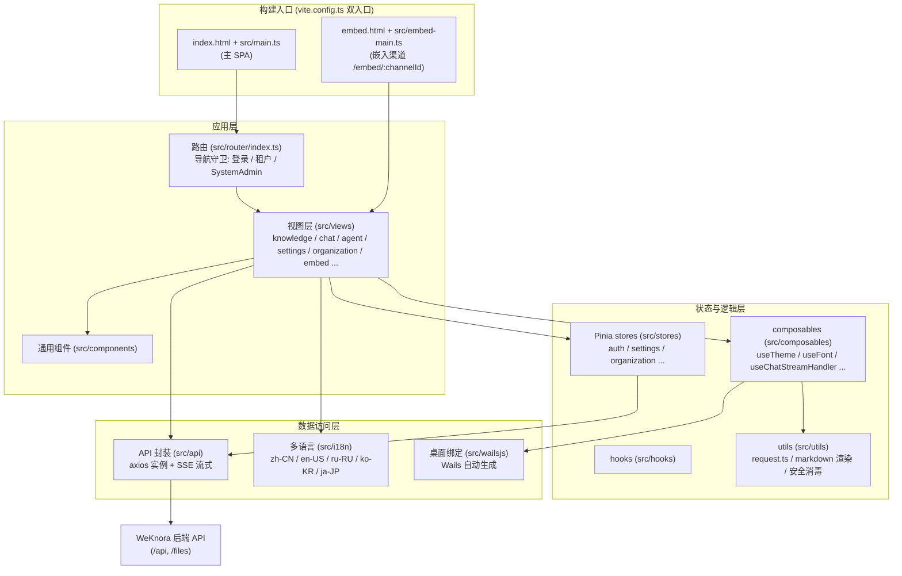

# Web 前端（frontend/）

WeKnora 的 Web 前端是一个基于 **Vue 3 + TypeScript + Vite** 的单页应用（SPA），承载知识库管理、Agent 对话、组织协作、系统设置等全部交互界面。同一份代码同时服务三种形态：

1. **标准 Web 部署**：Vite 构建产物由 nginx 容器托管，`/api` 反向代理到后端；
2. **网页嵌入（Embed）**：独立的轻量入口 `frontend/embed.html` + `frontend/src/embed-main.ts`，供第三方网站以 iframe / 浮窗方式嵌入智能体对话；
3. **桌面端（Wails）**：通过 `frontend/src/wailsjs/` 下的自动生成绑定与桌面进程的 Go 侧通信，支持 `--wails-draggable` 拖拽区域和窗口深浅色同步等桌面功能。

## 技术栈总览

依据 `frontend/package.json`（版本 0.8.2）：

| 类别 | 选型 | 版本 | 说明 |
| --- | --- | --- | --- |
| 框架 | Vue | ^3.5.34 | Composition API，`<script setup>` 风格 |
| 语言 | TypeScript | ~6.0.3 | `vue-tsc` 做类型检查（`npm run type-check`） |
| 构建工具 | Vite | ^7.3.5 | 插件：`@vitejs/plugin-vue`、`@vitejs/plugin-vue-jsx` |
| UI 组件库 | TDesign (tdesign-vue-next) | ^1.19.2 | 配合 `tdesign-icons-vue-next` 0.4.4（版本被 overrides 锁定） |
| 状态管理 | Pinia | ^3.0.4 | 全部 store 位于 `frontend/src/stores/` |
| 路由 | Vue Router | ^4.5.0 | `createWebHistory`，见 `frontend/src/router/index.ts` |
| 多语言 | vue-i18n | ^11.4.2 | zh-CN / en-US / ru-RU / ko-KR / ja-JP |
| HTTP | axios | ^1.16.0 | 统一实例封装于 `frontend/src/utils/request.ts` |
| SSE 流式 | @microsoft/fetch-event-source | ^2.0.1 | 聊天流式回复，见 `frontend/src/api/chat/streame.ts` |
| Markdown 渲染 | marked / marked-katex-extension / katex / highlight.js / mermaid | — | 聊天答案富文本渲染（公式、代码高亮、图表） |
| 安全 | dompurify | ^3.4.11 | v-html 内容统一消毒（`frontend/src/utils/markdownDomPurify.ts`） |
| 文档预览 | docx-preview / @vue-office/pptx / xlsx / papaparse | — | 站内预览 Word / PPT / Excel / CSV |
| 长列表 | vue-virtual-scroller | 2.0.0-beta.8 | 消息列表虚拟滚动 |
| 样式 | Less + CSS Variables | less ^4.6.4 | 主题变量见 `frontend/src/assets/theme/theme.css` |

值得注意的依赖细节：

- `xlsx` 从 SheetJS 官方固定地址安装 `0.20.2`，`package-lock.json` 保留完整性校验值；源码仓库不附带组件包，离线构建需提前准备 npm 缓存；
- `frontend/pnpm-workspace.yaml` 并非声明子包 workspace，只包含 `allowBuilds` 白名单（允许 `@vue-office/pptx`、`esbuild`、`vue-demi` 执行构建脚本），用于 pnpm 的构建脚本安全策略；
- `overrides` / `resolutions` 中禁用了 `lightningcss` 并统一 `esbuild`、`serialize-javascript` 版本。

## 模块结构

### 目录速览

| 目录 | 职责 |
| --- | --- |
| `frontend/src/main.ts` | 主 SPA 入口：安装 TDesign / Pinia / Router / i18n，初始化主题与字体，注册 TDesign 图标离线保护（`installTDesignIconOfflineGuard`，避免运行时请求 `tdesign.gtimg.com`），等待 `router.isReady()` 后再挂载以避免首屏闪烁 |
| `frontend/src/embed-main.ts` | 嵌入入口：独立的 Vue 应用与独立路由（仅 `/embed/:channelId`），挂载 `#embed-app`，使用独立 i18n（`src/i18n/embed.ts`） |
| `frontend/src/views/` | 页面级组件，按业务域分目录（见下方路由表） |
| `frontend/src/components/` | 跨页面通用组件（消息气泡、上传遮罩、命令面板等） |
| `frontend/src/stores/` | Pinia 状态（见下方 store 表） |
| `frontend/src/api/` | 后端 API 封装（见下方 API 模块表） |
| `frontend/src/composables/` | 组合式函数：主题、字体、聊天流处理、引用弹层、Embed 桥接等 |
| `frontend/src/hooks/` | 业务 hook（如 `useKnowledgeBase`） |
| `frontend/src/utils/` | 工具集：axios 实例、markdown 渲染管线、DOMPurify 消毒、Agent 工具展示等 |
| `frontend/src/i18n/` | vue-i18n 配置与语言包 |
| `frontend/src/assets/theme/` | 主题 CSS 变量（light / dark） |
| `frontend/src/wailsjs/` | Wails 桌面端自动生成绑定（勿手改） |
| `frontend/src/directives/`、`frontend/src/types/`、`frontend/src/config/` | 自定义指令、类型定义、配置 |
| `frontend/public/` | 静态资源：`weknora-widget.js`（第三方站点嵌入加载器）、`config.js`（运行时配置占位，容器启动时覆盖）、离线 TDesign 图标 |

## 页面路由清单

路由定义在 `frontend/src/router/index.ts`，使用 `createWebHistory`，所有页面组件均为动态 import（按路由分包懒加载）。

### 顶层路由

| 路径 | 名称 | 组件 | 功能 |
| --- | --- | --- | --- |
| `/` | — | 重定向 | 重定向到 `/platform/knowledge-bases` |
| `/login` | `login` | `src/views/auth/Login.vue` | 登录页（含 OIDC、语言切换、动画背景） |
| `/register` | `registerByInvite` | `src/views/auth/Login.vue` | 邀请注册落地页——复用 Login 组件，挂载时检测 `?token=xxx` 切换到邀请注册模式 |
| `/onboarding/workspace` | `workspaceOnboarding` | `src/views/auth/WorkspaceOnboarding.vue` | 无租户用户的工作空间引导页（创建或等待被邀请），需要登录但不要求已有租户 |
| `/join` | `joinOrganization` | 重定向 | 加入组织邀请链接，把 `?code=` 转成 `invite_code` 参数并跳到 `/platform/organizations` |
| `/knowledgeBase` | `home` | `src/views/knowledge/KnowledgeBase.vue` | 知识库详情（历史遗留顶层路径） |
| `/platform` | `Platform` | `src/views/platform/index.vue` | 平台主布局（左侧菜单 + 路由出口 + 全局设置模态 + 拖拽上传遮罩），默认重定向到知识库列表 |
| `/platform/dev/markdown` | `markdownTest` | `src/views/dev/MarkdownTestPage.vue` | 仅开发模式（`import.meta.env.DEV`）注册的 Markdown 渲染视觉回归测试页 |

### `/platform` 子路由

| 路径 | 名称 | 组件 | 功能 |
| --- | --- | --- | --- |
| `/platform/knowledge-bases` | `knowledgeBaseList` | `src/views/knowledge/KnowledgeBaseList.vue` | 知识库列表：空间侧栏（全部/我的/按组织/收藏/最近）、卡片列表、创建入口；支持按更新时间 / 创建时间 / 名称排序（`components/ResourceSortControl.vue`，智能体列表同样适用） |
| `/platform/knowledge-bases/:kbId` | `knowledgeBaseDetail` | `src/views/knowledge/KnowledgeBase.vue` | 知识库详情：文档列表（可按更新时间 / 创建时间 / 文件名排序，排序在服务端完成，默认创建时间倒序）、上传、解析状态、会话入口、Wiki 等 |
| `/platform/agents` | `agentList` | `src/views/agent/AgentList.vue` | 智能体（Agent）列表与管理，编辑走 `AgentEditorModal.vue`；需部署能力 `agents` |
| `/platform/toolbox/:section?` | `toolbox` | `src/views/toolbox/Toolbox.vue` | 工具箱：`skills`（技能）、`mcp`（MCP 服务）、`browserconnection`（浏览器连接）三个标签页，见下方「工具箱」 |
| `/platform/artifacts` | `artifactLibrary` | `src/views/artifacts/ArtifactLibrary.vue` | 产物库：汇总智能体在各会话中生成的文件；需部署能力 `settings.sandbox` |
| `/platform/creatChat` | `globalCreatChat` | `src/views/creatChat/creatChat.vue` | 新建对话页：推荐问题、选择知识库/Agent/模型后发起会话 |
| `/platform/knowledge-bases/:kbId/creatChat` | `kbCreatChat` | `src/views/creatChat/creatChat.vue` | 从某个知识库上下文发起新对话（同一组件） |
| `/platform/chat/:chatid` | `chat` | `src/views/chat/index.vue` | 会话页：消息流（SSE 流式渲染、骨架屏、虚拟滚动）、引用面板、附件预览 |
| `/platform/organizations` | `organizationList` | `src/views/organization/OrganizationList.vue` | 组织列表：创建/加入组织、成员与共享资源管理（配合 `OrganizationSettingsModal.vue`）；需部署能力 `organizations`，Lite 版始终隐藏。添加成员时按完整空间 ID 精确查找，不再按空间名模糊搜索 |
| `/platform/settings` | `settings` | `src/views/settings/Settings.vue` | 设置中心（全屏模态形态），分区见下方「设置中心的分区与可见性」 |
| `/platform/tenant` | — | 重定向 | 兼容旧路径 → `/platform/settings` |
| `/platform/knowledge-search` | — | 重定向 | 旧全局搜索路径 → 知识库列表并通过 `?cmdk=` 打开全局命令面板（⌘K） |
| `/platform/integrations` | — | 重定向 | → `/platform/settings?section=integration-im`（旧 `?tab=` 会归一成 `integration-<tab>`；视图在 `src/views/integrations/`） |
| `/platform/system`、`/platform/system/settings`、`/platform/system/admins` | `systemSettings` / `systemAdmins` | 重定向 | 系统管理旧路径 → `/platform/settings?section=system-global`，要求 `requiresSystemAdmin`（视图在 `src/views/system/`：`SystemSettings.vue`、`SystemAuditLog.vue`、`PlatformAPIKeys.vue` 等） |
| `/platform/system/queues` | `systemQueues` | 重定向 | → `/platform/settings?section=runtime-queues`（运行时任务队列 `src/views/system/RuntimeQueues.vue`） |

### 独立入口：嵌入页

`/embed/:channelId` 不属于主 SPA 路由，而是由 `frontend/embed.html` + `frontend/src/embed-main.ts` 构成的独立入口（nginx 与 Vite dev server 都将 `/embed/*` fallback 到 `embed.html`），组件为 `src/views/embed/EmbedPage.vue`（配套 `EmbedChatView.vue` / `EmbedChatCore.vue` / `EmbedBotMessage.vue` 等），使用 Embed token 鉴权，供第三方网站 iframe 嵌入。

### 设置中心的分区与可见性

`Settings.vue` 把所有分区按七组呈现，用 `?section=` 定位：

| 分组 | 分区（`section` 值） |
| --- | --- |
| 账户 | `general`（个人偏好）、`userprofile`、`mymemory`（个人记忆）、`envvars`（个人变量） |
| 空间 | `tenant`（空间信息）、`members`（成员）、`chathistory`、`memory`（空间记忆） |
| 模型与运行 | `models`、`ollama`、`weknoracloud` |
| 发布集成 | `integration-im`、`integration-embed`、`integration-api`、`integration-mcpserver`、`integration-cli`、`integration-chrome`、`integration-claw` |
| 数据与扩展 | `vectorstore`、`parser`、`storage`、`sandbox`、`websearch` |
| 系统管理 | `system-global`、`runtime-queues`、`platform-api-keys`、`system-audit-log` |
| 平台 | `system`（版本信息） |

发布集成的标签页由 `frontend/src/config/integrations.ts` 的 `INTEGRATION_TABS` / `INTEGRATION_PREVIEW_ITEMS` 注册，分区值统一为 `integration-<tab>`；旧的 `/platform/integrations?tab=<tab>` 会被归一成对应分区。

自 v0.8.2 起，技能、MCP 服务与浏览器连接不再是设置分区，而是移到[工具箱](#工具箱)。旧书签 `/platform/settings?section=skills|mcp|browserconnection` 会被路由守卫重定向到 `/platform/toolbox/<section>`（`skills` 会保留 `sandboxId` 参数）。

可见性由三套规则决定，且**前端只做收敛展示，后端路由守卫才是权威**：

- **空间角色门槛**：`frontend/src/config/settingsAccess.ts` 的 `SETTINGS_SECTION_MIN_ROLE` 给每个分区规定最低角色。`general` / `models` / `system` / `userprofile` / `tenant` / `members` / `mymemory` / `envvars` 是 `viewer` 起（只读可见），`ollama`、`weknoracloud`、`websearch`、`chathistory`、`memory`、`vectorstore`、`parser`、`storage`、`sandbox` 要求 `admin`；发布集成中的 `integration-api` 要求 `owner`（`INTEGRATION_TAB_MIN_ROLE`）。另有 `SETTINGS_MANAGEMENT_SHORTCUT_MIN_ROLE`：头像菜单里那些标着「管理」的快捷入口门槛更高（成员管理要 `owner`，模型管理要 `admin`），避免把只读页面伪装成管理入口。
- **部署能力**：`frontend/src/config/deploymentCapabilities.ts` 的 `SETTINGS_SECTION_CAPABILITY` / `INTEGRATION_TAB_CAPABILITY` 把分区映射到 `GET /api/v1/system/capabilities` 返回的能力键（如 `settings.sandbox`、`integrations.mcpserver`），能力明确为 `supported: false` 时隐藏入口，见下方「设置导航与部署能力」。
- **系统管理员白名单**：`SYSTEM_ADMIN_SETTINGS_SECTIONS`（`system-global`、`runtime-queues`、`platform-api-keys`、`system-audit-log`）只对系统管理员显示，与空间角色无关，详见[租户、用户与认证授权](../03-features/01-tenant-auth.md)的「系统管理员与平台控制台」。

### 工具箱

左侧菜单的「工具箱」（`/platform/toolbox/:section?`，`src/views/toolbox/Toolbox.vue`）集中管理智能体可用的工具，标签页定义在 `frontend/src/config/toolbox.ts` 的 `TOOLBOX_ITEMS`：

| 标签页（`section`） | 内容 | 可见条件 |
| --- | --- | --- |
| `skills` | 技能管理（复用 `SkillSettings.vue`），可带 `?sandboxId=` 定位沙箱配置 | `admin` 起，且部署支持 `settings.sandbox` |
| `mcp` | MCP 服务（复用 `McpSettings.vue`） | `admin` 起，且部署支持 `settings.mcp` |
| `browserconnection` | 浏览器连接（复用 `BrowserConnectionSettings.vue`），标签上显示连接状态 | `viewer` 起 |

标签页沿用原设置分区的角色与部署能力门槛（`canAccessToolboxSection`）；当前空间没有任何可见标签页时显示空状态。侧栏菜单项悬停时会预览可用工具，浏览器连接状态也会显示在侧栏。浏览器连接的用法见[本地浏览器](09-local-browser.md)。

<Screenshot
  src="/screenshots/toolbox.png"
  caption="工具箱：在一个页面管理技能、MCP 服务和浏览器连接"
  hint="展示左侧菜单「工具箱」入口（含悬停预览的工具图标），以及工具箱页面顶部三个标签页（技能 / MCP 服务 / 浏览器连接，含数量与连接状态），当前停留在技能标签页。" />

### 知识库编辑弹窗的分区

不少配置**不在设置中心，而在知识库编辑弹窗里**（`KnowledgeBaseEditorModal.vue`），因为它们是按库生效的。侧栏分区按五组组织，其中三个只在「编辑已有知识库」时出现：

| 分组 | 分区（`key`） | 备注 |
| --- | --- | --- |
| 基础 | `basic`、`models` | 名称、类型、对话/向量/摘要模型 |
| 处理 | `parser`、`multimodal`、`asr`、`chunking` | 解析引擎与首行表头、图片理解、语音转写、分块参数 |
| 数据 | `vectorStore`、`storage`、`faq` | `faq` 仅 FAQ 类型库；`vectorStore` 绑定后不可改 |
| 集成 | `datasource` | **仅编辑模式**，飞书 / Lark（知识库与云盘）、Notion、Confluence、语雀、钉钉文档、腾讯 IMA、RSS / Atom、GitLab 等同步配在这里，不在全局设置里（连接器定义见 `views/knowledge/settings/DataSourceEditorDialog.vue`） |
| 管理 | `graph`、`advanced`、`share`、`activity` | 知识图谱、高级项、共享到组织、活动流；后两个仅编辑模式 |

### 全局命令面板（⌘K / Ctrl+K）

`components/GlobalCommandPalette.vue` 是除侧栏之外的第二条主要导航通路：

- 搜索知识库、文档与会话，支持把范围收窄到某个知识库（scope chip）后再搜；
- 空状态下展示最近搜索与快捷动作（建库、上传、新建会话等）；
- 右上角的入口打开**检索设置抽屉**（`views/settings/RetrievalSettings.vue`）。这是调 TopK、向量/关键词阈值、重排参数的地方——它**不在设置中心里**，找不到的话就是在这。

### 导航守卫

`router.beforeEach` 中实现了一条完整的鉴权链（`frontend/src/router/index.ts`）：

1. **OIDC 回调放行**：URL hash 含 `oidc_result=` / `oidc_error=` 时直接放行，交由 `App.vue` 消费；
2. **工具箱旧书签**：`/platform/settings?section=skills|mcp|browserconnection` 重定向到 `/platform/toolbox/<section>`；
3. **Lite / 桌面端深链恢复**：Lite 模式硬刷新落在默认首页时，从 `sessionStorage` 恢复上次访问的 `/platform` 子路径（不恢复到组织页）；
4. **会话恢复**：未登录时先用 `localStorage` 中的 `weknora_token` 调 `getCurrentUser()` 恢复会话（同时刷新 memberships，避免角色变更滞后）；
5. **桌面端自动登录**：恢复失败则尝试一次 `autoSetup()`。自 v0.8.2 起它只在原生桌面端生效：先经 Wails 绑定 `GetAutoSetupToken()` 取得本进程的随机凭据，再以 `X-WeKnora-Desktop-Token` 请求头调用 `POST /api/v1/auth/auto-setup`；浏览器中打开的 Lite 版没有该绑定，直接走普通注册 / 登录。失败会在 `localStorage` 打标避免重复尝试；
6. **租户门槛**：已登录但无有效租户 → 跳 `/onboarding/workspace`；
7. **部署能力门槛**：路由 `meta.requiredCapability`（如 `agents`、`organizations`、`settings.sandbox`）不被当前部署支持时，提示后跳回知识库列表；能力探测失败时放行，由后端接口兜底；
8. **SystemAdmin 门槛**：`requiresSystemAdmin` 路由对非系统管理员跳回知识库列表（仅 UI 层拦截，服务端另有强校验）。

## 状态管理（Pinia）

`frontend/src/stores/` 下的 store 与辅助模块：

| 文件 | Store ID / 类型 | 职责 |
| --- | --- | --- |
| `stores/auth.ts` | `useAuthStore` | 认证核心：user / token / refreshToken / tenant / memberships / 角色判断（`hasRole`、`isSystemAdmin`）、Lite 模式标记；登出时级联清理其他 store 的空间级缓存并按用户重载偏好（主题/字体） |
| `stores/chatResources.ts` | `useChatResourcesStore` | 空间级资源缓存（TTL 60s）：知识库、Agent、模型、Web 搜索 provider 列表，供聊天/新建对话选择器复用 |
| `stores/editorResources.ts` | `useEditorResourcesStore` | 编辑器/设置相关资源缓存（TTL 60s）：存储引擎配置与状态、Prompt 模板、解析引擎、系统信息、MCP 服务、Skill、Agent 类型预设、检索配置 |
| `stores/commandPalette.ts` | `useCommandPaletteStore` | 全局命令面板（⌘K / Ctrl+K）开关与查询；最近搜索按 (user, tenant) 作用域存储避免跨账号泄漏 |
| `stores/organization.ts` | `useOrganizationStore` | 组织协作：组织列表、成员、共享知识库/Agent、加入申请与审核、角色升级等全套动作 |
| `stores/organizationState.ts` | 纯函数模块 | 组织列表 upsert / merge、加入审核对成员数影响等纯逻辑（配套单测 `organizationState.test.ts`） |
| `stores/settings.ts` | 设置 store | 会话与 Agent 配置：选中的知识库/文件/标签/MCP/Skill/工具、模型配置、Ollama 配置、Web 搜索开关等 |
| `stores/settingsStorage.ts` | 纯函数模块 | 设置持久化（`WeKnora_settings` key）的读取、克隆与内建 Agent 模式修复（配套 `settingsStorage.test.mjs`） |
| `stores/menu.ts` | `useMenuStore` | 左侧导航菜单结构（新建对话、知识库、Agent 等条目）与 i18n 标题 |
| `stores/knowledge.ts` | `knowledgeStore` | 知识卡片列表与总数（轻量） |
| `stores/ui.ts` | `useUIStore` | 全局 UI 状态：设置模态、知识库编辑模态、手工文档编辑器、侧栏折叠等开关与参数 |
| `stores/uploadConfirm.ts` | 上传确认 store | 上传/URL 导入/手工录入/重新解析前的处理参数确认对话框状态 |
| `stores/versionedRequest.ts` | 纯函数模块 | `createVersionedRequestCoordinator`：带版本号的缓存请求协调器，防止旧响应覆盖新写入（配套 `versionedRequest.test.ts`） |
| `stores/deploymentCapabilities.ts` | `useDeploymentCapabilitiesStore` | 部署能力快照（`GET /api/v1/system/capabilities`），供路由守卫、侧栏、设置和工具箱判断入口是否显示 |
| `stores/modelProviders.ts` | `useModelProvidersStore` | 模型厂商目录缓存（`GET /api/v1/models/providers`，按模型类型加载），模型编辑器与模型卡片统一从这里读厂商信息 |
| `stores/uploadTasks.ts`（+ `uploadQueue.ts` / `uploadTasksCore.ts` / `uploadTasksState.ts`） | `useUploadTasksStore` | 知识文件上传队列：限并发传输、取消 / 重试、轮询解析进度，驱动浮动的上传进度面板；离开知识库页面后上传继续 |
| `stores/browserConnection.ts` | `useBrowserConnectionStore` | 本地浏览器连接状态，供工具箱标签与侧栏状态显示 |
| `stores/sessionActivity.ts` | `useSessionActivityStore` | 侧栏会话的进行中状态 |

## API 封装（frontend/src/api/）

### 请求基座

- **axios 实例**：`frontend/src/utils/request.ts` 创建统一实例（`baseURL` 来自 `frontend/src/utils/api-base.ts` 的 `getApiBaseUrl()`，尊重 Vite `BASE_URL` 以支持子路径反代部署；普通请求超时 30s）。文件上传（`postUpload`）按载荷大小计算超时（`utils/requestTimeouts.ts` 的 `uploadTimeoutMs`，下限 5 分钟，按约 10MB/分钟放大），调大 `MAX_FILE_SIZE_MB` 后大文件不会被 30s 默认值中断；调用方显式传入的 `timeout` 优先。
- **请求拦截器**：自动附加 `Authorization: Bearer <weknora_token>`（Embed 渠道的 `Embed ` token 不被覆盖）、`Accept-Language`（当前 i18n 语言）、`X-Request-ID`（随机串）、`X-Tenant-ID`（跨空间访问，始终携带激活空间 id 以避免切空间后 header 丢失）。
- **响应拦截器**：2xx 解包返回 `data`；401 触发单飞（single-flight）refresh token 刷新，失败队列重放；公开端点（`/auth/login`、`/auth/register`、`/auth/oidc/`、`/auth/auto-setup`、`/auth/invitations/lookup`、`/api/v1/embed/`，即 `PUBLIC_AUTH_PATHS`）的 401 直接抛给页面而不跳登录；Embed 页面永不重定向到 `/login`。
- **HTTP 状态码（`$httpStatus`）**：`get` / `post` / `put` / `patch` / `del` / `postUpload` 的返回类型为 `WithStatus<T>`，JSON 对象或数组响应上挂有不可枚举的 `$httpStatus` 属性，可用来区分成功形状相同的结果（例如系统管理员创建用户：201 表示新建，200 表示幂等重试）。它不出现在对象展开、`JSON.stringify` 与 `Object.keys` 中；Blob、字符串与 SSE 响应不带该属性。
- **SSE 流式**：`frontend/src/api/chat/streame.ts` 基于 `@microsoft/fetch-event-source` 封装 `useStream()`，支持流式输出、加载态、错误态与请求调试元数据；上层由 `frontend/src/composables/useChatStreamHandler.ts` 组织为聊天消息流。聊天流握手返回 401 时，会与 axios 共用 `utils/authRefresh.ts` 的单飞刷新，拿到新 token 后原样重放一次请求，因此 access token 过期不会打断正在发起的对话。

### 模块清单

| 模块 | 职责 |
| --- | --- |
| `api/auth/` | 登录、注册、OIDC、`autoSetup`（仅原生桌面端，携带 Wails 提供的 `X-WeKnora-Desktop-Token`）、`getCurrentUser` 会话恢复 |
| `api/tenant/`（`index` / `members` / `invitations` / `audit-log`） | 租户（工作空间）信息、成员管理、邀请、审计日志 |
| `api/organization/` | 组织 CRUD、成员、共享知识库/Agent、加入申请 |
| `api/knowledge-base/` | 知识库 CRUD 与文件/知识条目管理 |
| `api/chat/`（`index` / `streame` / `steer` / `temporary-attachments`) | 会话 CRUD、标题生成、SSE 流式问答、向运行中的智能体轮次追加消息（`steer`）、临时附件 |
| `api/artifacts.ts` | 产物库列表与删除（`/api/v1/artifacts`） |
| `api/memory.ts` / `api/env-vars.ts` | 空间 / 个人记忆，个人变量 |
| `api/mcp-endpoint.ts` | 内置 MCP Server 端点管理（发布集成 → MCP Server） |
| `api/chat-history.ts` | 聊天历史记录 |
| `api/agent/` | 自定义 Agent CRUD、类型预设、占位符（含内建 Quick Answer / Smart Reasoning id） |
| `api/model/` | 模型配置管理 |
| `api/retrieval.ts` | 租户检索配置 |
| `api/vector-store.ts` / `api/storage-backend.ts` / `api/chunker/` | 向量库、存储后端、分块器配置 |
| `api/datasource/` | 数据源接入 |
| `api/embed/` | 网页嵌入渠道管理（创建渠道、限流等） |
| `api/initialization/` | 系统初始化流程 |
| `api/system/` | 系统信息、存储引擎状态、Prompt 模板、解析引擎等系统级接口 |
| `api/mcp-service.ts` / `api/skill/` | MCP 服务与 Skill 管理 |
| `api/web-search.ts` / `api/web-search-provider.ts` | Web 搜索及 provider 配置 |
| `api/wiki/` | 知识库 Wiki 生成相关接口 |
| `api/message-suggestion.ts` | 推荐问题 |
| `api/user-favorites.ts` | 用户收藏（知识库/Agent 收藏列表） |

## 对话时间线的等待态

RAG 流水线的可视化进度（`views/chat/components/RagPipelineProgress.vue`）在「所有可见步骤都完成」到「模型吐出第一个字」之间会有一段静默期。这段空白由 `utils/rag-pipeline-state.ts` 描述：

- `getRagPipelineWaitKind()` 判定等待类型：检索步骤确实完成过才叫 `model`（正在生成回答）；纯附件问答这类没有检索步骤的轮次给中性的 `preparing`，而不是完全没有反馈；
- `createRagWaitController()` 负责呈现细节：延迟 `RAG_WAIT_REVEAL_DELAY_MS`（250ms）才显示，避免模型很快回答时闪一下；超过 `RAG_WAIT_STALL_DELAY_MS`（60s）转为「停滞」态——SSE 断连时后端不会再发 `is_completed`，没有这个上限进度条会永远宣称「马上就好」；
- 状态变化通过一个常驻的 `aria-live` 区域播报，读屏用户不会因为节点整体替换而漏读。

## 多语言（i18n）

实现于 `frontend/src/i18n/index.ts`，基于 `vue-i18n`（`legacy: false` 的 Composition 模式，`globalInjection: true`）：

- **支持语言**（`frontend/src/i18n/locales/`）：
  - `zh-CN`（简体中文，默认与 fallback）
  - `en-US`（英语）
  - `ru-RU`（俄语）
  - `ko-KR`（韩语）
  - `ja-JP`（日语）
- 语言选择持久化在 `localStorage` 的 `locale` key；axios 拦截器会把当前语言写入 `Accept-Language` 请求头，使后端返回本地化内容。
- 部分翻译内嵌 `<strong>` 标记（经 DOMPurify 消毒后 v-html 渲染），配置了 `warnHtmlMessage: false` 关闭 vue-i18n 的 HTML 告警。
- **Embed 独立 i18n**：访客侧嵌入页使用单独的 `frontend/src/i18n/embed.ts`（由 `embed-main.ts` 加载），管理端「网页嵌入」文案仍在主语言包中；`frontend/src/i18n/locales/embed/index.ts` 统一 re-export 语言归一化助手（支持从 URL 参数同步 embed 语言）。
- **审计与裁剪工具**：语言包体量大、容易积累无人引用的死键或漏翻的新键，因此配套了三个脚本（`frontend/package.json`）：

  | 命令 | 作用 |
  | --- | --- |
  | `npm run check-i18n` | 跑 `src/i18n/localeKeyAudit.test.ts`，校验各语言包键集一致、无缺失引用 |
  | `npm run scan-i18n-gaps` | 扫描源码中实际用到的 key 与语言包对比，报告未定义与未使用的键 |
  | `npm run regenerate-i18n-locales` | 按扫描结果重新生成裁剪后的语言包 |

  审计日志的动作名走单独的注册表（`i18n/auditActionRegistry.ts` + `auditActionLocaleDefaults.ts`），新增审计动作时在注册表补一条即可，避免裁剪工具把它们当成未引用的死键删掉。

## 主题与外观

- **主题模式**：`frontend/src/composables/useTheme.ts` 提供 `light | dark | system` 三态。生效方式是在 `document.documentElement` 上设置 `theme-mode` 属性；`system` 模式监听 `prefers-color-scheme` 媒体查询自动跟随。
- **CSS 变量**：`frontend/src/assets/theme/theme.css` 以 TDesign token 体系（`--td-brand-color-*`、`--td-bg-color-*`、`--td-text-color-*`、字体/圆角/阴影等）分别定义 `:root[theme-mode="light"]` 与 `:root[theme-mode="dark"]` 两套变量，品牌色为绿色系；组件样式一律引用变量实现一键换肤。
- **偏好持久化**：主题与字体偏好通过 `frontend/src/composables/preferenceStorage.ts` 按用户 id 命名空间存入 `localStorage`，登录/登出/切换账号时由 `reloadThemeFromStorage()` / `reloadFontFromStorage()` 重载（在 `stores/auth.ts` 中触发）。
- **字体**：`frontend/src/composables/useFont.ts` 管理界面字体选择，`main.ts` 启动时 `initTheme()` + `initFont()`。
- **桌面端同步**：`useTheme.ts` 中的 `syncWailsNativeChrome()` 调用 Wails runtime 的 `WindowSetDarkTheme / WindowSetLightTheme / WindowSetBackgroundColour`，让原生窗口底色与网页主题一致，减轻刷新白闪。

## 构建与部署

### 开发与构建（vite.config.ts）

`frontend/vite.config.ts` 要点：

- **双入口构建**：`rollupOptions.input` 同时构建 `index.html`（主 SPA）与 `embed.html`（嵌入页）；开发环境用自定义插件 `embedHtmlDevFallback()` 把 `/embed/:channelId` 请求改写到 `/embed.html`，与 nginx 行为对齐。
- **代码分包**：`manualChunks` 将 mermaid/dagre/cytoscape、marked/katex、highlight.js 分别拆为 `vendor-mermaid`、`vendor-markdown`、`vendor-highlight`；embed 入口通过 `modulePreload.resolveDependencies` 过滤重型聊天 chunk，保证嵌入页首屏只加载 token 交换所需代码。
- **版本注入**：`__FRONTEND_VERSION__`（package.json version）与 `__FRONTEND_COMMIT__`（`VITE_FRONTEND_COMMIT` / `GITHUB_SHA` / `git rev-parse`）编译期注入。
- **开发代理**：dev server（端口 5173）与 preview（端口 4173）都把 `/api`、`/files`、`/mcp/` 代理到 `VITE_DEV_PROXY_TARGET`（或 `FRONTEND_BACKEND_URL`，默认 `http://localhost:8080`）。`/api` 开启 WebSocket 转发（沙箱终端等），超时放宽到 180s；`/mcp/` 为内置 MCP Server 的 Streamable HTTP 长连接，超时 1 小时。
- **别名**：`@` → `frontend/src`；并对 `@vue-office/pptx` 做入口文件探测修正。
- 常用脚本：`npm run dev` / `npm run build` / `npm run preview`（用生产构建产物本地起服务，最接近发布镜像的验证环境）/ `npm run type-check` / `npm run test`（tsx --test）。

### 生产镜像（Dockerfile + nginx）

`frontend/Dockerfile`：

- 自 v0.8.2 起为两阶段构建：digest 锁定的 `node:24-bookworm-slim` 以 `$BUILDPLATFORM` 执行 `npm ci` + `npm run build`，再把 `dist/` 拷贝到运行层。构建时不再需要宿主机安装 Node / npm，也无需预先生成 `dist/`（`scripts/build_frontend_dist.sh` 仍供 Lite / 桌面打包使用）；
- 运行层基础镜像固定为 digest 锁定的 `nginx:1.30.3-alpine`（注释明确禁止改回浮动 tag——更新的 Alpine 3.24+ 在 CentOS 7 旧内核上无法启动，曾导致 v0.7.0 故障）；
- `nginx.conf` 作为模板放入 `/etc/nginx/templates/default.conf.template`；`/api/`、`/mcp/` 与技能上传共用的代理参数在 `nginx-api-proxy.conf`（原样拷贝为 `/etc/nginx/api-proxy.conf`），http 级片段在 `nginx-http.conf`（去掉查询串的 `api_no_query` 日志格式）。暴露 80 端口，入口为 `docker-entrypoint.sh`。

镜像构建参数：

| 名称 | 类型 | 默认值 | 说明 |
| --- | --- | --- | --- |
| `NPM_REGISTRY` | build-arg | 空 | `npm ci` 使用的镜像源，空则用 npm 默认源 |
| `NODE_MAX_OLD_SPACE_SIZE` | build-arg | `4096` | 构建阶段 Node 堆上限（MB），避免 Vite 构建 OOM |
| `VITE_FRONTEND_COMMIT` | build-arg | `unknown` | 注入页面的前端 commit；在 `npm ci` 之后声明，改动它不会使依赖层缓存失效 |

`frontend/docker-entrypoint.sh`（运行时配置注入）：

1. 生成 `/usr/share/nginx/html/config.js`，把 `MAX_FILE_SIZE_MB`、`MAX_SKILL_BUNDLE_SIZE_MB` 与 `DEFAULT_LOCALE` 写入 `window.__RUNTIME_CONFIG__` 供前端运行时读取；
2. 用 `envsubst` 渲染 nginx 模板；
3. 前台启动 nginx。

| 名称 | 类型 | 默认值 | 说明 |
| --- | --- | --- | --- |
| `MAX_FILE_SIZE_MB` | 整数（MB） | `50` | 全站请求体上限与前端上传大小上限 |
| `MAX_SKILL_BUNDLE_SIZE_MB` | 整数（MB） | `256` | 只作用于技能 ZIP 上传路由；小于 `MAX_FILE_SIZE_MB` 时抬到该值，最大 512 |
| `DEFAULT_LOCALE` | 字符串 | 空 | 默认界面语言，仅允许 `zh-CN` / `en-US` / `ru-RU` / `ko-KR` / `ja-JP`，其他值被丢弃 |
| `APP_HOST` | 字符串 | `app` | 后端主机名 |
| `APP_PORT` | 整数 | `8080` | 后端端口 |
| `APP_SCHEME` | 字符串 | `http` | 后端协议，远程 HTTPS 后端可设 `https` |

`frontend/nginx.conf` 关键行为：

- **SPA fallback**：`/` 下 `try_files ... /index.html`，且 `index.html` 设置 `no-cache`（避免升级后用户拿到旧版本）；带 hash 的 `/assets/*` 设置一年 immutable 缓存；
- **API 代理**：`/api/` 与 `/files` 反代到 `${APP_SCHEME}://${APP_HOST}:${APP_PORT}`，`/api/` 针对 SSE 关闭 `proxy_buffering` / 缓存 / 分块编码，读写超时放宽到 3600s，并配置 3 次 upstream 重试；
- **内置 MCP Server `/mcp/`**：原路径反代到后端，代理参数与 `/api/` 相同，外部 MCP 客户端可直接用网站域名连接 `/mcp/<endpoint_id>`；
- **WebSocket 通道**：`/api/v1/sessions/<id>/sandbox/(terminal|desktop)`（沙箱终端与图形桌面）和 `/api/v1/local-browser/extension`（BrowserSkill 浏览器扩展接入）单独开启 Upgrade，访问日志去掉查询串以免记录握手票据；集群内部路径 `/api/v1/local-browser/internal` 直接返回 404；
- **技能包上传**：`/api/v1/skills/catalog` 与 `/api/v1/sandbox-configs/<id>/skills` 两条集合路由单独使用 `MAX_SKILL_BUNDLE_SIZE`，其他上传端点仍受 `MAX_FILE_SIZE` 限制；
- **资源短链 `/r/`**：`location ^~ /r/` 同样反代到后端。IM 渠道把 `resource://` 图片改写成 `<APP_EXTERNAL_URL>/r/<token>`，缺这段配置时请求会落进 SPA fallback，IM 侧图片显示为空白（详见 [IM 集成](../03-features/12-im-integration.md)）；
- **嵌入页**：`/embed/*` 返回 `embed.html`（独立 location，不继承主站的 `X-Frame-Options: SAMEORIGIN`）。nginx 先经内部子请求 `/_embed-frame-policy` 向后端 `GET /api/v1/embed-frame-policy` 查询该渠道允许的宿主来源，并把返回的 `Content-Security-Policy` 加到响应上；渠道不存在、已停用、没有允许的宿主来源或后端不可达时拒绝加载。自定义反向代理需要保留这一步，否则宿主来源白名单不生效。`/weknora-widget.js` 是给第三方站点的静态加载器；文件头部另附可选的独立 embed 子域 server 块示例；
- 启用 gzip（注释记录了实测收益：低带宽下首屏从 25s 降到 3-5s）及一组安全响应头（`X-Frame-Options`、`X-Content-Type-Options`、`Referrer-Policy` 等，在各 location 内重复声明以规避 nginx `add_header` 不继承的问题）。

## 桌面端（Wails）关联

`frontend/src/wailsjs/` 是 Wails 框架自动生成的绑定代码（文件头标注 "automatically generated. DO NOT EDIT"）：

- `wailsjs/go/main/App.d.ts` / `App.js`：Go 侧 `App` 结构体方法的 JS 绑定，包括 `CheckForUpdates` / `AutoCheckForUpdates`（桌面更新检查）、`GetAPIBaseURL` / `GetAPILanBaseURL`、桌面内置 HTTP 服务的端口与对外监听设置（`GetDesktopHTTPPortSetting`、`SetDesktopHTTPBindPublicSetting` 等），以及 `GetAutoSetupToken`（返回桌面进程启动时生成的随机凭据，前端据此调用 `auto-setup` 免登录，见上文导航守卫）；
- `wailsjs/runtime/`：Wails runtime API（窗口控制等），前端在浏览器环境下调用会被 try/catch 安静降级（如 `useTheme.ts`）。

桌面应用的窗口内容就是这份前端代码，桌面端自动登录、深链恢复与 `--wails-draggable` 标记的可拖拽标题区都是为桌面形态准备的适配。

## 设置导航与部署能力

设置入口按任务分组，发布集成中包含 IM、网页嵌入、API、MCP Server、CLI、Chrome 插件、Claw Skill 等接入页；沙箱配置、个人变量与空间 / 个人记忆在设置中心各有管理界面；技能、MCP 服务与浏览器连接在工具箱。新增入口应复用 `frontend/src/config/integrations.ts`、`frontend/src/config/toolbox.ts`、`frontend/src/config/settingsAccess.ts` 等现有注册信息，并同时检查侧栏分组。

`GET /api/v1/system/capabilities` 返回 edition 及能力 supported/reason。前端据实际部署能力隐藏或禁用入口（路由守卫、左侧菜单、设置分区、工具箱标签页都读同一份快照）：能力探测失败或旧版后端缺少某个键时默认保持可见；`organizations` 在 Lite 版始终隐藏；`settings.sandbox.docker` / `settings.sandbox.host` 只有后端明确返回 `supported: true` 才显示。前端可见性只改善操作体验，后端路由继续执行角色与能力检查。接口见[系统 API](../04-api/02-api-system.md)。
