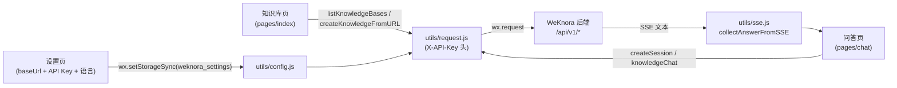

# 微信小程序客户端

微信小程序提供移动端知识库问答和网页导入入口，连接已有 WeKnora 服务。源码位于 `miniprogram/`。使用时先配置 API 地址和 API Key，再选择知识库：

- 将网页 URL 导入所选知识库。
- 围绕所选知识库发起问答。

## 后端地址与认证配置

小程序**不在代码中硬编码后端地址**，一切连接信息由用户在「设置」页填写，存储于 `wx.setStorageSync` 的本地存储键 `weknora_settings` 中，结构包含四个字段：

```js
{
  baseUrl: "http://localhost:8080",   // app.js onLaunch 写入的默认值
  apiKey: "",
  selectedKnowledgeBaseId: "",
  locale: "zh"                        // 界面语言：zh | en
}
```

- **默认值**：`miniprogram/app.js` 在 `onLaunch` 中若发现本地无设置，会写入默认 `baseUrl: "http://localhost:8080"`、空 `apiKey` 与 `locale: "zh"`。默认值仅便于本地开发，实际使用必须在设置页改为真实地址。
- **读写与规范化**：`miniprogram/utils/config.js` 提供 `getSettings()` / `saveSettings()`，通过 `normalizeBaseUrl()` 去除首尾空白与末尾 `/`，通过 `normalizeLocale()` 把非 `en` 的值一律归为 `zh`。
- **认证方式为 API Key**：`miniprogram/utils/request.js` 中所有请求统一携带请求头：
  - `X-API-Key: <用户填写的 API Key>`（在 WeKnora「设置 → 发布集成 → API 集成」获取，形如 `sk-...`）；
  - `X-Request-ID: mp-<时间戳>-<随机串>`（便于服务端追踪）；
  - `Content-Type: application/json`。
- **前置校验**：`baseUrl` 或 `apiKey` 任一缺失时，请求会直接以错误 Promise 拒绝，提示按当前语言显示（如「请先配置 WeKnora API 地址。」/「请先配置 WeKnora API Key。」）；`pages/index/index.js` 的 `onShow` 也会据此显示引导用户去设置页的提示。
- **AppID 配置**：复制 `miniprogram/project.private.config.json.example` 为 `project.private.config.json` 并填入自己的 AppID（示例文件内容为 `{"appid": "your-wechat-mini-program-appid"}`）。注意：当前共享的 `project.config.json` 中带有一个 `appid` 字段，使用自己的小程序时以私有配置覆盖它。

调用到的后端接口（均定义在 `miniprogram/utils/request.js`）：

| 函数 | 方法与路径 |
| --- | --- |
| `listKnowledgeBases()` | `GET /api/v1/knowledge-bases` |
| `createKnowledgeFromURL(kbId, url, enableMultimodel)` | `POST /api/v1/knowledge-bases/{kbId}/knowledge/url` |
| `createSession(kbId)` | `POST /api/v1/sessions` |
| `knowledgeChat(sessionId, query, kbId)` | `POST /api/v1/knowledge-chat/{sessionId}` |

## 中英文与本地设置

自 v0.8.2 起，设置页可选择「中文」或「English」，默认中文；选择以 `locale`（`zh` / `en`）保存在本地设置，重启后保留。切换后页面文案、导航栏标题（`wx.setNavigationBarTitle`）和底部 tab 文案（`wx.setTabBarItem`）立即更新；底部 tab 同时带有图标（`assets/tab/*.png`）。词条集中在 `utils/i18n.js`，新增页面应复用该模块。

聊天页目前在请求完成后解析整段 SSE 文本并累计 `answer` 片段，不做逐块实时渲染。正式发布需把 API 域名加入 request 合法域名。

## 构建与发布流程

小程序无需编译步骤（原生开发、无构建工具链），直接用微信开发者工具（WeChat DevTools）打开即可：

1. **导入项目**：在微信开发者工具中选择「导入项目」，目录指向仓库的 `miniprogram/`。工具会读取 `project.config.json`（项目名 "WeKnora Mini Program"）。
2. **配置 AppID**：复制 `miniprogram/project.private.config.json.example` 为 `project.private.config.json`，将 `appid` 替换为实际小程序 AppID。`project.private.config.json` 属于个人私有配置，已被 `.gitignore` 忽略，不应提交。
3. **配置后端连接**：运行后进入「设置」tab，填写 API Base URL（如 `https://weknora.example.com`）与 WeKnora API Key（「设置 → 发布集成 → API 集成」中获取），按需切换界面语言，保存。
4. **本地调试注意**：`project.config.json` 开启了 `urlCheck: true`，开发者工具默认会拦截 `localhost` 等非合法域名请求。本地测试可在 DevTools 中勾选「不校验合法域名」，或通过 HTTPS 开发域名暴露 WeKnora 服务。
5. **发布**：正式发布前，需在微信公众平台的小程序管理后台，把 WeKnora API 域名（必须为 HTTPS）加入 request 合法域名（request 域名白名单）；随后在开发者工具中点击「上传」提交代码，再在管理后台提交审核并发布。

### 测试

`miniprogram/package.json` 定义了唯一脚本：

```bash
cd miniprogram
npm test    # 实际执行 node --test ../tests/miniprogram/*.test.js
```

即使用 Node.js 内置 test runner 运行仓库 `tests/miniprogram/miniprogram.test.js` 中的单元测试（覆盖 SSE 解析、地址规范化、中英文切换、请求头与请求体、知识库页加载逻辑），无需安装任何依赖。

### 基础库兼容

页面与 `utils/` 代码不使用可选链 `?.` 和空值合并 `??`：部分基础库版本不支持这两种语法，会导致页面白屏（v0.8.2 修复了知识库页因此空白的问题）。WXML 中的文案绑定也保持扁平字段，便于在各版本基础库中渲染。修改代码时请保持这一约束。

## 实现参考

### 技术栈

该客户端是**原生微信小程序**（native Mini Program），未使用 Taro / uni-app / mpvue 等跨端框架，也没有任何 npm 运行时依赖：

- `miniprogram/app.js` — 标准的 `App({...})` 入口，`onLaunch` 时向本地存储写入默认设置；
- `miniprogram/app.json` — 标准小程序全局配置（`pages`、`window`、`tabBar`）；
- `miniprogram/app.wxss` — 全局样式；页面均为 `js / wxml / wxss / json` 四件套；
- `miniprogram/package.json` — 包名 `weknora-miniprogram`（version `0.1.0`），`description` 为 "WeChat Mini Program plugin for WeKnora"，**没有 `dependencies`**，仅有一个测试脚本（见下文「测试」）；
- `miniprogram/project.config.json` — `compileType: "miniprogram"`，`libVersion: "latest"`（基础库使用最新版），编译选项开启 `es6`、`enhance`、`postcss`、`minified`、`minifyWXSS`、`minifyWXML`，并开启 `urlCheck: true`（合法域名校验）。该文件目前带有 `appid` 字段，自己的 AppID 通过私有配置文件提供（见「构建与发布流程」）。

全局窗口样式：导航栏标题 `WeKnora`，背景色 `#0d3b2a`（深绿），文字白色。

### 页面清单

`miniprogram/app.json` 中注册了 3 个页面，且三者同时构成底部 `tabBar`（选中色 `#07c05f`，每项带普通 / 选中两套图标）。tab 文案默认为中文，运行时按语言切换：

| 页面路径 | tabBar 文案（中文 / English） | 功能 |
| --- | --- | --- |
| `pages/index/index` | 知识库 / Knowledge | 首页。检测是否已配置 baseUrl / API Key，未配置时提示并可一键跳转设置页；调用 `GET /api/v1/knowledge-bases` 加载知识库列表，通过 `picker` 或列表点选知识库（选择结果持久化到本地存储）；输入网页 URL 后调用 `POST /api/v1/knowledge-bases/{id}/knowledge/url` 将该 URL 导入选中知识库（`enable_multimodel` 固定为 `false`） |
| `pages/chat/chat` | 问答 / Chat | 知识问答页。首次提问时通过 `POST /api/v1/sessions` 懒创建会话（携带选中的 `knowledge_base_id`），随后调用 `POST /api/v1/knowledge-chat/{sessionId}` 提问；返回体为 SSE 文本，客户端用 `utils/sse.js` 解析并拼接 `response_type === "answer"` 的分片后整体展示（解析失败则回退展示原始响应） |
| `pages/settings/settings` | 设置 / Settings | 连接配置页。填写 API Base URL 与 API Key（密码输入框），选择界面语言，保存到本地存储 `weknora_settings` |

### utils/ 工具模块

| 文件 | 职责 |
| --- | --- |
| `miniprogram/utils/config.js` | 设置的持久化层：定义存储键 `STORAGE_KEY = "weknora_settings"`，提供 `getSettings()`、`saveSettings()`（合并式更新）、`normalizeBaseUrl()`（trim 并去除末尾斜杠）与 `normalizeLocale()` |
| `miniprogram/utils/i18n.js` | 中英文词条表与 `t()`、`getLocale()` / `setLocale()`、`applyTabBar()`（更新底部 tab 文案与图标）、`applyNavTitle()`（更新导航栏标题） |
| `miniprogram/utils/request.js` | 基于 `wx.request` 的 Promise 化 HTTP 封装：拼接 `baseUrl + path`、注入 `X-API-Key` / `X-Request-ID` 头、统一 2xx 判定与错误消息提取（优先 `error.message`，其次 `message`，兜底 `HTTP <status>`）；并导出上表 4 个业务 API 函数 |
| `miniprogram/utils/sse.js` | Server-Sent Events 文本解析器：`parseSSE(raw)` 按空行切分事件块、解析 `event:` / `data:` 行；`collectAnswerFromSSE(raw)` 将各事件的 `data` 按 JSON 解析并累加 `response_type === "answer"` 的 `content`，得到最终答案文本。注意小程序端**不做流式渲染**，而是等 `wx.request` 拿到完整 SSE 文本后一次性解析展示 |

### 数据流概览


