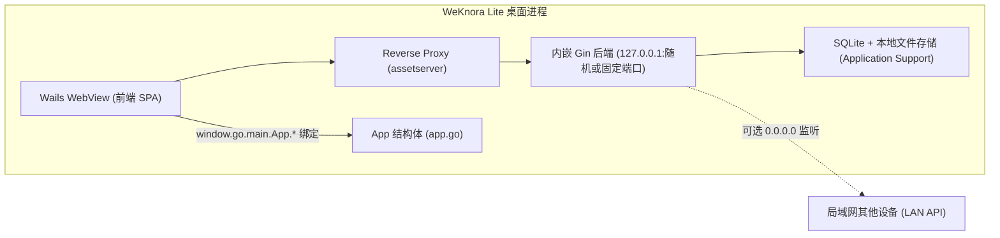

# 桌面客户端（WeKnora Lite Desktop）

::: warning 尚未正式发布
桌面应用目前没有随 Release 提供安装包，需按[安装部署](../01-getting-started/02-installation.md)自行构建。
:::

WeKnora Lite 桌面应用基于 [Wails v2](https://wails.io)，在桌面进程中运行 Go 后端，使用 SQLite 和本地文件存储。启动后可管理知识库并进行检索问答，无需 Docker 或外部数据库。源码位于 `cmd/desktop/`，基础能力与[单二进制 Lite](../01-getting-started/02-installation.md)一致；桌面版另外提供免登录启动，以及在 macOS 上运行智能体命令的[本机沙箱](../03-features/22-skills-sandbox.md#lite-host)。

## 总体架构 {#_1-总体架构}

桌面应用由三部分组成（均在同一进程内）：

1. **内嵌后端**：`cmd/desktop/main.go` 中通过 `container.BuildContainer()` 构建与服务器版相同的依赖注入容器，在独立 goroutine 中启动 `http.Server`（Gin router）。
2. **Wails 窗口（WebView）**：`wails.Run()` 创建原生窗口，前端页面通过 `assetserver.Options.Handler` 挂载的 **反向代理**（`httputil.NewSingleHostReverseProxy`）转发到内嵌后端，因此 WebView 加载的就是后端 `./web` 目录提供的 SPA。
3. **Go 绑定层**：`cmd/desktop/app.go` 中的 `App` 结构体通过 `Bind` 暴露给前端 JS（`window.go.main.App.*`）。



### 端口与监听

由 `main.go` 中的 `desktopBackendListenAddr()` 决定：

- 默认绑定 `127.0.0.1`，端口取 `desktop-prefs.json` 中保存的 `http_port`；未设置（为 0）时使用 `:0` 随机空闲端口，并带指数退避重试（`listenWithRetry`，最多 10 次）。
- 若偏好项 `http_bind_public` 为 `true`，则改为监听 `0.0.0.0`，并通过 `desktopPreferredLANIPv4()` 探测一个非回环 IPv4（优先私网地址），拼出 `http://<LAN-IP>:<port>/api/v1` 供局域网内其他设备调用。
- 反向代理与 WebView 的 API 调用始终走回环地址 `http://127.0.0.1:<port>`，不会以 `0.0.0.0` 作为拨号目标。

### 数据存储位置（macOS .app 运行时）

`main.go` 的 `configureDesktopStorage()` 在检测到从 `.app/Contents/MacOS` 运行时：

- 数据目录定为 `~/Library/Application Support/WeKnora Lite/`（名称取自 .app bundle 名）。
- SQLite 数据库：`.../data/weknora.db`（通过设置 `DB_PATH` 环境变量注入）。
- 本地文件存储：`.../data/files`（`LOCAL_STORAGE_BASE_DIR`）。
- `migrateLegacyDesktopData()` 会把旧版存放在 `.app/Contents/Resources/data` 里的数据一次性迁移到 Application Support。
- 工作目录会切到 `.app/Contents/Resources`，以便读取打包进去的 `config/config.yaml`、`.env`、`migrations/sqlite` 与 `web/` 前端资源。

## 主要源码文件 {#_2-主要源码文件}

| 文件 | 作用 |
|------|------|
| `cmd/desktop/main.go` | 主入口（`//go:build !bindings`）：启动内嵌 Gin 后端、构建 macOS 菜单、配置 Wails 窗口与反向代理、注入 DomReady JS |
| `cmd/desktop/main_bindings.go` | 绑定生成入口（`//go:build bindings`）：`wails build` 生成前端绑定阶段用 `-tags bindings` 单独编译，只 `Bind` 不启动 Gin/数据库 |
| `cmd/desktop/app.go` | `App` 结构体与全部 Wails 绑定方法 |
| `cmd/desktop/prefs.go` | 桌面偏好设置的读写（`desktop-prefs.json`），含本机沙箱的已批准项目目录 |
| `cmd/desktop/signing_key.go` | 首次启动生成并持久化签名密钥 |
| `cmd/desktop/update.go` | 基于 GitHub Releases 的检查更新 / 下载 / 安装重启逻辑 |
| `cmd/desktop/wails.json` | Wails 构建配置 |
| `cmd/desktop/build/` | 打包资源：`appicon.png`（应用图标）、`darwin/Info.plist`（macOS bundle 模板）、`windows/installer/project.nsi`（Windows NSIS 安装器模板） |

## 窗口配置与前端注入 {#_3-窗口配置与前端注入}

`wails.Run(&options.App{...})` 的关键配置（见 `cmd/desktop/main.go`）：

- 标题 `WeKnora Lite`，初始尺寸 **1280 × 800**，可调整大小，启动即显示。
- `AssetServer.Handler` 使用反向代理指向内嵌后端 —— **前端资源并非 Go embed，而是后端 `./web` 目录（打包在 `.app/Contents/Resources/web`）提供的 SPA**。
- macOS 专属：`mac.TitleBarHiddenInset()` 隐藏式标题栏，WebView 不透明。
- 应用菜单：`About WeKnora`（含 "Open GitHub" 按钮，指向 `https://github.com/Tencent/WeKnora`）、`Check for Updates...`、`Quit`（Cmd+Q）、标准 Edit 菜单、`View > Reload`（Cmd+R，向前端发送 `app:reload` 事件）。

`OnDomReady` 时向 WebView 注入三段 JS：

1. `wailsThemeSyncJS`：按 `localStorage` 的 `WeKnora_theme` 同步深浅色主题与窗口背景色。
2. `dragHandlerJS`：自定义窗口拖拽处理（绕过 Wails 的 CSS 变量拖拽检测，改用 `el.closest()` DOM 遍历 + 顶部 38px 标题栏区域判定，通过 WKWebView 消息桥发送 `drag`）；同时拦截外部 `http(s)` 链接与 `window.open`，改用系统浏览器打开（`BrowserOpenURL`）。
3. 注入 `window.__WEKNORA_API_BASE__`（真实 API 根路径 `http://127.0.0.1:<port>/api/v1`）以及可选的 `window.__WEKNORA_API_LAN_BASE__`（LAN 访问地址）。

## Wails 绑定方法（前端可调用） {#_4-wails-绑定方法-前端可调用}

`App` 结构体（`cmd/desktop/app.go`）通过 `Bind` 暴露，前端以 `window.go.main.App.<方法名>` 调用，生成的 TypeScript 绑定位于 `frontend/src/wailsjs/go/main/App.d.ts`：

| 方法 | 签名（JS 侧） | 说明 |
|------|--------------|------|
| `GetAPIBaseURL` | `(): Promise<string>` | 返回本地 REST API 根地址，如 `http://127.0.0.1:PORT/api/v1`（WebView 的 `window.location.origin` 不是 API 主机，需用此值） |
| `GetAPILanBaseURL` | `(): Promise<string>` | 返回建议给局域网其他设备使用的 API 地址（`…/api/v1`）；非 bind-public 模式或 IP 探测失败时为空 |
| `GetDesktopHTTPPortSetting` | `(): Promise<number>` | 读取已保存的本地 API 端口偏好（0 = 每次启动随机端口） |
| `SetDesktopHTTPPortSetting` | `(port: number): Promise<void>` | 保存端口偏好；需重启应用生效 |
| `GetDesktopHTTPBindPublicSetting` | `(): Promise<boolean>` | 读取是否监听所有网卡（`0.0.0.0`）的偏好 |
| `SetDesktopHTTPBindPublicSetting` | `(v: boolean): Promise<void>` | 保存 LAN/公开监听偏好；需重启应用生效 |
| `GetDesktopListenPublicActive` | `(): Promise<boolean>` | 当前会话是否**实际**在所有网卡上监听（运行时状态，而非保存的偏好） |
| `CheckForUpdates` | `(): Promise<void>` | 手动触发更新检查（有"已是最新"等对话框反馈） |
| `AutoCheckForUpdates` | `(): Promise<void>` | 静默检查更新并自动后台下载 |
| `GetAutoSetupToken` | `(): Promise<string>` | 返回本次进程的免登录凭据，前端用它调用 `POST /api/v1/auth/auto-setup` |
| `PickProjectDir` | `(): Promise<string>` | 打开系统目录选择框，把选中的目录加入本机沙箱已批准列表并返回；取消时为空 |
| `GetProjectDirs` | `(): Promise<string[]>` | 读取已批准的项目目录 |
| `RemoveProjectDir` | `(dir: string): Promise<void>` | 从已批准列表移除一个目录 |
| `GetApprovalMode` / `SetApprovalMode` | `(): Promise<string>` / `(mode: string): Promise<void>` | 读写本机沙箱审批模式；当前只接受 `auto` |

## 偏好设置存储（cmd/desktop/prefs.go） {#_5-偏好设置存储-cmd-desktop-prefs-go}

偏好保存为 JSON 文件 `desktop-prefs.json`，路径为 `os.UserConfigDir()/WeKnora Lite/desktop-prefs.json`：

- macOS：`~/Library/Application Support/WeKnora Lite/desktop-prefs.json`
- Windows：`%AppData%\WeKnora Lite\desktop-prefs.json`
- Linux：`~/.config/WeKnora Lite/desktop-prefs.json`

文件权限 `0600`，字段如下：

| 字段 | 类型 | 默认值 | 说明 |
|------|------|--------|------|
| `http_port` | int | 0 | 内嵌 API 服务监听端口；0 或非法值（超出 1–65535）表示每次启动使用随机空闲端口 |
| `http_bind_public` | bool | false | 是否监听 `0.0.0.0`（允许局域网/公网访问内嵌 API） |
| `project_dirs` | string[] | 空 | 通过系统目录选择框批准的本机项目目录（绝对路径）；只有列表中的目录能绑定到会话 |
| `approval_mode` | string | `auto` | 本机沙箱审批模式；未知值按 `auto` 处理，`ask`、`full` 尚未提供，保存时被拒绝 |

读写入口：`LoadDesktopPrefsHTTPPort()` / `LoadDesktopHTTPBindPublic()` / `SaveDesktopHTTPPortPreference()` / `SaveDesktopHTTPBindPublicPreference()`，以及本机沙箱用的 `LoadProjectDirs()` / `LoadApprovalMode()`，读取失败或解析失败时静默回退为零值。`project_dirs` 只能通过目录选择框（`PickProjectDir` 或 `POST /api/v1/system/host-project-dir`）追加，手工输入的路径不会被当作授权。

## 免登录启动与签名密钥

桌面版启动时不需要注册或登录：

- 每次启动生成一个随机凭据，只通过 Wails 绑定 `GetAutoSetupToken` 交给内置前端。前端在请求头 `X-WeKnora-Desktop-Token` 中携带它调用 `POST /api/v1/auth/auto-setup`，首次调用创建默认用户 `admin@weknora.local` 和空间，之后直接签发登录令牌。没有该凭据的请求（包括局域网内的其他设备和普通浏览器）会被拒绝。
- 未配置有效的 `SYSTEM_SIGNING_KEY`（或非默认值的 `SYSTEM_AES_KEY`）时，首次启动在偏好目录生成 `signing.key`（权限 `0600`）并作为 `SYSTEM_SIGNING_KEY` 使用，供文件预签名链接、网页嵌入会话等签名，重启后仍然有效。它只用于签名，不会替换加密已存凭据的 AES 密钥。

## 自动更新机制（cmd/desktop/update.go） {#_6-自动更新机制-cmd-desktop-update-go}

`checkUpdate(ctx, currentVersion, showUpToDate, autoDownload)` 在 goroutine 中执行：

1. **版本来源**：`desktopAboutVersion()` 优先使用构建时 ldflags 注入的 `handler.Version`，否则向上查找仓库根目录的 `VERSION` 文件；无法确定版本时放弃检查。
2. **检查**：GET `https://api.github.com/repos/Tencent/WeKnora/releases/latest`（超时 10s，带 `User-Agent: WeKnora-Lite-Desktop-App`；若设置了环境变量 `GITHUB_TOKEN` 则附带 `Authorization` 头以提升速率限制）。用 `golang.org/x/mod/semver` 比较 `tag_name` 与当前版本。
3. **选择资产**：`findBestAsset()` 按 `runtime.GOOS/GOARCH` 匹配 release assets 文件名——OS 关键词（`mac`/`win`/`linux`）+ 架构关键词（`amd64`/`arm64`，兼容 `universal`/`aarch64`），逐级回退：OS+Arch → 仅 OS → macOS 的 `.dmg` → Windows 的 `.exe`；均无匹配时打开 release 页面。
4. **下载**：`downloadAndInstall()` 下载到系统临时目录；`autoDownload` 模式静默下载，手动模式先弹 "Update Available" 对话框。下载完成后询问 "Restart Now / Later"。
5. **安装与重启**（`applyUpdateAndRestart()`，平台差异）：
   - **Windows**：写临时 `weknora_update.bat`（延时 2 秒 → 静默运行安装包 `/S` → 重启原程序 → 自删除），`cmd.exe /C start /b` 执行后退出应用。
   - **macOS（.dmg）**：`hdiutil attach` 挂载到临时挂载点，找到其中的 `.app`，写临时 `weknora_update.sh`：`rm -rf` 旧 bundle 并 `cp -a` 新 bundle（失败时通过 `osascript … with administrator privileges` 提权重试）→ `hdiutil detach` → `open` 新应用 → 自删除；非 `.dmg` 或异常时回退为 `open` 下载文件。
   - **Linux**：`xdg-open` 打开下载文件后退出。

触发入口：macOS 菜单 `Check for Updates...`（手动，显示结果）、绑定方法 `CheckForUpdates()`（手动）与 `AutoCheckForUpdates()`（静默 + 自动下载，前端 `frontend/src/App.vue` 在检测到 `window.go.main.App.AutoCheckForUpdates` 存在时会调用）。

## Wails 构建配置（cmd/desktop/wails.json） {#_7-wails-构建配置-cmd-desktop-wails-json}

```json
{
  "name": "WeKnora Lite",
  "outputfilename": "WeKnora Lite",
  "frontend:dir": "../../frontend",
  "wailsjsdir": "../../frontend/src",
  "build:tags": "desktop",
  "info": { "companyName": "Tencent", "productName": "WeKnora Lite", "productVersion": "1.0.0" },
  "mac": { "category": "public.app-category.productivity", "titlebar": "hiddenInset" }
}
```

要点：

- `build:tags` 为 `desktop`：只有带该标签编译的程序才包含 Lite 本机沙箱，`wails build -tags ...` 传入的标签会与它合并。
- `frontend:dir` 指向仓库的 `frontend/`；`wailsjsdir` 指向 `frontend/src`，因此 Wails 自动生成的绑定输出在 `frontend/src/wailsjs/`（`go/main/App.js`、`App.d.ts` 及 `runtime/`）。
- **前端构建**：打包脚本单独构建前端，Wails 配置中不设置 `frontend:build`。WebView 通过反向代理访问内嵌后端。
- `cmd/desktop/build/` 包含 `appicon.png`（应用图标）、`darwin/Info.plist`（macOS bundle 的 Go template，声明 `CFBundleIdentifier: com.wails.WeKnora Lite`、最低系统版本 10.13、Retina 支持等）和 Windows 安装器模板 `windows/installer/project.nsi`（额外安装第三方许可证文件）；`wails build` 的产物输出到 `cmd/desktop/build/bin/`。

## 前端如何感知桌面环境 {#_8-前端如何感知桌面环境}

- `dragHandlerJS` 会给 `document.documentElement` 加上 `wails-desktop` class，前端 CSS 可据此做桌面端样式适配。
- Wails 注入的 `window.go.main.App.*`（生成绑定见 `frontend/src/wailsjs/go/main/`）与 `window.runtime`（`frontend/src/wailsjs/runtime/`，如 `BrowserOpenURL`、`EventsEmit`）只在桌面环境存在，前端通过特性检测判断：例如 `frontend/src/composables/useApiBaseUrlDisplay.ts` 轮询读取 `window.__WEKNORA_API_BASE__` 或调用 `window.go.main.App.GetAPIBaseURL()` 来获取真实 API 地址（浏览器环境则回退到配置值 / `window.location.origin`）；`frontend/src/App.vue` 检测到 `window.go.main.App.AutoCheckForUpdates` 存在时触发静默更新检查。
- 设置页 `frontend/src/views/settings/GeneralSettings.vue` 与 `frontend/src/views/integrations/ApiIntegrationSettings.vue` 亦使用这些绑定展示/修改端口与 LAN 监听等桌面专属选项。

## 构建方式 {#_9-构建方式}

macOS 打包脚本为 `scripts/package-mac-app.sh`（根目录 `Makefile` 中没有 desktop 相关 target）：

```bash
# 完整构建（前端 + Wails 打包 + 组装 .app）
./scripts/package-mac-app.sh

# 跳过前端构建（复用已有 web/ 目录）
SKIP_FRONTEND=1 ./scripts/package-mac-app.sh
```

脚本流程：

1. **前端构建**：`cd frontend && npm ci && npm run build`，然后将 `frontend/dist` 同步为仓库根的 `web/`（Lite 后端从 `./web` 提供 SPA）。
2. **Wails 构建**：需先安装 Wails CLI（`go install github.com/wailsapp/wails/v2/cmd/wails@latest`），设置 `EDITION=lite`、`GOLANG_PROTOBUF_REGISTRATION_CONFLICT=warn`（规避 Milvus 与 Qdrant gRPC 生成代码的 `common.proto` 描述符注册冲突）等环境变量，从 `scripts/get_version.sh` 取版本号注入 ldflags，然后执行真实构建命令：

   ```bash
   cd cmd/desktop && wails build -clean -tags "sqlite_fts5" -ldflags="$LDFLAGS" -o "WeKnora Lite"
   ```

   实际生效的构建标签为 `wails.json` 中的 `desktop` 加上命令行的 `sqlite_fts5`。该命令的"生成绑定"阶段使用 `-tags bindings` 单独编译 `main_bindings.go`（不连接数据库），并刷新 `frontend/src/wailsjs/` 下的绑定文件。
3. **组装产物**：将 `cmd/desktop/build/bin/WeKnora Lite.app` 复制到 `dist/`，并向 `.app/Contents/Resources/` 内放置第三方许可证（`scripts/copy-licenses.sh`）、`.env`（来自 `.env.lite.example`）、`config/`、`migrations/sqlite/` 与 `web/` 前端资源。

最终产物为 `dist/WeKnora Lite.app`，双击即可运行。Windows/Linux 亦可在 `cmd/desktop` 下用 `wails build` 自行构建（更新机制已按 `.exe` / `xdg-open` 做了平台适配），但仓库当前仅提供 macOS 打包脚本与 `build/darwin` 资源。
