# 数据库与迁移

WeKnora 使用版本化迁移维护数据库结构，PostgreSQL 与 SQLite 分别使用对应的迁移目录。应用启动时可自动执行迁移，也可通过脚本手动执行；新增字段或表时需要同步维护两条路径。

## 支持的数据库 {#_1-支持的数据库}

主应用通过 GORM 连接数据库，驱动由环境变量 `DB_DRIVER` 决定。`internal/container/container.go` 的 `initDatabase()` 中的 switch **只接受两个值**：

| `DB_DRIVER` | 说明 |
| --- | --- |
| `postgres` | 标准模式。既支持原生 PostgreSQL（+pgvector），也支持 **ParadeDB**（PostgreSQL 分支，内置 `pg_search`/BM25，官方 compose 默认镜像 `paradedb/paradedb:v0.22.6-pg17`）。GORM DSN 由 `DB_HOST/DB_PORT/DB_USER/DB_PASSWORD/DB_NAME` 拼装，强制 `sslmode=disable`、`TimeZone=UTC` |
| `sqlite` | Lite 模式。路径取 `DB_PATH`（默认 `./data/weknora.db`），DSN 附加 `_journal_mode=WAL&_busy_timeout=5000&_foreign_keys=on`，并加载 `sqlite-vec` 扩展（`sqlite_vec.Auto()`）做向量检索 |
| 其他值 | 直接报错 `unsupported database driver` |

**MySQL 不是主库选项**：`go.mod` 里的 `go-sql-driver/mysql` 是给 Doris 检索引擎（MySQL 协议、`database/sql`）注册协议驱动用的（见 `container.go` import 注释）。`migrations/mysql/00-init-db.sql` 是一份仅含 10 张核心表（tenants/models/knowledge_bases/knowledges/sessions/messages/message_suggestion_sets/message_suggestion_events/chunks/chunk_revisions）的一次性 MySQL 建表脚本，**没有任何 Go 代码或脚本引用它**，未接入应用启动流程，可视为遗留/外部初始化用途。

检索引擎（向量/关键词索引的存储）与主库解耦，由 `RETRIEVE_DRIVER` 控制（postgres / elasticsearch / qdrant / milvus / sqlite 等，详见《扩展点指南》）。当 `RETRIEVE_DRIVER` 不含 `postgres` 时，迁移 DSN 会带上 `options=-c app.skip_embedding=true`，`embeddings` 表相关迁移通过该 GUC 条件跳过。

## 迁移目录结构 {#_2-迁移目录结构}

```text
migrations/
├── versioned/     # PostgreSQL/ParadeDB 版本化迁移：000000-000110 共 111 版（222 个 .up/.down.sql 文件）
├── sqlite/        # SQLite 迁移：000000_init（压平的全量 schema）+ 000001-000030 增量版本
├── paradedb/      # ParadeDB 附加脚本：00-init-db.sql、01-migrate-to-paradedb.sql（存量库切换）
└── mysql/         # 00-init-db.sql，遗留的一次性 MySQL 建表脚本（未接入代码）
```

- PostgreSQL 的 `versioned/` 从 `000000_init` 到 `000110_im_channel_locale`；
- `sqlite/` 以 `000000_init` 作为压平后的全量初始化（JSONB→TEXT、SERIAL→AUTOINCREMENT 等方言差异已适配），其后追加增量版本（当前到 `000030_im_channel_locale`），同样由 golang-migrate 顺序执行；
- `uuid-ossp`、`vector`、`pg_trgm`、`pg_search` 等扩展由 `versioned/` 迁移自行创建（000000、000002）；BM25 索引使用中文 Lindera 分词器建在 `embeddings.content` 上；
- `paradedb/00-init-db.sql` 除扩展外还含一份旧版建表语句，**没有被 compose 或代码引用**。不要把它挂成数据库 initdb 脚本：它先建出的旧表会让 `000000_init` 失败。

### versioned/ 迁移史概览（按主题） {#_2-1-versioned-迁移史概览-按主题}

| 版本段 | 主题 | 引入的关键表/列 |
| --- | --- | --- |
| 000000 | 核心初始化 | `tenants`、`models`、`knowledge_bases`、`knowledges`、`chunks`、`sessions`、`messages` |
| 000001 | 用户认证 + Agent + MCP | `users`、`auth_tokens`、`custom_agents`、`mcp_services`、`knowledge_tags` |
| 000002-000011 | 向量/检索 | `embeddings`（HNSW + BM25，受 `app.skip_embedding` 门控）、`chunks.flags`、`seq_id`、ParadeDB BM25 索引 |
| 000012-000018 | 跨租户协作 | `organizations`、`organization_members`、`kb_shares`、`agent_shares`、`organization_join_requests` |
| 000019-000028 | 消息/IM 增强 | `messages` 扩列（images、rendered_content、agent_duration_ms）、`im_channels`、`im_channel_sessions` |
| 000029-000036 | 数据源与向量库抽象 | `data_sources`、`sync_logs`、`web_search_providers`、`vector_stores`、KB 的 asr_config/vector_store_id |
| 000037-000041 | Wiki 与任务队列 | `wiki_pages`、`wiki_folders`、`wiki_page_issues`、`wiki_log_entries`（已于 000077 移除）、`task_pending_ops`、`task_dead_letters` |
| 000042-000054 | RBAC / 审计 / 邀请 / 系统设置 | `mcp_tool_approvals`、`tenant_members`、`audit_logs`、`organization_tenant_members`（原 `organization_members` 改名归档）、`user_resource_favorites`、`tenant_invitations`、`user_kb_pins`、`system_settings` 与 `users.is_system_admin`（000053）、邀请链接列 `tenant_invitations.token`/`accepted_count`（000054） |
| 000055-000060 | 处理管道与嵌入渠道 | `knowledge_processing_spans`、`knowledges.pending_subtasks_count`（000056，`finalizing` 状态计数）、`embed_channels`、HNSW 1024 维索引 |
| 000061-000067 | Wiki 层级 / OAuth / 文档多标签 / 主体身份 / 建议问题 | `wiki_pages` 层级列、`mcp_oauth_clients`、`mcp_oauth_tokens`、`knowledge_tag_relations`、主体身份列（000064：`tenants.api_principal_config`、`mcp_oauth_tokens.principal_type`/`principal_id`）、`tenant_api_keys`（000065，同时移除 `tenants.api_key`）、`message_suggestion_sets`、`message_suggestion_events` |
| 000068-000074 | 存储/资源/临时文档 | `storage_backends`、`resources`、`resource_bindings`、`resource_access_grants`、`temporary_documents`、平台级 API key、OAuth 刷新租期 |
| 000075-000076 | Wiki 版本历史与索引 | `wiki_page_revisions`、`wiki_pages.last_edit_source`/`last_editor_id`、`knowledges.metadata->>'external_id'` 前缀索引 |
| 000077 | 移除 Wiki 操作日志 | DROP `wiki_log_entries`，并删除历史遗留的 `page_type = 'log'` 页面；Wiki 变更统一记入知识库活动流 |
| 000078 | 分块编辑与自定义元数据 | `chunks` 增加 `source_content`/`content_revision`/`index_status`/`last_editor_id`/`context_header`，新增 `chunk_revisions` 表，`knowledges` 增加 `custom_metadata` |
| 000079 | 知识库文件夹树 | `knowledges` 增加 `folder_path` 列并回填历史目录上传（原先路径塞在 `file_name` 里），新增 `(tenant_id, knowledge_base_id, folder_path)` 索引 |

### 000080 之后的迁移 {#_2-2-000080-之后的迁移}

| 版本 | 变更 |
| --- | --- |
| 000080 | knowledge_bases.auto_tag_config |
| 000081 | messages.artifacts，持久化生成文件（000103 起改存 `message_artifacts` 表） |
| 000082 | tenant_sandbox_configs，多命名后端与配置变更租期 |
| 000083 | sessions.sandbox_config_id |
| 000084 | 个人记忆六张表、tenants.memory_config、messages.used_memories |
| 000085 | messages.usage |
| 000086 | tenant_skills、tenant_skill_snapshots，安装与快照账本 |
| 000087 | 技能 install_session_id / install_message_id，安装对话日志 |
| 000088 | 快照 planned_name，创建前记录计划名称 |
| 000089 | 技能 envs、tenant_user_env_vars |
| 000090 | tenant_skill_catalog；tenant_skills.catalog_id，回填已有安装 |
| 000091 | mcp_tool_approvals.enabled，默认 true |
| 000092 | mcp_services.usage_instructions；`mcp_metadata` 表，持久化 MCP 服务的工具目录快照 |
| 000093 | `browser_devices`、`browser_pairings`、`browser_task_interruptions`，浏览器连接的设备授权与配对 |
| 000094 | memory_subjects.extraction_state、memory_items.replaces_id、`memory_extraction_sessions` 表（按会话记录抽取进度）；修复旧版本中待确认推断过早替换已生效记忆的数据 |
| 000095 | memory_item_embeddings.embedding（halfvec，仅在已安装 `vector` 扩展时添加）与检索索引 |
| 000096 | 数据迁移：钉钉渠道 `mode` 从 webhook 改为 websocket（Stream）。需在钉钉开发者后台开启 Stream 模式；down 为空操作 |
| 000097 | 会话分叉：sessions.parent_session_id / forked_from_message_id / fork_bootstrap，messages.sandbox_checkpoint |
| 000098 | `fork_snapshot_leases` 表，记录分叉会话落库前拍下的沙箱快照，便于回收 |
| 000099 | 将已安装的 pg_search 0.22.2–0.22.5 升级到 0.22.6；镜像未提供 0.22.6、其他版本或 `app.skip_embedding=true` 时跳过 |
| 000100 | 删除 chunks 上只拖慢写入的三个索引：`idx_chunks_chunk_type`、`idx_chunks_content_hash`、`idx_chunks_tenant_kg` |
| 000101 | knowledges.profile（文档画像），knowledge_bases.profile_config / generated_profile（AI 知识库描述） |
| 000102 | `mcp_endpoints` 表，空间对外发布的 MCP 端点 |
| 000103 | `message_artifacts` 表，从 `messages.artifacts` 回填；此后只读写新表。回填后旧列中有内容的行置为 NULL（列保留，兼容滚动升级中的旧实例）；无法解析的 `file_size`/`created_at` 回退为 0 和消息创建时间，不中断迁移。down 迁移会把新表写回旧列 |
| 000104 | tenant_skills.served，新版本安装中或失败时记录仍在镜像中提供的版本 |
| 000105 | messages.context_checkpoint，Agent 上下文压缩摘要 |
| 000106 | messages `(session_id, created_at DESC, id DESC)` 索引 `idx_messages_session_created_id`，以 `CREATE INDEX CONCURRENTLY` 创建，不阻塞写入；构建中断会留下 INVALID 索引，需先 `DROP INDEX` 再重跑迁移 |
| 000107 | message_artifacts.deleted_at，用户删除的文件保留为墓碑行 |
| 000108 | sessions.sandbox_config_tenant_id（BIGINT，默认 0），记录会话所用沙箱配置属于哪个空间；按沙箱配置回填使用共享 Agent 的会话 |
| 000109 | sessions.host_workspace_dir（VARCHAR(1024)），Lite 桌面版主机沙箱的项目目录，创建后不再修改 |
| 000110 | im_channels.locale（VARCHAR(16)，默认空串），IM 渠道固定回复语言，空串使用部署默认值 |

SQLite 版本号独立演进，不能与 PostgreSQL 数字一一对应：

| SQLite 版本 | 变更 |
| --- | --- |
| 000001–000002 | 移除 Wiki 日志、文件夹路径 |
| 000003–000004 | 自动标签、长期记忆 |
| 000005 | 消息附件与邀请字段 |
| 000006–000008 | 任务/死信、系统管理与设置、处理 spans/待处理子任务计数 |
| 000009 | 历史 Embed memory 标志列；当前渠道接口不暴露此字段 |
| 000010–000011 | 多标签关联、principal 模型 |
| 000012–000013 | 消息 usage、MCP 工具 enabled（对应 000085、000091） |
| 000014–000016 | 浏览器授权、记忆一致性、记忆向量检索索引（对应 000093–000095；SQLite 无向量列，仍在应用内排序） |
| 000017 | 钉钉渠道改为 websocket（对应 000096） |
| 000018–000019 | 会话分叉、分叉快照租约（对应 000097–000098） |
| 000020–000022 | chunks 删冗余索引、知识画像、MCP 端点（对应 000100–000102） |
| 000023 | `message_artifacts` 表，回填并清空旧列（对应 000103） |
| 000024–000026 | messages.context_checkpoint、messages 会话时间索引、message_artifacts.deleted_at（对应 000105–000107） |
| 000027 | sessions.sandbox_config_tenant_id（对应 000108；Lite 无共享空间，不回填） |
| 000028 | 补建 `tenant_skills`、`tenant_skill_snapshots`、`tenant_skill_catalog`、`tenant_user_env_vars`（对应 000086–000090 与 000104）。此前 Lite 缺这四张表，技能读取凭据时报 `no such table` |
| 000029–000030 | sessions.host_workspace_dir、im_channels.locale（对应 000109–000110） |

000092（`mcp_metadata`、`mcp_services.usage_instructions`）与 000099（pg_search 升级）没有 SQLite 对应版本。

基线 schema 与后续增量共同决定新建库和已有库的最终结果；不能只看新增迁移文件名判断 Lite 是否有某张表。

## 最终表结构 {#_3-最终表结构}

以下为全部 up 迁移叠加后的**最终生效结构**（后续迁移对早期表的 ALTER 已合并）。多数业务表带 `created_at` / `updated_at`，不少带 `deleted_at`（GORM 软删除），不再逐一列出。

### 租户与用户 {#_3-1-租户与用户}

| 表 | 用途 | 关键字段 |
| --- | --- | --- |
| `tenants` | 租户（工作空间），多租户体系根 | `id`（SERIAL，起始 10000）、`name`、`retriever_engines`（JSONB）、`status`、`storage_quota`/`storage_used`、`agent_config`/`context_config`/`conversation_config`/`web_search_config`/`credentials`/`api_principal_config`/`memory_config`（JSONB）、`default_storage_backend_id`。原 `api_key` 列已在 000065 迁入 `tenant_api_keys` 并删除 |
| `users` | 登录用户 | `id`（UUID）、`username`（唯一）、`email`（唯一）、`password_hash`、`tenant_id`（FK→tenants，ON DELETE SET NULL）、`is_active`、`can_access_all_tenants`（跨空间访问）、`is_system_admin`（系统管理员，000053）、`preferences`（JSON） |
| `auth_tokens` | 登录令牌 | `id`、`user_id`（FK→users，CASCADE）、`token`、`token_type`（access/refresh）、`expires_at`（TIMESTAMPTZ，000072 起）、`is_revoked` |
| `tenant_members` | 租户级 RBAC 成员关系 | `user_id`+`tenant_id`（软删除下唯一）、`role`（owner/admin/contributor/viewer）、`status`、`invited_by`、`joined_at` |
| `tenant_invitations` | 站内邀请与邀请链接 | `tenant_id`、`invitee_user_id`、`role`、`status`（pending/accepted/rejected）、`expires_at`；pending 唯一约束；`token`（邀请链接，唯一）/`accepted_count`（000054） |
| `tenant_api_keys` | 租户/平台 API Key | `tenant_id`（platform 作用域时为 NULL）、`scope_type`（tenant/platform，CHECK 约束）、`key_hash`（唯一）、`full_access`、`knowledge_base_ids`、`capabilities`、`expires_at`/`revoked_at` |
| `user_kb_pins` | 用户级知识库置顶 | PK（`tenant_id`,`user_id`,`kb_id`）+ `pinned_at` |
| `user_resource_favorites` | 用户收藏 | PK（`user_id`,`tenant_id`,`resource_type`,`resource_id`） |
| `system_settings` | 系统级设置（000053） | `key`、`value`/`value_type`、`category`、`is_secret`、`requires_restart`、`last_modified_by` |
| `audit_logs` | 审计日志（000044） | `tenant_id`、`actor_user_id`/`actor_role`、`action`、`target_type`/`target_id`/`target_user_id`、`request_path`/`request_method`、`outcome`（success/denied）、`scope_type`/`scope_id`、`details`（JSONB） |

### 模型与知识库 {#_3-2-模型与知识库}

| 表 | 用途 | 关键字段 |
| --- | --- | --- |
| `models` | AI 模型配置（LLM/embedding/rerank 等） | `id`、`tenant_id`（FK→tenants，CASCADE）、`name`/`display_name`、`type`（`KnowledgeQA` / `Embedding` / `Rerank` / `VLLM` / `ASR`）、`source`、`parameters`（JSONB；v0.8.2 起可含可选的 `spec` 覆盖协议与能力，无需迁移）、`is_default`、`is_builtin`、`managed_by`、`status` |
| `knowledge_bases` | 知识库 | `id`（UUID）、`tenant_id`、`name`、`type`（document/faq/wiki）、`chunking_config`/`image_processing_config`/`vlm_config`/`faq_config`/`asr_config`/`wiki_config`/`indexing_strategy`/`auto_tag_config`/`profile_config`/`generated_profile`（JSONB）、`embedding_model_id`/`summary_model_id`（FK→models）、`vector_store_id`（FK→vector_stores）、`storage_backend_id`（FK→storage_backends）、`creator_id`（FK→users）、`is_temporary`、`activity_scope` |
| `knowledges` | 知识条目（文档/网页/FAQ 等） | `id`、`tenant_id`、`knowledge_base_id`（FK）、`type`、`title`、`source`（VARCHAR(2048)）、`parse_status`（pending/processing/finalizing/completed/failed/cancelled/deleting）、`pending_subtasks_count`（000056，`finalizing` 阶段未完成的增强子任务数）、`enable_status`、`file_name`/`file_type`/`file_size`/`file_path`/`file_hash`、`metadata`（内部入库状态）、`custom_metadata`（JSONB，用户自填元数据，000078）、`folder_path`（目录树路径，000079）、`summary_status`、`profile`（JSONB，文档画像：gist/主题/类型/典型问题，000101）、`channel`、`processed_at`/`error_message`。**没有 `tag_id` 列**——000063 起标签走 `knowledge_tag_relations` 关联表 |
| `chunks` | 分块（检索最小单元） | `id`、`tenant_id`、`knowledge_base_id`、`knowledge_id`（FK）、`content`、`source_content`（解析器原始输出，不可变）、`content_revision`、`index_status`（ready/processing/failed）、`last_editor_id`、`context_header`（索引用标题面包屑）、`chunk_index`、`start_at`/`end_at`、`pre_chunk_id`/`next_chunk_id`（链表）、`parent_chunk_id`（父子分块自引用）、`chunk_type`（text/image/…）、`image_info`/`video_info`、`relation_chunks`/`indirect_relation_chunks`（JSONB）、`is_enabled`、`flags`、`status`、`content_hash`、`seq_id`、`tag_id` |
| `chunk_revisions` | 分块历史版本（000078） | `id`、`tenant_id`、`knowledge_base_id`、`knowledge_id`、`chunk_id`+`revision`（唯一索引）、`content`、`is_enabled`、`editor_id`、`edit_source`、`edited_at` |
| `embeddings` | 向量 + BM25 索引（Postgres/ParadeDB 检索引擎专用，受 `app.skip_embedding` 门控） | `id`、`source_id`+`source_type`（唯一，chunk/wiki 页等来源）、`chunk_id`/`knowledge_id`/`knowledge_base_id`、`content`（BM25 全文）、`dimension`、`embedding`（halfvec，HNSW 索引按 768/1024/3584 维分建）、`is_enabled`、`tag_id` |
| `knowledge_tags` | 知识标签（FAQ 分类等） | `id`、`tenant_id`、`knowledge_base_id`、`name`、`seq_id` |
| `knowledge_tag_relations` | 文档 ↔ 标签多对多（000063） | 复合主键（`knowledge_id`,`tag_id`）+ `created_at`；两侧各建索引。**同时删掉了 `knowledges.tag_id` 列**（存量单标签数据已迁入本表）。FAQ 条目的标签不在这里，仍是 `chunks.tag_id` 单标签 |
| `vector_stores` | 外接向量库连接配置（000032） | `id`、`tenant_id`、`name`（租户内唯一）、`engine_type`、`connection_config`/`index_config`（JSONB） |

### 会话与消息 {#_3-3-会话与消息}

| 表 | 用途 | 关键字段 |
| --- | --- | --- |
| `sessions` | 会话（对话上下文与检索参数快照） | `id`、`tenant_id`、`title`、`knowledge_base_id`、`agent_id`（FK→custom_agents）、`user_id`、`max_rounds`、`enable_rewrite`、`fallback_strategy`/`fallback_response`、`keyword_threshold`/`vector_threshold`、`embedding_top_k`/`rerank_top_k`/`rerank_threshold`、`rerank_model_id`/`summary_model_id`、`agent_config`/`context_config`（JSONB）、`sandbox_config_id`/`sandbox_config_tenant_id`（沙箱配置及其所属空间，0 表示会话自身空间，000108）、`parent_session_id`/`forked_from_message_id`/`fork_bootstrap`（会话分叉，000097；不设外键）、`host_workspace_dir`（Lite 桌面版项目目录，000109） |
| `messages` | 消息 | `id`、`request_id`、`session_id`（FK）、`role`、`content`/`rendered_content`、`knowledge_references`（JSONB 引用）、`agent_steps`（JSONB，Agent 推理轨迹）、`mentioned_items`/`images`（JSONB）、`is_completed`/`is_fallback`、`channel`（web/IM 渠道）、`agent_id`+`agent_tenant_id`、`model_id`、`knowledge_id`、`agent_duration_ms`、`execution_context`、`attachments`、`used_memories`/`usage`（JSONB）、`sandbox_checkpoint`（分叉点的沙箱检查点，000097）、`context_checkpoint`（Agent 上下文压缩摘要，000105）。`artifacts` 列自 000103 起不再读写且已清空（仅为回滚与滚动升级保留），生成文件见 `message_artifacts` |
| `message_artifacts` | 技能生成的文件，一行一个（000103） | `session_id`、`message_id`、`position`（消息内序号，即下载接口的 index；与 `message_id` 唯一）、`url`（存储或 resource:// 引用，不返回客户端）、`file_name`/`file_type`/`file_size`、`content_hash`、`source_path`（同会话同路径视为同一文件的多个版本）、`mod_time`（RFC 3339 文本，保留纳秒精度供采集器比对）、`created_at`、`deleted_at`（000107，用户删除文件后保留墓碑行，保持 `position` 稳定且不被重新采集）。消息被软删除时其文件一并隐藏 |
| `message_suggestion_sets` | 建议问题集（000067） | `tenant_id`、`session_id`、`assistant_message_id`、`placement`（starter/follow_up）、`config_hash`+`locale`（缓存键，唯一）、`status`、`questions`（JSONB）、token/延迟统计、`lease_until` |
| `message_suggestion_events` | 建议问题曝光/点击事件 | `suggestion_set_id`（FK，CASCADE）、`question_id`、`event_type`、`actor_id` |
| `temporary_documents` | 会话内临时文档（000070） | `tenant_id`、`session_id`、`resource_ref`、`file_name`/`file_type`/`file_size`、`status`（uploaded/processing/ready/expired）、`content`、`chunks`（JSONB）、`expires_at` |

### Agent 与 MCP {#_3-4-agent-与-mcp}

| 表 | 用途 | 关键字段 |
| --- | --- | --- |
| `custom_agents` | 自定义 Agent | **复合主键 (`id`,`tenant_id`)**、`name`、`is_builtin`、`created_by`（FK→users）、`runnable_by_viewer`、`config`（JSONB：模式/模型/工具/知识范围） |
| `mcp_services` | MCP 服务配置 | `id`、`tenant_id`、`name`、`enabled`、`transport_type`（stdio/sse/…）、`url`/`headers`/`auth_config`/`advanced_config`/`stdio_config`/`env_vars`（JSONB）、`is_builtin`、`usage_instructions`（本地维护的使用说明，000092） |
| `mcp_metadata` | MCP 工具目录快照（000092） | PK（`tenant_id`,`service_id`,`principal`），静态认证时 `principal` 为空串、OAuth 服务按用户主体分行；`config_fingerprint`、`tools`（JSONB）、`instructions`、`server_name`/`server_version`/`server_description`、`synced_at`；随服务删除级联 |
| `mcp_endpoints` | 空间对外发布的 MCP 端点（000102） | `tenant_id`、`name`/`description`、`enabled`、`token_hash`（Bearer token 的 SHA-256，未删除行唯一，明文只显示一次）/`token_hint`、`knowledge_base_ids`（JSONB，空数组表示全部知识库）、`tools`（JSONB 白名单）、`default_agent_id`、`rate_limit_per_minute`（默认 60）、`last_used_at` |
| `mcp_tool_approvals` | MCP 工具审批策略（000042） | (`tenant_id`,`service_id`,`tool_name`) 唯一、`require_approval`、`enabled`（默认 true） |
| `mcp_oauth_clients` | MCP OAuth 客户端（000062） | (`tenant_id`,`service_id`) 唯一、`client_id`/`client_secret`/`redirect_uri` |
| `mcp_oauth_tokens` | MCP OAuth 令牌 | (`tenant_id`,`principal_type`,`principal_id`,`service_id`) 唯一（000064 起按主体，原按 `user_id`）、`access_token`/`refresh_token`、`expires_at`、`refresh_lease_id`/`refresh_lease_until`（000074，防并发刷新） |

### 浏览器连接

| 表 | 用途与关键字段 |
| --- | --- |
| `browser_devices` | 已授权的浏览器扩展设备（000093），每个空间内每个用户一台；label、token_hash/previous_hash（只存 SHA-256，令牌轮换有宽限期）、expires_at/renew_after、last_seen_at、revoked_at、在线租约 owner/lease_until |
| `browser_pairings` | 一次性配对令牌哈希与过期时间 |
| `browser_task_interruptions` | 需要用户显式恢复的中断任务（scope_key + session） |

### 沙箱与技能

| 表 | 用途与关键字段 |
| --- | --- |
| `tenant_sandbox_configs` | id、tenant_id、name、sandbox_type、config（JSONB）、cordoned_at；未删除配置在空间内名称唯一 |
| `tenant_skill_catalog` | 空间技能定义；name/version/description/instructions、bundle_ref/bundle_sha256，空间内名称唯一 |
| `tenant_skills` | catalog_id 与 sandbox_config_id 对应一次安装；enabled/status/error、installed_snapshot_id、installing_since、install_session_id/install_message_id、envs、served（新版本安装中或失败时仍在提供的版本，000104） |
| `tenant_skill_snapshots` | sandbox_config_id、skill_id、snapshot_id/parent_snapshot_id、generation、trigger/state、planned_name、superseded_at |
| `tenant_user_env_vars` | tenant_id、principal_type/principal_id、sandbox_config_id、skill_id、name、加密 value；空 skill_id 表示配置级变量 |
| `fork_snapshot_leases` | snapshot_id（PK）、tenant_id、sandbox_config_id、created_at；会话分叉时先记下沙箱快照，分叉失败或进程中断后由后台回收（000098） |

目录定义与安装分开；禁用技能只改变可见性。个人变量使用完整 principal 身份，不能按 IM 共享的合成 user_id 合并。空间变量与个人值加密存储，响应不回传个人值明文。

### 长期记忆

| 表 | 用途与关键字段 |
| --- | --- |
| `memory_subjects` | (tenant_id,subject_id) 唯一；个人 enabled、常驻 block_text、item_count、extract_cursor/pending_sessions/extract_scheduled_at、extraction_state（000094）、整理时间 |
| `memory_extraction_sessions` | PK（tenant_id,subject_id,session_id）；按会话记录抽取游标、pending 标记与失败区间（000094） |
| `memory_items` | kind/content/topic/normalized_key、importance/origin/status、来源会话/消息、valid_from/invalid_at/expires_at、superseded_by、replaces_id（待确认条目要替换的旧条目，000094） |
| `memory_tombstones` | 删除/拒绝的主题与内容指纹，用于抑制重复抽取，不保存原正文 |
| `memory_topic_stats` | topic/aliases、hits、last_seen_at/promoted_at |
| `memory_doc_affinity` | knowledge_id/knowledge_base_id/title、hits/last_used_at |
| `memory_item_embeddings` | item_id、model_id、dims、vector；PostgreSQL 装有 `vector` 扩展时另有 embedding（halfvec，000095）供库内检索，SQLite 在应用内排序；与条目分表存储 |

subject_id 使用 Principal.StorageID()，与 tenant_id 共同隔离身份。向量记录不放进条目列表，也不改变原知识库的访问权。

### 跨租户协作（组织） {#_3-5-跨租户协作-组织}

| 表 | 用途 | 关键字段 |
| --- | --- | --- |
| `organizations` | 组织（跨租户协作单元，000012） | `id`、`name`、`owner_id`（FK→users）、`owner_tenant_id`、`invite_code`（唯一）+ 过期控制、`require_approval`、`searchable`、`member_limit` |
| `organization_members_pre_plan3` | 旧版组织用户成员表（000045 由 `organization_members` 改名归档，仅供回滚） | `organization_id`、`user_id`、`tenant_id`、`role`；成员关系已改由 `organization_tenant_members` 维护 |
| `organization_tenant_members` | 组织的租户成员（000045） | (`organization_id`,`tenant_id`) 唯一、`role`（admin/editor/viewer）、`representative_user_id` |
| `organization_join_requests` | 加入/升级申请 | `organization_id`、`user_id`、`status`（pending 唯一）、`requested_role`、`request_type`（join/upgrade）、审批字段 |
| `kb_shares` | 知识库共享到组织 | (`knowledge_base_id`,`organization_id`) 软删除下唯一、`source_tenant_id`、`permission` |
| `agent_shares` | Agent 共享到组织 | FK (`agent_id`,`source_tenant_id`)→custom_agents 复合主键、`organization_id`、`permission` |
| `tenant_disabled_shared_agents` | 租户禁用某共享 Agent | PK（`tenant_id`,`agent_id`,`source_tenant_id`） |

### Wiki {#_3-6-wiki}

| 表 | 用途 | 关键字段 |
| --- | --- | --- |
| `wiki_pages` | AI 生成的 Wiki 页面（000037） | `id`、`tenant_id`、`knowledge_base_id`、`slug`（KB 内唯一）、`title`、`page_type`（summary/index/…）、`status`、`content`/`summary`、层级列（000061：`parent_slug`、`folder_id`、`category_path`、`wiki_path`、`depth`、`sort_order`）、`source_refs`/`chunk_refs`/`in_links`/`out_links`（JSONB）、`version`；全文 GIN/tsvector + trigram 索引 |
| `wiki_folders` | Wiki 文件夹树 | `knowledge_base_id`、`parent_id`（邻接表）、`name`（同父下唯一）、`path`（物化路径）、`depth`、`sort_order` |
| `wiki_page_issues` | 页面问题上报 | `knowledge_base_id`、`slug`、`issue_type`、`description`、`suspected_knowledge_ids`、`status`、`reported_by` |
| `wiki_page_revisions` | Wiki 页面历史版本（000075） | `page_id`+`version`（唯一索引）、标题/正文/摘要/类型/状态/别名快照、`edit_source`（pipeline/agent/user/revert）、`editor_id`、`edited_at`；两级保留上限：软 50 版（只裁 pipeline 与空来源）/ 硬 200 版 |

### 数据源 / 渠道 / 搜索 {#_3-7-数据源-渠道-搜索}

| 表 | 用途 | 关键字段 |
| --- | --- | --- |
| `data_sources` | 外部数据源连接（飞书/Lark 知识库与云盘、Notion、Confluence、语雀、钉钉、IMA、RSS、GitLab，000029） | `id`、`tenant_id`、`knowledge_base_id`、`type`、`config`（JSONB 凭证）、`sync_schedule`（cron）、`sync_mode`（incremental/full）、`conflict_strategy`、`sync_deletions`、`last_sync_at`/`last_sync_cursor`/`last_sync_result` |
| `sync_logs` | 每次同步的执行记录 | `data_source_id`（FK，CASCADE）、`status`、`started_at`/`finished_at`、`items_total/created/updated/deleted/skipped/failed`、`error_message` |
| `im_channels` | IM 渠道接入配置（企业微信/飞书/Slack 等） | `tenant_id`、`platform`、`agent_id`、`knowledge_base_id`、`mode`（websocket/webhook；钉钉自 000096 起只用 websocket）、`output_mode`、`session_mode`、`bot_identity`、`credentials`、`locale`（固定回复语言，空串用部署默认值，000110） |
| `im_channel_sessions` | IM 用户/线程 ↔ session 映射 | `im_channel_id`、`session_id`、`agent_id`、平台用户/会话标识 |
| `embed_channels` | 网页嵌入聊天组件渠道（000060） | `tenant_id`、`agent_id`、公开 token/域名配置 |
| `web_search_providers` | 联网搜索引擎配置（000030） | `id`、`tenant_id`、`name`、`provider`（bing/google/tavily/searxng…）、`parameters`（JSONB API key）、`is_default` |

### 存储 / 资源 / 任务 / 可观测 {#_3-8-存储-资源-任务-可观测}

| 表 | 用途 | 关键字段 |
| --- | --- | --- |
| `storage_backends` | 对象存储后端配置（000068） | `id`、`tenant_id`、`name`（租户内唯一）、`provider`（local/minio/cos/oss/s3/obs/tos/ks3）、`config`（JSONB）、`source`（user/system）、`legacy_alias` |
| `resources` | 统一资源注册表（000069） | `id`、`handle`（22 位短句柄，唯一）、`tenant_id`、`storage_backend_id`、`provider`、`physical_path`、`location_hash`（租户内唯一）、`mime_type`/`original_name`/`size`/`content_hash`、`lifecycle`（persistent/temporary）+`expires_at`、`state` |
| `resource_bindings` | 资源 ↔ 属主（消息/知识/会话）多态绑定 | (`resource_id`,`owner_type`,`owner_id`,`relation`) 唯一 |
| `resource_access_grants` | 资源临时访问令牌 | `token_hash`（唯一）、`resource_id`、`access_scope`、`expires_at`/`revoked_at` |
| `task_pending_ops` | 通用待处理任务队列（000041） | `tenant_id`、`task_type`、`scope`+`scope_id`、`op`、`dedup_key`、`payload`（JSONB）、`fail_count`、`enqueued_at`/`claimed_at`（并发领取） |
| `task_dead_letters` | 失败任务死信归档 | `task_type`、`scope`/`scope_id`/`related_id`、`payload`、`last_error`、`fail_count`、`failed_at` |
| `knowledge_processing_spans` | 文档处理管道 trace（000055） | (`knowledge_id`,`attempt`,`span_id`) 唯一、`parent_span_id`、`name`（DocReader/Chunking/Embedding…）、`kind`、`status`、`input`/`output`/`metadata`（JSONB）、`error_code`/`error_message`、`duration_ms` |
| `schema_migrations` | golang-migrate 状态表（自动维护） | `version`、`dirty` |

## ER 图（核心表） {#_4-er-图-核心表}

```mermaid
erDiagram
    tenants ||--o{ users : "tenant_id (SET NULL)"
    tenants ||--o{ tenant_members : "租户成员"
    users ||--o{ tenant_members : "user_id"
    users ||--o{ auth_tokens : "登录令牌"
    tenants ||--o{ models : "模型配置"
    tenants ||--o{ knowledge_bases : "知识库"
    tenants ||--o{ tenant_api_keys : "API Key"
    tenants ||--o{ audit_logs : "审计"
    users ||--o{ audit_logs : "actor_user_id"

    knowledge_bases ||--o{ knowledges : "文档"
    knowledge_bases }o--|| models : "embedding_model_id"
    knowledge_bases }o--o| vector_stores : "vector_store_id"
    knowledge_bases }o--o| storage_backends : "storage_backend_id"
    knowledge_bases }o--o| users : "creator_id"
    knowledges ||--o{ chunks : "分块"
    chunks ||--o| chunks : "parent_chunk_id (父子分块)"
    chunks ||--o| embeddings : "source_id (向量/BM25)"
    knowledge_bases ||--o{ knowledge_tags : "标签"
    knowledge_tags ||--o{ knowledge_tag_relations : "多标签关联"
    knowledges ||--o{ knowledge_tag_relations : "knowledge_id"

    tenants ||--o{ sessions : "会话"
    sessions ||--o{ messages : "消息"
    sessions ||--o{ sessions : "parent_session_id (分叉)"
    messages ||--o{ message_artifacts : "生成文件"
    sessions }o--o| custom_agents : "agent_id"
    sessions }o--o| knowledge_bases : "knowledge_base_id"
    messages }o--o| knowledges : "knowledge_id"
    messages ||--o{ message_suggestion_sets : "建议问题"
    message_suggestion_sets ||--o{ message_suggestion_events : "事件"
    sessions ||--o{ temporary_documents : "临时文档"

    tenants ||--o{ custom_agents : "自定义 Agent"
    tenants ||--o{ mcp_services : "MCP 服务"
    mcp_services ||--o{ mcp_tool_approvals : "工具审批"
    mcp_services ||--o{ mcp_oauth_clients : "OAuth 客户端"
    mcp_services ||--o{ mcp_oauth_tokens : "OAuth 令牌"
    mcp_services ||--o{ mcp_metadata : "工具目录快照"
    tenants ||--o{ mcp_endpoints : "对外 MCP 端点"

    users ||--o{ organizations : "owner_id"
    organizations ||--o{ organization_tenant_members : "租户成员"
    organizations ||--o{ kb_shares : "知识库共享"
    organizations ||--o{ agent_shares : "Agent 共享"
    organizations ||--o{ organization_join_requests : "加入申请"
    knowledge_bases ||--o{ kb_shares : "被共享"
    custom_agents ||--o{ agent_shares : "被共享 (id, tenant_id)"

    knowledge_bases ||--o{ wiki_pages : "Wiki 页面"
    wiki_pages }o--o| wiki_folders : "folder_id"
    wiki_folders ||--o{ wiki_folders : "parent_id (树)"
    knowledge_bases ||--o{ wiki_page_issues : "问题上报"

    knowledge_bases ||--o{ data_sources : "数据源"
    data_sources ||--o{ sync_logs : "同步日志"
    tenants ||--o{ web_search_providers : "联网搜索配置"
    tenants ||--o{ im_channels : "IM 渠道"
    im_channels ||--o{ im_channel_sessions : "渠道会话映射"
    im_channel_sessions }o--|| sessions : "session_id"
    tenants ||--o{ embed_channels : "嵌入渠道"

    tenants ||--o{ storage_backends : "存储后端"
    tenants ||--o{ resources : "资源"
    resources }o--o| storage_backends : "storage_backend_id"
    resources ||--o{ resource_bindings : "多态绑定 (message/knowledge/session)"
    resources ||--o{ resource_access_grants : "访问授权"

    tenants ||--o{ task_pending_ops : "任务队列"
    tenants ||--o{ task_dead_letters : "死信"
    knowledges ||--o{ knowledge_processing_spans : "处理 trace"
```



## 迁移机制（golang-migrate） {#_5-迁移机制-golang-migrate}

迁移工具是 **golang-migrate/migrate v4**（`go.mod`：`github.com/golang-migrate/migrate/v4 v4.19.1`），状态记录在 `schema_migrations` 表（`version` + `dirty`）。有两条执行路径：

### 应用启动时自动迁移（默认） {#_5-1-应用启动时自动迁移-默认}

`internal/container/container.go` 的 `initDatabase()`：

- `AUTO_MIGRATE != "false"` 时（**默认开启**），调用 `database.RunMigrationsWithOptions(migrateDSN, opts)`；
- `AUTO_RECOVER_DIRTY != "false"` 时（**默认开启**）设置 `MigrationOptions.AutoRecoverDirty = true`，遇到 dirty state 自动尝试恢复；
- 迁移失败**只打 Warn 日志不阻断启动**（假设迁移可能由外部管理），排查问题时务必看启动日志；
- postgres 的 migrate DSN 会拼上 `options=-c app.skip_embedding=<true|false>`（取决于 `RETRIEVE_DRIVER` 是否包含 `postgres`），控制 `embeddings` 相关迁移是否实际建表建索引。

`internal/database/migration.go` 中的路径选择逻辑：

```go
// internal/database/migration.go
migrationsPath := "file://migrations/versioned"
if strings.HasPrefix(dsn, "sqlite3://") {
    migrationsPath = "file://migrations/sqlite"
}
```

即 postgres/ParadeDB 走 `migrations/versioned/`，SQLite 走 `migrations/sqlite/`。

### 手工执行：scripts/migrate.sh {#_5-2-手工执行-scripts-migrate-sh}

`scripts/migrate.sh` 是 `migrate` CLI 的包装（Makefile 的 `migrate-*` 目标调用它）：

- 自动加载根目录 `.env`；
- DSN 优先取 `DB_URL`（并把 `sslmode=require/prefer` 强制替换为 `disable`），否则由 `DB_HOST/DB_PORT/DB_USER/DB_PASSWORD/DB_NAME` 拼装（默认 `localhost:5432/postgres/WeKnora`），密码用 Python `urllib.parse.quote` URL 编码以兼容特殊字符；
- 迁移目录默认 `MIGRATIONS_DIR=migrations/versioned`；
- 未安装 `migrate` 时提示：`go install -tags 'postgres' github.com/golang-migrate/migrate/v4/cmd/migrate@latest`。

```bash
make migrate-up                    # 应用全部待执行迁移
make migrate-down                  # 回滚
make migrate-version               # 查看当前版本与 dirty 标志
make migrate-create name=add_xxx   # 创建下一个空闲版本的 add_xxx.up.sql / .down.sql
make migrate-force version=74      # 强制标记版本（恢复 dirty）
make migrate-goto version=60       # 迁移/回滚到指定版本
```

## 如何新增一个迁移 {#_6-如何新增一个迁移}

1. **创建文件**：`make migrate-create name=add_my_feature`，在 `migrations/versioned/` 下生成下一个版本号（创建前检查目录，使用下一个空闲版本的 up/down 文件）；
2. **编写 up SQL**：注意 PostgreSQL 方言（JSONB、部分索引、`TIMESTAMP WITH TIME ZONE`）；若涉及 `embeddings` 表，参考既有迁移用 `app.skip_embedding` GUC 做条件门控（`SELECT current_setting('app.skip_embedding', true)`），保证非 postgres 检索引擎部署也能通过迁移；
3. **编写 down SQL**：必须可逆（drop column/table/index），否则回滚链会断；
4. **同步 SQLite**：在 `migrations/sqlite/` 追加下一个空闲版本的增量迁移，镜像同一变更（注意方言转换：JSONB→TEXT、SERIAL→INTEGER AUTOINCREMENT、TIMESTAMPTZ→DATETIME 等）。已有 Lite 库不会重放 `000000_init`，只改基线会让老库缺列/缺表。同时更新 `internal/database/migration_sqlite_versioned_schema_test.go` 中的表/列清单与期望版本号；
5. **同步 GORM 模型**：在 `internal/types/` 对应 struct 增加字段（GORM 只做 ORM 映射，生产库**不使用 AutoMigrate** 建表，schema 完全由 SQL 迁移驱动）;
6. **验证**：`make migrate-up` → `make migrate-down` → `make migrate-up` 三连确认可逆；SQLite 侧用 `DB_DRIVER=sqlite` 启动一次 Lite 版验证初始化脚本。

## 常见迁移问题排查 {#_7-常见迁移问题排查}

面向部署的诊断顺序、扩展检查与恢复边界见[数据库迁移排障](../01-getting-started/05-troubleshooting.md#database-migrations)。`force` 只修改版本标记，不撤销 SQL；先备份并核对实际 schema，不能假定失败迁移已完整回滚。

### dirty state（最常见） {#_7-1-dirty-state-最常见}

迁移中途失败/进程被杀后，`schema_migrations.dirty = true`，后续迁移拒绝执行。

```bash
# 1. 确认状态
make migrate-version            # 输出形如 "74 (dirty)"
# 或直接查表
# SELECT version, dirty FROM schema_migrations;

# 2. 停止写入、备份，核对实际 schema 和失败 SQL 的执行位置

# 3. 仅在确认 schema 符合版本 73 且失败迁移可安全重跑后执行
# 73 仅为示例，不能机械地用失败版本减一
make migrate-force version=73
make migrate-up
```

应用默认 `AUTO_RECOVER_DIRTY` 开启（`container.go`），启动时会自动尝试恢复；若关闭（设为 `false`），日志会提示手工使用 force。

### 迁移"成功"但表没建出来 {#_7-2-迁移-成功-但表没建出来}

检查启动日志：自动迁移失败只是 Warn（`Database migration failed ... Continuing with application startup`），不会让进程退出。另外 `embeddings` 相关对象受 `app.skip_embedding` 门控——若 `RETRIEVE_DRIVER` 不含 `postgres`，不建 `embeddings` 索引属预期行为。

### 密码特殊字符导致连接失败 {#_7-3-密码特殊字符导致连接失败}

`migrate` CLI 要求 URL 形式 DSN，密码含 `@ # !` 等字符必须 URL 编码。`scripts/migrate.sh` 和 `container.go` 都已处理（分别用 Python `quote` 与 Go `url.QueryEscape`）；自己手拼 `DB_URL` 时需自行编码。

### ParadeDB / 原生 Postgres 差异 {#_7-4-paradedb-原生-postgres-差异}

BM25 索引（`USING bm25`、Lindera 中文分词）只在 ParadeDB 可用；原生 Postgres 部署需保证相应迁移的条件分支生效或改用 Elasticsearch 等外部检索引擎。存量原生 Postgres 库切到 ParadeDB 可参考 `migrations/paradedb/01-migrate-to-paradedb.sql`。

官方镜像自 v0.8.2 起为 `paradedb/paradedb:v0.22.6-pg17`。迁移 000099 只把已安装的 pg_search 0.22.2–0.22.5 升级到 0.22.6：若启动日志提示 `pg_search 0.22.6 is not available`，说明数据库镜像还没换，换镜像后手工执行 `ALTER EXTENSION pg_search UPDATE TO '0.22.6'`；其他版本线不会被自动升级或降级。

### 版本文件冲突 {#_7-5-版本文件冲突}

多个分支同时新增同一个版本号（如两个分支都生成同一数字前缀）会冲突：golang-migrate 按数字排序且版本号唯一，目录里出现重复版本时整个目录无法加载，所有部署都会迁移失败。合并时后合入者需要把自己的迁移改成下一个空闲版本号（up/down 两个文件都要改名）。`internal/database/migration_versions_test.go` 会加载 `versioned/` 与 `sqlite/` 两个目录，CI 中可发现这类冲突（000105 即因此从 000104 重编号）。
