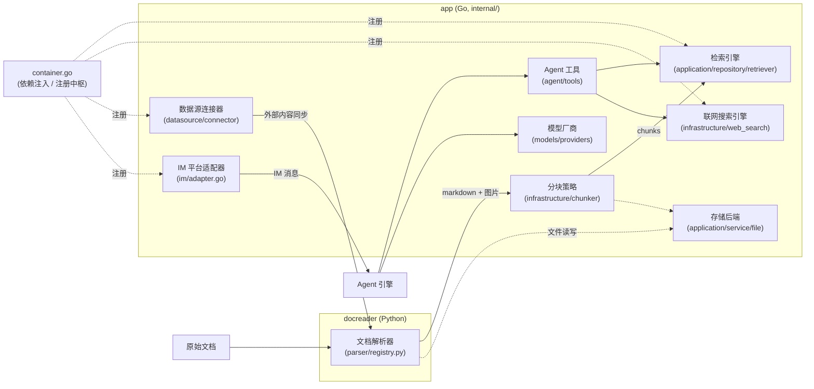

# 扩展点指南

WeKnora 的解析器、分块策略、检索引擎、模型厂商、搜索引擎、数据源、IM 适配器、Agent 工具和存储后端均通过接口接入。新增实现时，先实现对应接口，再在注册入口装配，并验证现有调用链。以下按扩展类型列出接口、已有实现和接入步骤。

## 扩展点总览 {#_0-扩展点总览}



Go 侧绝大多数扩展点的**注册中枢**是 `internal/container/container.go`（依赖注入容器）：检索引擎 `initRetrieveEngineRegistry()`、联网搜索 `registerWebSearchProviders()`、IM 适配器 `registerIMAdapterFactories()`、数据源连接器 `initConnectorRegistry()`。

---

## 新增文档解析器（docreader，Python） {#_1-新增文档解析器-docreader-python}

### 接口定义

基类在 `docreader/parser/base_parser.py`。轻量化重构后 BaseParser 只负责把文档转成 markdown 文本 + 原始图片引用（分块、图片存储、OCR、VLM caption 均在 Go 侧完成）：

```python
# docreader/parser/base_parser.py
class BaseParser(ABC):
    """Base parser interface."""

    def __init__(self, file_name: str = "", file_type: Optional[str] = None, **kwargs):
        self.file_name = file_name
        self.file_type = file_type or os.path.splitext(file_name)[1].lstrip(".")

    @abstractmethod
    def parse_into_text(self, content: bytes) -> Document:
        """Parse document content into markdown text.

        Returns:
            Document with ``content`` (markdown string) and optional
            ``images`` dict mapping storage-relative paths to base64 data.
        """
```

返回值 `Document`（`docreader/models/document.py`，pydantic 模型）核心字段是 `content: str`（markdown）与 `images: Dict[str, str]`（路径 → base64）。

### 注册机制

`docreader/parser/registry.py` 的 `ParserEngineRegistry` 以"引擎名 → {文件扩展名 → Parser 类}"两级映射管理解析器；当请求的引擎不支持该文件类型时自动回落到 `builtin` 引擎。默认注册表由 `_build_default_registry()` 构建，模块级单例 `registry = _build_default_registry()`。

```python
# docreader/parser/registry.py（节选）
class ParserEngineRegistry:
    def register(self, name: str, file_types: Dict[str, Type[BaseParser]],
                 description: str = "", check_available: Callable = None,
                 unavailable_hint: str = ""): ...
    def get_parser_class(self, engine: str, file_type: str) -> Type[BaseParser]: ...
```

### 现有实现

| 引擎 | Parser | 文件 |
| --- | --- | --- |
| `builtin` | `Docx2Parser` / `DocParser` / `PDFParser` / `MarkdownParser` / `ExcelParser` / `EPUBParser` / `HTMLParser` / `MHTMLParser` / `ImageParser`（jpg/png/gif/bmp/tiff/webp 等） | `docreader/parser/docx2_parser.py`、`doc_parser.py`、`pdf_parser.py`、`markdown_parser.py`、`excel_parser.py`、`epub_parser.py`、`html_parser.py`、`mhtml_parser.py`、`image_parser.py` |
| `markitdown` | `MarkitdownParser`（微软 MarkItDown，多格式） | `docreader/parser/markitdown_parser.py` |
| `opendataloader` | `OpenDataLoaderParser`（PDF 版面分析，需 Java 11+，带 `check_available` 探测） | `docreader/parser/opendataloader_parser.py` |

### 新增步骤

1. 在 `docreader/parser/` 新建 `my_parser.py`，继承 `BaseParser`，实现 `parse_into_text(content: bytes) -> Document`；
2. **注册点：`docreader/parser/registry.py`** — 在 `_build_default_registry()` 中追加：

```python
reg.register(
    "my_engine",
    {"myext": MyParser},
    description="我的解析引擎",
    check_available=lambda overrides: (True, ""),   # 可选：依赖可用性探测
    unavailable_hint="缺依赖时给用户的提示",          # 可选
)
```

3. 若是给已有扩展名换实现，也可只往 `builtin` 的映射里加一行 `"ext": MyParser`；
4. 在 `docreader/tests/` 增加 unittest（参考 `test_parser_routing.py`），`uv run python -m unittest` 验证。

---

## 新增分块策略（internal/infrastructure/chunker） {#_2-新增分块策略-internal-infrastructure-chunker}

### 接口定义

分块没有 interface，而是**策略分层（tier）+ 包级函数变量覆盖**的模式。公共入口在 `internal/infrastructure/chunker/strategy.go`：

```go
// internal/infrastructure/chunker/strategy.go
// Strategy values for SplitterConfig.Strategy.
const (
    StrategyAuto      = "auto"
    StrategyHeading   = "heading"
    StrategyHeuristic = "heuristic"
    StrategyRecursive = "recursive"
    StrategyLegacy    = "legacy"
)

func Split(text string, cfg SplitterConfig) []Chunk
func SplitWithDiagnostics(text string, cfg SplitterConfig) ([]Chunk, *Diagnostics)
func SplitParentChild(text string, parentCfg, childCfg SplitterConfig) ParentChildResult
```

配置与结果类型在 `internal/infrastructure/chunker/splitter.go`：

```go
// internal/infrastructure/chunker/splitter.go
type Chunk struct {
    Content       string
    ContextHeader string
    Seq           int
    Start         int
    End           int
}

type SplitterConfig struct {
    ChunkSize    int
    ChunkOverlap int
    Separators   []string
    Strategy     string   // 空 = legacy（向后兼容）
    TokenLimit   int      // 以近似 token 数限制块大小，0 = 用 ChunkSize 字符数
    Languages    []string // 多语言启发式提示，空 = 自动检测
}
```

策略分发在 `runTier()`；heading / heuristic 两个实现通过包级函数变量在各自文件的 `init()` 中覆盖：

```go
// internal/infrastructure/chunker/strategy.go
func runTier(tier StrategyTier, text string, cfg SplitterConfig, profile *DocProfile) []Chunk {
    switch tier {
    case TierHeading:
        return splitByHeadings(text, cfg, profile)
    case TierHeuristic:
        return splitByHeuristics(text, cfg, profile)
    case TierLegacy:
        return SplitText(text, cfg)
    }
    return SplitText(text, cfg)
}

var splitByHeadings = func(text string, cfg SplitterConfig, _ *DocProfile) []Chunk {
    return SplitText(text, cfg) // 被 heading_splitter.go 的 init() 覆盖
}
var splitByHeuristics = func(text string, cfg SplitterConfig, _ *DocProfile) []Chunk {
    return SplitText(text, cfg) // 被 heuristic_splitter.go 的 init() 覆盖
}
```

### 现有实现

| 策略 tier | 说明 | 文件 |
| --- | --- | --- |
| `TierHeading` | 按 Markdown 标题层级分块 | `internal/infrastructure/chunker/heading_hierarchy.go` 等 |
| `TierHeuristic` | 多语言启发式分块 | `internal/infrastructure/chunker/heuristic_splitter.go` |
| `TierLegacy`（=`recursive`） | 递归分隔符分块（原始实现） | `internal/infrastructure/chunker/splitter.go` 的 `SplitText()` |
| 校验器 | 每个 tier 输出经 `ValidateChunks` 验收，失败则沿链回落 | `internal/infrastructure/chunker/validator.go` |

### 新增步骤

1. 在 `internal/infrastructure/chunker/` 新建 `my_splitter.go`，实现 `func(text string, cfg SplitterConfig, profile *DocProfile) []Chunk`；
2. **注册点：`internal/infrastructure/chunker/strategy.go`** —
   - 增加策略常量（如 `StrategyMine = "mine"`）与新的 `StrategyTier`；
   - 在 `resolveChain`/`resolveChainWithProfile` 的 switch 中为新策略返回 tier 链（建议以 `TierLegacy` 兜底）；
   - 在 `runTier()` 中新增 case；
3. 调用方无需改动：知识库的 `chunking_config.strategy`（JSONB）经 `internal/application/service/knowledge_process.go` 的 `buildSplitterConfigFromChunking` 传入；
4. 用 `SplitWithDiagnostics` 写单测验证 tier 选择与 `ValidateChunks` 验收行为。

---

## 新增检索引擎（Retriever Engine） {#_3-新增检索引擎-retriever-engine}

### 接口定义

接口在 `internal/types/interfaces/retriever.go`（三层：引擎 → 仓储 → 服务 + 注册表）：

```go
// internal/types/interfaces/retriever.go
type RetrieveEngine interface {
    EngineType() types.RetrieverEngineType
    Retrieve(ctx context.Context, params types.RetrieveParams) ([]*types.RetrieveResult, error)
    Support() []types.RetrieverType // 支持的检索类型（向量/关键词）
}

type RetrieveEngineRepository interface {
    Save(ctx context.Context, indexInfo *types.IndexInfo, params map[string]any) error
    BatchSave(ctx context.Context, indexInfoList []*types.IndexInfo, params map[string]any) error
    EstimateStorageSize(ctx context.Context, indexInfoList []*types.IndexInfo, params map[string]any) int64
    DeleteByChunkIDList(ctx context.Context, indexIDList []string, dimension int, knowledgeType string) error
    DeleteBySourceIDList(ctx context.Context, sourceIDList []string, dimension int, knowledgeType string) error
    CopyIndices(ctx context.Context, sourceKnowledgeBaseID string,
        sourceToTargetKBIDMap map[string]string,
        sourceToTargetChunkIDMap map[string]string,
        targetKnowledgeBaseID string, dimension int, knowledgeType string) error
    DeleteByKnowledgeIDList(ctx context.Context, knowledgeIDList []string, dimension int, knowledgeType string) error
    BatchUpdateChunkEnabledStatus(ctx context.Context, chunkStatusMap map[string]bool) error
    BatchUpdateChunkTagID(ctx context.Context, chunkTagMap map[string]string) error
    RetrieveEngine
}

type RetrieveEngineRegistry interface {
    Register(indexService RetrieveEngineService) error
    GetRetrieveEngineService(engineType types.RetrieverEngineType) (RetrieveEngineService, error)
    GetAllRetrieveEngineServices() []RetrieveEngineService
    GetByStoreID(storeID string) (RetrieveEngineService, error)
}
```

引擎类型枚举在 `internal/types/retriever.go`：

```go
// internal/types/retriever.go
const (
    PostgresRetrieverEngineType        RetrieverEngineType = "postgres"
    ElasticsearchRetrieverEngineType   RetrieverEngineType = "elasticsearch"
    InfinityRetrieverEngineType        RetrieverEngineType = "infinity"
    ElasticFaissRetrieverEngineType    RetrieverEngineType = "elasticfaiss"
    QdrantRetrieverEngineType          RetrieverEngineType = "qdrant"
    MilvusRetrieverEngineType          RetrieverEngineType = "milvus"
    WeaviateRetrieverEngineType        RetrieverEngineType = "weaviate"
    DorisRetrieverEngineType           RetrieverEngineType = "doris"
    SQLiteRetrieverEngineType          RetrieverEngineType = "sqlite"
    TencentVectorDBRetrieverEngineType RetrieverEngineType = "tencent_vectordb"
    OpenSearchRetrieverEngineType      RetrieverEngineType = "opensearch"
)
```

### 现有实现

均在 `internal/application/repository/retriever/` 下：`postgres/`（pgvector + BM25/ParadeDB）、`elasticsearch/v7/`、`elasticsearch/v8/`、`qdrant/`、`milvus/`、`weaviate/`、`doris/`、`sqlite/`（sqlite-vec + FTS5）、`tencentvectordb/`、`opensearch/`。

### 新增步骤

1. 在 `internal/types/retriever.go` 增加 `RetrieverEngineType` 常量；
2. 在 `internal/application/repository/retriever/myengine/` 新建包，实现 `RetrieveEngineRepository` 接口（可参考 `qdrant/` 或 `sqlite/`）；
3. **注册点：`internal/container/container.go` 的 `initRetrieveEngineRegistry()`** — 按 `RETRIEVE_DRIVER` 环境变量（逗号分隔）条件注册：

```go
// internal/container/container.go（节选）
retrieveDriver := strings.Split(os.Getenv("RETRIEVE_DRIVER"), ",")
if slices.Contains(retrieveDriver, "postgres") {
    postgresRepo := postgresRepo.NewPostgresRetrieveEngineRepository(db)
    if err := registry.Register(
        retriever.NewKVHybridRetrieveEngine(postgresRepo, types.PostgresRetrieverEngineType),
    ); err != nil { ... }
}
```

   仿照上例为新引擎加分支，用 `retriever.NewKVHybridRetrieveEngine(repo, 引擎类型)` 包装后注册；
   如需支持知识库间移动文档时复用已有向量，再实现可选接口 `KnowledgeIndexMover`（`MoveKnowledgeIndices`：保留 chunk ID 与向量，只改所属知识库，且可安全重试）；未实现时复用向量的移动会被拒绝，只能改用重新解析模式；
4. 若引擎需要独立部署，在 `docker-compose.dev.yml` 加一个带 profile 的服务（参考 `qdrant`/`opensearch`），并在 `.env.example` 补连接变量。

---

## 新增模型厂商（internal/models/providers） {#_4-新增模型-provider-internal-models-provider}

模型接入分为协议、厂商、目录、运行时四层（概览见[模型管理](../03-features/06-models.md#分层结构)）。大多数新厂商只需新增一份厂商定义并补充模型目录，复用已有协议即可。

### 接口定义

厂商定义是一个结构体，而不是接口实现，位于 `internal/models/providers/definition.go`：

```go
// internal/models/providers/definition.go（节选）
type Definition struct {
    ID           string            // 存入 models.parameters.provider 的稳定标识
    Name         string
    Names        map[string]string // 按语言的名称，如 "zh-CN"
    Website      string
    Icon         []byte            // SVG
    API          api.API           // 默认对话协议
    RerankAPI    api.RerankAPI     // 未声明时默认 cohere-rerank
    EmbeddingAPI api.EmbeddingAPI  // 未声明时默认 openai-embeddings
    TranscriptionAPI api.TranscriptionAPI // 未声明时默认 openai-transcriptions
    DefaultBaseURLs  map[types.ModelType]string
    ModelTypes       []types.ModelType
    RequiresAuth     bool
    Auth             AuthStyle          // bearer / api-key / x-api-key / x-goog-api-key / none / signed
    URLPatterns      []string           // 旧行未填 provider 时按 URL 识别
    ExtraFields      []ExtraField       // 编辑器动态渲染的额外字段
    CredentialLabels []CredentialLabel  // 重命名凭证输入框（签名类接口）
    Compat           VendorCompat       // 各协议的厂商级兼容默认值
    ThinkingLevels   api.ThinkingLevelMap
    Order            int                // 厂商列表排序
    // 可选钩子
    Endpoint  func(req EndpointRequest) (url string, query map[string]string)
    PreferAPI func(baseURL string, spec models.ModelSpec) api.API
    Signer    func(creds api.Credentials) api.AuthFunc
}
```

协议层按能力各有一个最小接口，新协议实现它即可接入：

```go
// internal/models/api/rerank.go
type Reranker interface {
    Rerank(ctx context.Context, query string, documents []string) ([]RerankResult, error)
}

// internal/models/api/embeddings.go
type Embedder interface {
    Embed(ctx context.Context, texts []string, kind EmbedInputType) ([][]float32, error)
}

// internal/models/api/transcriptions.go
type Transcriber interface {
    Transcribe(ctx context.Context, req TranscriptionRequest) (*Transcription, error)
}
```

对话协议客户端实现 `internal/models/chat` 的 `Chat` 接口（`Chat` / `ChatStream` / `GetModelName` / `GetModelID`）。

### 现有实现

- **厂商**：`internal/models/providers/` 下 27 个文件，一个厂商一份（`aliyun.go`、`deepseek.go`、`generic.go`、`weknoracloud.go` 等），由 `builtin.go` 的 `Builtins()` 显式列出；图标在 `providers/assets/<id>.svg`。
- **协议**：`internal/models/api/<protocol>`。对话 `openaicompletions`、`openairesponses`、`anthropicmessages`、`googlegenai`；向量 `openaiembeddings`、`dashscopeembeddings`、`arkembeddings`、`googleembeddings`；重排 `cohererank`、`dashscoperank`、`nimrerank`、`tencentlkeap`、`volcengineknowledge`；语音 `openaitranscriptions`、`openaichataudio`。
- **模型目录**：`internal/models/catalog/data/seed.json`（模型元数据）+ `overrides.json`（协议、思考映射与 compat 修正）→ 由脚本生成 `models.generated.json`，编译时嵌入。
- **运行时**：`internal/models/runtime` 组合厂商定义与目录（`New()`），应用部署叠加 `config/models.json`，并为每个模型行解析出协议、端点和兼容设置。

### 新增步骤

1. **新建厂商定义**：`internal/models/providers/<id>.go`，声明名称、支持的模型类型、各类型默认地址、鉴权方式、协议默认值及特殊端点钩子，并在包注释中写明官方文档依据；
2. **注册点一：`internal/models/providers/builtin.go`** — 把 `new<Id>Provider()` 加进 `Builtins()`；图标放入 `providers/assets/<id>.svg`；
3. **注册点二：模型目录** — 在 `internal/models/catalog/data/seed.json` 中为该厂商加一个条目（即使暂时没有模型也要有空列表，运行时按厂商 ID 读取目录），维护模型元数据；协议、思考映射与 compat 修正写在 `overrides.json`。模型键包含类型与 id / match，同名的对话和向量模型可以共存；
4. **生成目录**：执行 `make model-catalog-generate`。生成文件不要手改；
5. **新协议（可选）**：已有协议能覆盖时直接复用；确需新协议时新增 `internal/models/api/<protocol>` 包，并在对应工厂的协议分支中接入（对话 `internal/models/chat/chat.go` 的 `NewRemoteChat`、向量 `internal/models/embedding/protocol.go`、重排 `internal/models/rerank/reranker.go`、语音 `internal/models/asr/protocol.go`）；
6. **校验**：运行 `make model-catalog-check`。

`make model-catalog-check` 先检查生成数据是否过期，再运行 `internal/models/...` 的全部测试：`providers` 的注册与图标检查；`runtime` 的解析与叠加；`parity` 包的**不变量**（每个模型条目的字段合法性、compat 键名可解码、上下文与最大输出自洽）和**逐模型出站请求检查**（每个对话模型在思考开 / 关两种情况下只能出现一个输出上限字段；不支持采样参数的模型不得带 temperature；始终思考的模型不得收到关闭开关等）。新厂商和新模型违反这些规则时测试直接失败，无需单独写用例。

前端不需要改动：厂商下拉、图标、额外字段、模型目录都由 `GET /api/v1/models/providers` 动态渲染。开箱即用的内置模型行由运维在 `config/builtin_models.yaml` 中声明，与厂商定义无关。

### 维护已有厂商

**新增或调整模型元数据**（新模型 id、上下文窗口、价格）：先生成差异报告，再对照厂商文档更新 `seed.json`，最后重新生成目录。

```bash
make model-catalog-diff                 # 全部厂商
make model-catalog-diff VENDOR=deepseek # 只看一家
```

报告对比 [models.dev](https://models.dev/api.json) 的公开元数据：`+` 是上游有而目录没有的模型，`~` 是数值差异，`?` 是上游没收录的条目（国内厂商和别名经常如此，不代表错）。脚本只读不写，也从不在运行时调用。字段名、思考格式这类行为事实不会被自动同步，必须以厂商文档为准手工维护。

**厂商改了接口行为**（换了输出上限字段、新增 effort 取值、思考开关格式变化）：改 `providers/<id>.go` 的 `Compat`，或 `overrides.json` 中对应模型的 `compat`，重新生成目录，并同步更新注释里的文档链接。`internal/models/api/openaicompletions/golden_test.go` 等快照测试会钉死出站 JSON，改动需先改测试预期。

**紧急修正**：不必等发版，可先用[部署叠加 `config/models.json`](../03-features/06-models.md#部署叠加-config-models-json)在部署侧修改，验证后再补回代码。

---

## 新增联网搜索引擎（internal/infrastructure/web_search） {#_5-新增联网搜索引擎-internal-infrastructure-web-search}

### 接口定义

```go
// internal/types/interfaces/web_search.go
type WebSearchProvider interface {
    // Name returns the name of the provider
    Name() string
    // Search performs a web search
    Search(ctx context.Context, query string, maxResults int, includeDate bool) ([]*types.WebSearchResult, error)
}
```

注册表是工厂映射（按需用租户参数实例化）：

```go
// internal/infrastructure/web_search/registry.go
type ProviderFactory func(params types.WebSearchProviderParameters) (interfaces.WebSearchProvider, error)

type Registry struct {
    factories map[string]ProviderFactory
    mu        sync.RWMutex
}

func (r *Registry) Register(id string, factory ProviderFactory)
func (r *Registry) CreateProvider(providerType string, params types.WebSearchProviderParameters) (interfaces.WebSearchProvider, error)
```

支持按地区、时效过滤的引擎可额外实现可选接口 `FilteredWebSearchProvider`（`SearchWithFilters`）；不支持过滤的引擎不得静默丢弃调用方请求的过滤条件。

### 现有实现

`internal/infrastructure/web_search/` 目录：`duckduckgo.go`、`google.go`、`bing.go`、`brave.go`、`tavily.go`、`ollama.go`、`baidu.go`、`searxng.go`、`keenable.go`、`zhipu.go`、`exa.go`、`metaso.go`、`bocha.go`、`serply.go`（另有 `proxy.go` 出站代理支持）。类型常量在 `internal/types/web_search_provider.go`（`WebSearchProviderTypeXxx`，与注册 ID 一一对应）。

### 新增步骤

1. 在 `internal/types/web_search_provider.go` 增加 `WebSearchProviderType` 常量；
2. 在 `internal/infrastructure/web_search/` 新建 `mysearch.go`，实现 `WebSearchProvider` 并暴露工厂 `func NewMySearchProvider(params types.WebSearchProviderParameters) (interfaces.WebSearchProvider, error)`；
3. **注册点：`internal/container/container.go` 的 `registerWebSearchProviders()`**：

```go
func registerWebSearchProviders(registry *infra_web_search.Registry) {
    registry.Register("duckduckgo", infra_web_search.NewDuckDuckGoProvider)
    registry.Register("google", infra_web_search.NewGoogleProvider)
    // ... 在此追加：
    registry.Register("mysearch", infra_web_search.NewMySearchProvider)
}
```

4. 前端的 provider 下拉与参数表单如需展示新引擎，同步 `frontend/` 相应配置页组件；租户配置持久化在 `web_search_providers` 表。

---

## 新增数据源连接器（internal/datasource/connector） {#_6-新增数据源连接器-internal-datasource-connector}

> 目录内附有实现指南 `internal/datasource/CONNECTOR_IMPLEMENTATION_GUIDE.md`，可对照阅读。

### 接口定义

```go
// internal/datasource/connector.go
type Connector interface {
    // Type returns the connector type identifier (e.g., "feishu", "notion")
    Type() string

    // Validate verifies that the provided configuration is valid by testing
    // connectivity and checking credentials.
    Validate(ctx context.Context, config *types.DataSourceConfig) error

    // ListResources lists available resources that can be synced.
    // parentID 支持层级资源的懒加载："" 返回顶层，非空返回该资源的直接子节点。
    ListResources(ctx context.Context, config *types.DataSourceConfig, parentID string) ([]types.Resource, error)

    // ResolveResourceAncestors 为懒加载树的既有选中项解析祖先链（O(depth)）。
    ResolveResourceAncestors(
        ctx context.Context, config *types.DataSourceConfig, resourceIDs []string,
    ) ([]string, error)

    // FetchAll performs a full sync of the specified resources.
    FetchAll(ctx context.Context, config *types.DataSourceConfig, resourceIDs []string) ([]types.FetchedItem, error)

    // FetchIncremental performs an incremental sync based on the provided cursor.
    FetchIncremental(ctx context.Context, config *types.DataSourceConfig, cursor *types.SyncCursor) ([]types.FetchedItem, *types.SyncCursor, error)
}
```

可选的流式接口（大数据量分页 checkpoint，内存只驻留单条 item）：

```go
// internal/datasource/connector.go
type StreamHandler interface {
    Emit(ctx context.Context, item types.FetchedItem) error
    Checkpoint(ctx context.Context, cursor *types.SyncCursor) error
}

type StreamingConnector interface {
    Connector
    FetchStream(ctx context.Context, config *types.DataSourceConfig,
        cursor *types.SyncCursor, h StreamHandler) (*types.SyncCursor, error)
}
```

另有两个可选接口用于全量同步时仍能对账删除：`FullStreamingConnector`（`FetchFullStream`）与 `FullSyncWithCursor`（`FetchAllFromCursor`），在强制全量或 `sync_mode=full` 时重新拉取全部条目，同时保留上一次游标用于识别已删除的文档。未实现时，全量同步无法产生删除事件。

注册表同文件：`ConnectorRegistry`（`NewConnectorRegistry()` / `Register(connector)` / `Get(type)` / `List()`）；连接器的 UI 元数据（名称、AuthType、capabilities）在同文件的 `ConnectorMetadataRegistry` map 中。

### 现有实现

| 类型 | 目录 | 说明 |
| --- | --- | --- |
| `feishu` / `lark` | `internal/datasource/connector/feishu/wiki/` | 飞书 / Lark 知识库，同一实现按区域区分 |
| `feishu_drive` / `lark_drive` | `internal/datasource/connector/feishu/drive/` | 飞书 / Lark 云盘 |
| `notion` | `internal/datasource/connector/notion/` | 页面与数据库 |
| `confluence` | `internal/datasource/connector/confluence/` | Confluence |
| `yuque` | `internal/datasource/connector/yuque/` | 语雀 |
| `dingtalk` | `internal/datasource/connector/dingtalk/` | 钉钉文档 |
| `ima` | `internal/datasource/connector/ima/` | 腾讯 ima 知识库 |
| `rss` | `internal/datasource/connector/rss/` | RSS 订阅 |
| `gitlab` | `internal/datasource/connector/gitlab/` | GitLab 仓库 |

`internal/types/datasource.go` 中还有 `github`、`google_drive` 等尚未注册实现的类型常量。

### 新增步骤

1. 在 `internal/datasource/connector/mysource/` 新建包，实现 `Connector`（大数据量建议同时实现 `StreamingConnector`），提供 `NewConnector()`；
2. **注册点一：`internal/container/container.go` 的 `initConnectorRegistry()`**：

```go
if err := registry.Register(mysourceConnector.NewConnector()); err != nil {
    errs = errors.Join(errs, fmt.Errorf("register mysource connector: %w", err))
}
```

3. **注册点二：`internal/datasource/connector.go` 的 `ConnectorMetadataRegistry`** — 增加类型常量（`internal/types` 的 `ConnectorTypeXxx`）与元数据条目（Name/Description/AuthType/Capabilities）；
4. 同步配置结构：`types.DataSourceConfig` 若需新增凭证字段，注意加密存储约定；前端数据源接入页按元数据渲染；
5. 复用 `internal/datasource` 的公共工具：用户可填写的 API 地址先经 `ValidateConnectorBaseURL` 做 SSRF 校验，HTTP 请求使用 `NewConnectorHTTPClient`（带重定向与拨号期 SSRF 防护），生成文件名使用 `SanitizeFileName`。

---

## 新增 IM 平台适配器（internal/im） {#_7-新增-im-平台适配器-internal-im}

### 接口定义

```go
// internal/im/adapter.go
type Platform string // "wecom" / "feishu" / "lark" / "slack" / "telegram" / "dingtalk" /
                     // "mattermost" / "wechat" / "qqbot" / "yunzhijia"

// Adapter is the interface every IM platform must implement.
type Adapter interface {
    // Platform returns the platform identifier.
    Platform() Platform

    // VerifyCallback verifies the signature/token of an incoming callback request.
    VerifyCallback(c *gin.Context) error

    // ParseCallback parses the raw IM callback request into a unified IncomingMessage.
    // Returns nil message for non-message events (e.g., URL verification).
    ParseCallback(c *gin.Context) (*IncomingMessage, error)

    // SendReply sends a reply back to the IM platform.
    SendReply(ctx context.Context, incoming *IncomingMessage, reply *ReplyMessage) error

    // HandleURLVerification handles the initial URL verification challenge.
    HandleURLVerification(c *gin.Context) bool
}
```

两个可选能力接口：

```go
// internal/im/adapter.go
// StreamSender：实现后 IM 服务将实时推送流式回答（如飞书流式卡片、Telegram 编辑消息）
type StreamSender interface {
    StartStream(ctx context.Context, incoming *IncomingMessage) (string, error)
    UpdateStreamContent(ctx context.Context, incoming *IncomingMessage, streamID string, fullContent string) error
    FinalizeStream(ctx context.Context, incoming *IncomingMessage, streamID string, finalContent string) error
    EndStream(ctx context.Context, incoming *IncomingMessage, streamID string) error
}

// FileDownloader：实现后，配置了 knowledge_base_id 的渠道会把文件消息入库
type FileDownloader interface {
    DownloadFile(ctx context.Context, msg *IncomingMessage) (io.ReadCloser, string, error)
}
```

适配器由工厂按渠道实例化（`internal/im/service.go`）：

```go
// internal/im/service.go
type AdapterFactory func(ctx context.Context, channel *IMChannel,
    msgHandler func(ctx context.Context, msg *IncomingMessage) error,
) (Adapter, context.CancelFunc, error)

func (s *Service) RegisterAdapterFactory(platform string, factory AdapterFactory)
```

### 现有实现

`internal/im/` 下每个平台一个子包：`wecom/`、`feishu/`（lark 复用，`feishu.NewFactory(RegionLark)`）、`slack/`、`telegram/`、`dingtalk/`、`mattermost/`、`wechat/`、`qqbot/`、`yunzhijia/`。

### 新增步骤

1. 在 `internal/im/adapter.go` 增加 `Platform` 常量；
2. 新建 `internal/im/myplatform/`，实现 `Adapter`（按需加 `StreamSender`/`FileDownloader`）与 `NewFactory() im.AdapterFactory`；
3. **注册点：`internal/container/container.go` 的 `registerIMAdapterFactories()`**：

```go
func registerIMAdapterFactories(imService *imPkg.Service) {
    imService.RegisterAdapterFactory("wecom", wecom.NewFactory())
    // ... 在此追加：
    imService.RegisterAdapterFactory("myplatform", myplatform.NewFactory())
    if err := imService.LoadAndStartChannels(); err != nil { ... }
}
```

4. 渠道配置持久化在 `im_channels` 表，会话映射在 `im_channel_sessions`；前端渠道管理页需增加对应平台的配置表单。

---

## 新增 Agent 工具（internal/agent/tools） {#_8-新增-agent-工具-internal-agent-tools}

### 接口定义

工具接口定义在 `internal/types/agent.go`：

```go
// internal/types/agent.go
type Tool interface {
    // Name returns the unique identifier for this tool
    Name() string

    // Description returns a human-readable description of what the tool does
    Description() string

    // Parameters returns the JSON Schema for the tool's parameters
    Parameters() json.RawMessage

    // Execute runs the tool with the given arguments
    Execute(ctx context.Context, args json.RawMessage) (*ToolResult, error)
}
```

运行时注册表在 `internal/agent/tools/registry.go`：

```go
// internal/agent/tools/registry.go
type ToolRegistry struct {
    tools             map[string]types.Tool
    maxToolOutputSize int
}

// RegisterTool adds a tool to the registry.
// 同名工具 first-wins，防止名称碰撞劫持（GHSA-67q9-58vj-32qx）。
func (r *ToolRegistry) RegisterTool(tool types.Tool)
func (r *ToolRegistry) GetTool(name string) (types.Tool, error)
func (r *ToolRegistry) ListTools() []string
```

### 现有实现

工具名常量集中在 `internal/agent/tools/definitions.go`：`thinking`、`todo_write`、知识检索工具（`search_knowledge`、`read_document`、`list_documents`、`query_knowledge_graph`）、`database_query`、`data_analysis`、`data_schema`、`web_search`、`web_fetch`、MCP 按需调用工具（`discover_mcp_tools`、`call_mcp_tool`）、沙箱/技能工具（`shell_exec`、`read_file`、`list_sandbox_files`、`write_sandbox_file`、`edit_sandbox_file`、`write_skill_file`、`edit_skill_file`），记忆工具（`search_memory`、`search_conversations`）、wiki 工具（`wiki_read_page`、`wiki_write_page`、`wiki_replace_text`、`wiki_rename_page`、`wiki_delete_page`、`wiki_search`、`wiki_flag_issue`、`wiki_read_issue`、`wiki_update_issue`）；本机浏览器工具 `local_browser` 实现在 `browserskill*.go`。实现文件多与工具同名（如 `search_knowledge.go`、`read_document.go`、`list_documents.go`、`data_analysis.go`；`mcp_tool.go` / `mcp_catalog.go` 负责把 MCP 服务的远程工具按需发现与调用）。

已退役的沙箱工具名（`execute_skill_script`、`read_skill`、`read_sandbox_file`）仅为解码历史记录保留，不再注册；已退役的检索工具名（`knowledge_search`、`grep_chunks`、`list_knowledge_chunks`、`get_document_info`、`wiki_read_source_doc`）仍以 `LegacyTool*` 常量保留：`legacyToolSuccessors` 把它们映射到 `search_knowledge` / `read_document`，`NormalizeAllowedTools` 在注册工具时自动改写已保存 Agent 配置里的旧名字，`SuccessorToolName` / `IsLegacyRetrievalTool` 供其他服务判定。重命名或合并工具时请沿用这一机制，而不是做数据迁移。

### 新增步骤

1. 在 `internal/agent/tools/` 新建 `my_tool.go`，实现 `types.Tool` 四个方法（`Parameters()` 返回 JSON Schema；注意工具名 ≤ 64 字符的 OpenAI 限制，见 `definitions.go` 的 `maxFunctionNameLength`）；
2. **注册点一：`internal/agent/tools/definitions.go`** — 增加 `ToolMyTool = "my_tool"` 常量，并把工具加进 `AvailableToolDefinitions()`（UI 的可选工具列表，注释明确要求与已注册工具保持同步）；
3. **注册点二：Agent 引擎的工具装配处** — 在构建 `ToolRegistry` 的服务逻辑（Agent 会话初始化，按 Agent 配置的允许工具列表实例化并 `RegisterTool`）中加入新工具的构造；带资源清理需求时实现 `Cleanup`（`types.Cleanable`）；
4. 输出体量大的工具注意 `ToolRegistry` 的 `maxToolOutputSize` 截断行为；为工具编写 `_test.go`（同目录有大量参考，如 `search_knowledge_test.go`、`scope_authorization_test.go`）。

---

## 新增存储后端（对象存储） {#_9-新增存储后端-对象存储}

### 接口定义

文件服务接口在 `internal/types/interfaces/file.go`：

```go
// internal/types/interfaces/file.go
type FileService interface {
    CheckConnectivity(ctx context.Context) error
    SaveFile(ctx context.Context, file *multipart.FileHeader, tenantID uint64, knowledgeID string) (string, error)
    SaveBytes(ctx context.Context, data []byte, tenantID uint64, fileName string, temp bool) (string, error)
    GetFile(ctx context.Context, filePath string) (io.ReadCloser, error)
    GetFileURL(ctx context.Context, filePath string) (string, error)
    DeleteFile(ctx context.Context, filePath string) error
    CopyFile(ctx context.Context, srcPath string, tenantID uint64, knowledgeID string) (string, error)
}
```

多后端解析（租户级 `storage_backends` 表配置 → FileService 实例）经 `internal/types/interfaces/storagebackend.go`：

```go
// internal/types/interfaces/storagebackend.go
type StorageBackendService interface {
    Create(ctx context.Context, backend *types.StorageBackend) error
    Update(ctx context.Context, backend *types.StorageBackend) error
    Delete(ctx context.Context, tenantID uint64, id string) error
    SetDefault(ctx context.Context, tenantID uint64, id string) error
    Test(ctx context.Context, backend *types.StorageBackend) error
}

type StorageBackendResolver interface {
    ResolveFileService(ctx context.Context, tenant *types.Tenant, backendID, provider, localBaseDir string) (FileService, string, error)
    ResolveBackend(ctx context.Context, tenant *types.Tenant, backendID, provider string) (*types.StorageBackend, error)
}
```

### 现有实现

均在 `internal/application/service/file/`：

| provider | 文件 | 说明 |
| --- | --- | --- |
| `local` | `local.go` | 本地文件系统 |
| `minio` | `minio.go` | MinIO / S3 兼容 |
| `cos` | `cos.go` | 腾讯云 COS |
| `tos` | `tos.go` | 火山引擎 TOS |
| `s3` | `s3.go` | AWS S3 及兼容服务 |
| `obs` | `obs.go` | 华为云 OBS |
| `oss` | `oss.go` | 阿里云 OSS |
| `ks3` | `ks3.go` | 金山云 KS3 |

### 新增步骤

1. 在 `internal/application/service/file/` 新建 `mystore.go`，实现 `FileService` 全部方法（`CheckConnectivity` 用于前端"测试连接"按钮，即 `StorageBackendService.Test`）；
2. **注册点：`internal/application/service/file/factory.go` 的 `NewFileServiceFromStorageConfig()`** — 在 provider switch 中加 case：

```go
switch p {
case "local":  // NewLocalFileService(...)
case "minio":  // NewMinioFileService(...)
// ... 在此追加：
case "mystore":
    return NewMyStoreFileService(cfg), p, nil
default:
    return nil, p, fmt.Errorf("unsupported storage provider: %s", p)
}
```

3. 若新 provider 需要新的配置字段（endpoint/bucket/region 等），扩展 `internal/types` 中的 `StorageEngineConfig` / `StorageBackend.config`（JSONB）；
4. 前端存储后端管理页增加对应 provider 的表单项；租户配置落在 `storage_backends` 表（`provider` 列即 switch 的 key）。

---

## 附：扩展点速查表

| 扩展点 | 核心接口 | 接口文件 | 注册点 |
| --- | --- | --- | --- |
| 文档解析器 | `BaseParser.parse_into_text` | `docreader/parser/base_parser.py` | `docreader/parser/registry.py` `_build_default_registry()` |
| 分块策略 | tier 函数 `func(text, cfg, profile) []Chunk` | `internal/infrastructure/chunker/strategy.go` | 同文件 `runTier()` + 策略常量 |
| 检索引擎 | `RetrieveEngineRepository` | `internal/types/interfaces/retriever.go` | `container.go` `initRetrieveEngineRegistry()`（`RETRIEVE_DRIVER` 门控） |
| 模型厂商 | `providers.Definition`（+ 协议层 `Reranker` / `Embedder` / `Transcriber`、`chat.Chat`） | `internal/models/providers/definition.go` | `internal/models/providers/builtin.go` `Builtins()` + `internal/models/catalog/data/seed.json` |
| 联网搜索 | `WebSearchProvider` | `internal/types/interfaces/web_search.go` | `container.go` `registerWebSearchProviders()` |
| 数据源连接器 | `Connector` / `StreamingConnector` | `internal/datasource/connector.go` | `container.go` `initConnectorRegistry()` + `ConnectorMetadataRegistry` |
| IM 适配器 | `Adapter`（+`StreamSender`/`FileDownloader`） | `internal/im/adapter.go` | `container.go` `registerIMAdapterFactories()` |
| Agent 工具 | `types.Tool` | `internal/types/agent.go` | `internal/agent/tools/definitions.go` + `ToolRegistry.RegisterTool` |
| 存储后端 | `FileService` | `internal/types/interfaces/file.go` | `internal/application/service/file/factory.go` switch |
